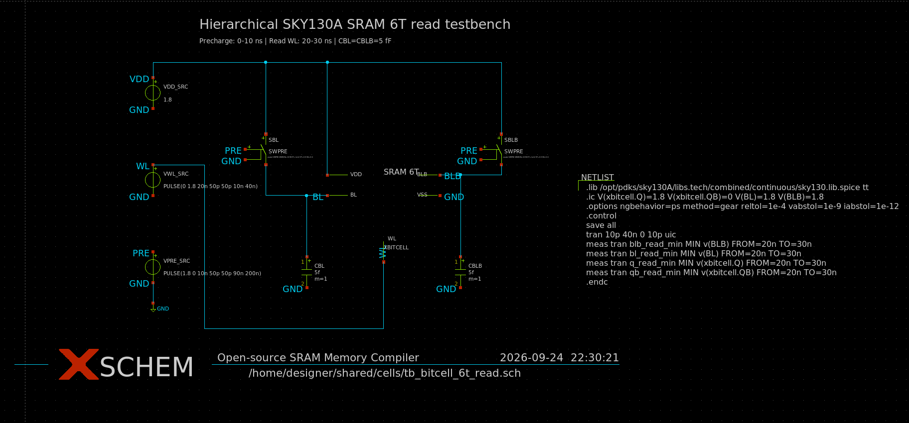

# Open-Source SRAM Memory Compiler

Compilador open-source de memória SRAM single-port baseado em uma bitcell 6T
para o PDK SKY130A. O escopo prevê profundidades de 4, 8, 16 e 32 palavras,
largura fixa de 8 bits e geração de GDSII, LEF, Verilog e .lib.

Este README consolida o [guia passo a passo da Pessoa 1](../passo_a_passo_pessoa1_bitcell6t-v2.md)
e os resultados do [relatório de validação](docs/relatorio_validacao_bitcell_6t_sky130.md).

## Escopo atual

O trabalho está concentrado nas leaf cells e na validação elétrica da bitcell:

- definição da topologia e do sizing;
- captura no Xschem;
- testbenches manual e hierárquico;
- simulação ngspice com SKY130A;
- sweep automatizado de capacitância, estado e corner;
- preparação de pré-carga, sense amplifier, driver de WL e driver de escrita.

Layout, DRC, LVS, caracterização completa e geração final das views ainda estão
pendentes.

## Configurações suportadas

O compilador terá largura fixa de 8 bits, uma palavra por linha física e as
seguintes profundidades:

| Configuração | Capacidade |
|---|---:|
| 4×8 | 32 bits |
| 8×8 | 64 bits |
| 16×8 | 128 bits |
| 32×8 | 256 bits |

A configuração 4×8 é o primeiro alvo de implementação e integração.

## Views e verificação previstas

Para cada configuração serão previstas as views GDSII, LEF, Verilog
comportamental e Liberty simplificada (`.lib`). A qualificação completa deverá
incluir DRC, LVS, caracterização temporal, potência dinâmica e estática, SNM e
avaliação nos corners TT, SS e FF.

## Toolchain

- SkyWater SKY130 / open_pdks
- Xschem e ngspice
- Magic e Netgen
- Python e gdstk
- Icarus Verilog e GTKWave
- Git

## Topologia da bitcell 6T

A célula é formada por dois inversores CMOS cruzados, dois NMOS de acesso e os
nós internos complementares Q e QB:

- MPL e MPR: PMOS pull-up, com fontes em VDD;
- MNL e MNR: NMOS pull-down, com fontes em VSS;
- MAL e MAR: NMOS de acesso, com gates em WL;
- MAL: conexão entre BL e Q;
- MAR: conexão entre BLB e QB.

Interface funcional:

~~~
BL  BLB  WL  VDD  VSS
~~~

Na expansão hierárquica do Xschem, o subcircuito aparece como:

~~~spice
.subckt bitcell_6t VDD BL BLB VSS WL
~~~

### Sizing e fórmulas

O guia define VDD = 1,8 V, L = 0,15 µm e nf = 1:

| Dispositivo | Função | Modelo | W (µm) | L (µm) |
|---|---|---|---:|---:|
| MPL, MPR | PMOS pull-up | sky130_fd_pr__pfet_01v8 | 0,21 | 0,15 |
| MNL, MNR | NMOS pull-down | sky130_fd_pr__nfet_01v8 | 0,42 | 0,15 |
| MAL, MAR | NMOS de acesso | sky130_fd_pr__nfet_01v8 | 0,30 | 0,15 |

A razão de leitura, ou beta-ratio, é:

\[
\beta = \frac{(W/L)_{\mathrm{pull-down}}}{(W/L)_{\mathrm{acesso}}}
\]

Com o sizing definido:

\[
\beta = \frac{0,42/0,15}{0,30/0,15}
       = \frac{0,42}{0,30}
       = 1,40
\]

O objetivo é manter o pull-down mais forte que o acesso e evitar read disturb.
O guia usa como referência β ≥ 1,2 a 1,5.

A razão de escrita, ou gamma-ratio, é:

\[
\gamma = \frac{(W/L)_{\mathrm{pull-up}}}{(W/L)_{\mathrm{acesso}}}
\]

Com o sizing definido:

\[
\gamma = \frac{0,21/0,15}{0,30/0,15}
        = \frac{0,21}{0,30}
        = 0,70 < 1,0
\]

O pull-up mais fraco facilita que o driver de escrita force a inversão do estado.

## Estrutura do projeto

~~~
.
├── cells/
│   ├── bitcell_6t/
│   │   ├── bitcell_6t.sch
│   │   ├── bitcell_6t.sym
│   │   ├── bitcell_6t.spice
│   │   └── sram_6t.sch (legacy)
│   ├── row_decoder/
│   │   └── row_decoder.sch
│   ├── precharge/
│   │   └── precharge.sch
│   ├── sense_amp/
│   │   └── sense_amp.sch
│   ├── wordline_driver/
│   │   └── wl_driver.sch
│   ├── write_driver/
│   │   └── write_driver.sch
│   └── README.md
├── sims/
│   └── bitcell_6t/
│       ├── tb_bitcell_6t_read.sch
│       ├── vsource_drive.sym
│       ├── tb_bitcell_6t.spice
│       ├── tb_bitcell_6t_read.spice
│       ├── run_bitcell_read_sweep.py
│       └── bitcell_read_sweep.csv
├── specs/sram_6t_cell.md
└── docs/
    ├── relatorio_validacao_bitcell_6t_sky130.md
    └── assets/
        ├── bitcell_6t_xschem.png
        └── tb_bitcell_6t_read_xschem.png
~~~

## Ambiente SKY130A

Os testes foram executados no container isaiassh/unic-cass-tools:1.1.0:

~~~bash
export PDK=sky130A
export PDK_ROOT=/opt/pdks
~~~

Biblioteca contínua usada pelos decks:

~~~
/opt/pdks/sky130A/libs.tech/combined/continuous/sky130.lib.spice
~~~

Para iniciar o container localmente, sem VNC:

~~~bash
cd /home/danilo_cunha/projetos/ueletronica/entregas/ueletronica_projeto_final
make \
  SHARED_DIR=/home/danilo_cunha/projetos/ueletronica/projeto-sram/Open-source-sram-memory-compiler \
  PDK=sky130A \
  DOCKER_TAG=1.1.0 \
  start
~~~

Dentro do container:

~~~bash
cd /home/designer/shared
export PDK=sky130A
export PDK_ROOT=/opt/pdks
~~~

## Xschem e testbench hierárquico

Abra a bitcell isolada com:

~~~bash
xschem cells/bitcell_6t/bitcell_6t.sch
~~~

O esquemático contém os seis transistores e os nós Q, QB, BL, BLB, WL, VDD
e VSS. A captura está em
[docs/assets/bitcell_6t_xschem.png](docs/assets/bitcell_6t_xschem.png).

Quando a bitcell é aberta diretamente, um smoke test `only_toplevel` carrega
o corner `tt`, aplica pré-carga e WL e grava `bitcell_6t.raw`. Esse bloco usa
`WPU=WPD=WACC=0.42 µm` e é omitido quando a célula participa da hierarquia.

O testbench visual de leitura é aberto com:

~~~bash
xschem sims/bitcell_6t/tb_bitcell_6t_read.sch
~~~

Hierarquia:

~~~
sims/bitcell_6t/tb_bitcell_6t_read.sch
└── cells/bitcell_6t/bitcell_6t.sym
    └── cells/bitcell_6t/bitcell_6t.sch
~~~

O testbench representa VDD, WL, PRE, chaves ideais de pré-carga e capacitores
de 5 fF em BL e BLB. A sequência visual é pré-carga de 0 ns a 10 ns e leitura
com WL ativo de 20 ns a 30 ns.

A expansão confirmou o sizing provisório da instância:

~~~spice
XBITCELL VDD BL BLB GND WL bitcell_6t WPU=0.42 WPD=0.42 WACC=0.42
~~~

O símbolo mantém como padrão o sizing alvo `WPU=0.21`, `WPD=0.42` e
`WACC=0.30` µm. A instância do testbench usa 0,42 µm nos seis transistores,
valor aceito pelo modelo contínuo instalado. O botão **Simulate** do Xschem
executa o testbench hierárquico em `tt`; o deck externo e o sweep cobrem os
demais corners e o estado complementar. Os dois fluxos usam pré-carga
desligada durante toda a leitura. Os nós internos são medidos com os nomes
hierárquicos `xbitcell.Q` e `xbitcell.QB`.

## Testes manuais

### Retenção, leitura inicial e escrita

~~~bash
cd /home/designer/shared/sims/bitcell_6t
ngspice -n -b tb_bitcell_6t.spice | tee tb_bitcell_6t_tt.log
~~~

Resultado obtido:

~~~text
q_hold         = 1.800000e+00
qb_hold        = 3.777216e-08
q_read_min     = 1.799998e+00
q_after_write  = 3.769092e-08
qb_after_write = 1.800000e+00
~~~

Retenção e escrita passaram no sizing provisório. A leitura diferencial não foi
conclusiva porque BL e BLB estavam presas a fontes ideais de 1,8 V.

### Leitura com bitlines capacitivas

~~~bash
cd /home/designer/shared/sims/bitcell_6t
ngspice -n -b tb_bitcell_6t_read.spice | tee tb_bitcell_6t_read.log
~~~

Para CBL = CBLB = 5 fF:

~~~text
bl_pre       = 1.800000 V
blb_pre      = 1.800000 V
blb_21n      ≈ 0 V
delta_21n    = 1.83618 V
q_read_min   = 1.773700 V
~~~

A margem diferencial é avaliada em 21 ns, com as bitlines isoladas da fonte
de pré-carga. A menor tensão da bitline durante a leitura continua disponível
como diagnóstico de descarga:

~~~spice
.meas tran blb_read_min MIN V(blb) FROM=20n TO=30n
~~~

## Sweep automatizado

O script sims/bitcell_6t/run_bitcell_read_sweep.py varia capacitância, estado armazenado,
bitline que deve descarregar e corner. As capacitâncias são 5, 10, 20 e 50 fF.

Execução padrão:

~~~bash
cd /home/designer/shared/sims/bitcell_6t
python3 run_bitcell_read_sweep.py
~~~

Execução em todos os corners:

~~~bash
python3 run_bitcell_read_sweep.py --corners tt ff ss fs sf
~~~

Foram executados 40 casos:

~~~
5 corners × 4 capacitâncias × 2 estados = 40 simulações
~~~

Critérios provisórios:

~~~
delta_21n >= 50 mV
nó armazenado em nível alto >= 0,9 V
~~~

Todos os 40 casos retornaram PASS. A menor diferença em 21 ns foi
`1,4258955 V`, no corner `ss` com 50 fF. Esses números substituem o sweep
anterior, no qual `PRE` voltava a ligar quando `WL` subia e reduzia
artificialmente a diferença medida.

O CSV é salvo em sims/bitcell_6t/bitcell_read_sweep.csv.

## Estado do projeto

| Item | Estado |
|---|---|
| Topologia 6T | definida |
| Fórmulas beta-ratio e gamma-ratio | documentadas |
| Captura da bitcell no Xschem | criada |
| Símbolo hierárquico | criado e expandido no netlist |
| Testbench hierárquico | netlist e simulação ngspice executados em `tt` |
| Retenção manual | passou no sizing provisório |
| Escrita manual | passou no sizing provisório |
| Leitura capacitiva | passou com critério de 50 mV |
| Sweep de capacitância | automatizado |
| Corners tt, ff, ss, fs, sf | 40 casos, todos PASS no critério de 50 mV |
| Sense amplifier, pré-carga e drivers | rascunhos, validação pendente |
| Sizing alvo 0,21/0,42/0,30 µm | pendente de validação |
| SNM, write margin e leakage | pendentes |
| Layout, DRC, LVS e parasitas | pendentes |

## Limitações e próximos passos

1. Reexecutar retenção, leitura e escrita com o sizing alvo. Os resultados atuais
   usam WPU = WPD = WACC = 0,42 µm por limitação do modelo contínuo.
2. Medir SNM de retenção e leitura, write margin e leakage nos cinco corners.
3. Validar pré-carga, equalização, wl_driver e write_driver.
4. Criar o testbench do sense amplifier para diferenças de 5 mV a 20 mV.
5. Integrar precharge -> write -> hold -> read -> SCLK.
6. Executar Monte Carlo de mismatch.
7. Iniciar layout, DRC, LVS e extração parasitária após fechar a validação
   elétrica da célula.

## Documentação relacionada

- [Guia passo a passo da bitcell 6T](../passo_a_passo_pessoa1_bitcell6t-v2.md)
- [Relatório de validação SKY130A](docs/relatorio_validacao_bitcell_6t_sky130.md)
- [Contrato das leaf cells](cells/README.md)
- [Especificação da célula](specs/sram_6t_cell.md)
- [Especificação técnica do projeto](specs/technical_specification.md)
