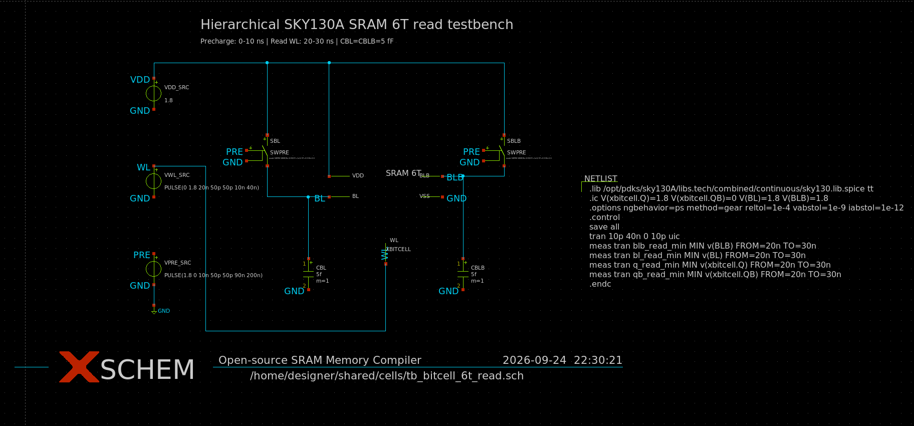

# Open-Source SRAM Memory Compiler

Compilador open-source de memória SRAM single-port baseado em uma bitcell 6T
para o PDK SKY130A. O escopo prevê profundidades de 4, 8, 16 e 32 palavras,
largura fixa de 8 bits e geração de GDSII, LEF, Verilog e .lib.

Este README consolida o [guia passo a passo da Pessoa 1](../passo_a_passo_pessoa1_bitcell6t-v2.md)
e os resultados do [relatório de validação](docs/relatorio_validacao_bitcell_6t_sky130.md).

## Escopo atual

O trabalho está concentrado nas leaf cells e na validação elétrica da bitcell:

- definição da topologia e do sizing;
- captura no Xschem;
- testbenches manual e hierárquico;
- simulação ngspice com SKY130A;
- sweep automatizado de capacitância, estado e corner;
- preparação de pré-carga, sense amplifier, driver de WL e driver de escrita.

O schematic freeze e o fechamento físico G6 das cinco leafs estão concluídos.
A coluna G7 reforçada e a wordline física representativa também têm DRC/LVS/PEX.
A requalificação elétrica pós-layout de leitura passou `60/60`; a de escrita
passou `56/60`, com quatro falhas porque a recuperação de BL/BLB excede a janela
vigente de 4 ns. Portanto, o fechamento da Fase 1 permanece aberto em G7.

## Configurações suportadas

O compilador terá largura fixa de 8 bits, uma palavra por linha física e as
seguintes profundidades:

| Configuração | Capacidade |
|---|---:|
| 4×8 | 32 bits |
| 8×8 | 64 bits |
| 16×8 | 128 bits |
| 32×8 | 256 bits |

A configuração 4×8 é o primeiro alvo de implementação e integração.

## Views e verificação previstas

Para cada configuração serão previstas as views GDSII, LEF, Verilog
comportamental e Liberty simplificada (`.lib`). A qualificação completa deverá
incluir DRC, LVS, caracterização temporal, potência dinâmica e estática, SNM e
avaliação nos corners TT, SS e FF.

## Toolchain

- SkyWater SKY130 / open_pdks
- Xschem e ngspice
- Magic e Netgen
- Python e gdstk
- Icarus Verilog e GTKWave
- Git

## Topologia da bitcell 6T

A célula é formada por dois inversores CMOS cruzados, dois NMOS de acesso e os
nós internos complementares Q e QB:

- MPL e MPR: PMOS pull-up, com fontes em VDD;
- MNL e MNR: NMOS pull-down, com fontes em VSS;
- MAL e MAR: NMOS de acesso, com gates em WL;
- MAL: conexão entre BL e Q;
- MAR: conexão entre BLB e QB.

Interface funcional:

~~~
BL  BLB  WL  VDD  VSS
~~~

Na expansão hierárquica do Xschem, o subcircuito aparece como:

~~~spice
.subckt bitcell_6t VDD BL BLB VSS WL
~~~

### Sizing e fórmulas

O guia define VDD = 1,8 V, L = 0,15 µm e nf = 1:

| Dispositivo | Função | Modelo | W (µm) | L (µm) |
|---|---|---|---:|---:|
| MPL, MPR | PMOS pull-up | sky130_fd_pr__pfet_01v8 | 0,42 | 0,15 |
| MNL, MNR | NMOS pull-down | sky130_fd_pr__nfet_01v8 | 0,84 | 0,15 |
| MAL, MAR | NMOS de acesso | sky130_fd_pr__nfet_01v8 | 0,60 | 0,15 |

A razão de leitura, ou beta-ratio, é:

\[
\beta = \frac{(W/L)_{\mathrm{pull-down}}}{(W/L)_{\mathrm{acesso}}}
\]

Com o sizing definido:

\[
\beta = \frac{0,84/0,15}{0,60/0,15}
       = \frac{0,84}{0,60}
       = 1,40
\]

O objetivo é manter o pull-down mais forte que o acesso e evitar read disturb.
O guia usa como referência β ≥ 1,2 a 1,5.

A razão de escrita, ou gamma-ratio, é:

\[
\gamma = \frac{(W/L)_{\mathrm{pull-up}}}{(W/L)_{\mathrm{acesso}}}
\]

Com o sizing definido:

\[
\gamma = \frac{0,42/0,15}{0,60/0,15}
        = \frac{0,42}{0,60}
        = 0,70 < 1,0
\]

O pull-up mais fraco facilita que o driver de escrita force a inversão do estado.

## Estrutura do projeto

~~~
.
├── cells/
│   ├── bitcell_6t.sch
│   ├── bitcell_6t.sym
│   ├── tb_bitcell_6t_read.sch
│   ├── sense_amp.sch
│   ├── precharge.sch
│   ├── wl_driver.sch
│   ├── write_driver.sch
│   └── README.md
├── sims/
│   ├── tb_bitcell_6t.spice
│   ├── tb_bitcell_6t_read.spice
│   ├── run_bitcell_read_sweep.py
│   └── bitcell_read_sweep.csv
├── specs/sram_6t_cell.md
└── docs/
    ├── relatorio_validacao_bitcell_6t_sky130.md
    └── assets/
        ├── bitcell_6t_xschem.png
        └── tb_bitcell_6t_read_xschem.png
~~~

## Ambiente SKY130A

Os testes foram executados no container isaiassh/unic-cass-tools:1.1.0:

~~~bash
export PDK=sky130A
export PDK_ROOT=/opt/pdks
~~~

Biblioteca contínua usada pelos decks:

~~~
/opt/pdks/sky130A/libs.tech/combined/continuous/sky130.lib.spice
~~~

Para iniciar o container localmente, sem VNC:

~~~bash
cd /home/danilo_cunha/projetos/ueletronica/entregas/ueletronica_projeto_final
make \
  SHARED_DIR=/home/danilo_cunha/projetos/ueletronica/projeto-sram \
  PDK=sky130A \
  DOCKER_TAG=1.1.0 \
  start
~~~

Dentro do container:

~~~bash
cd /home/designer/shared
export PDK=sky130A
export PDK_ROOT=/opt/pdks
~~~

## Xschem e testbench hierárquico

Abra a bitcell isolada com:

~~~bash
xschem cells/bitcell_6t.sch
~~~

O esquemático contém os seis transistores e os nós Q, QB, BL, BLB, WL, VDD
e VSS. A captura está em
[docs/assets/bitcell_6t_xschem.png](docs/assets/bitcell_6t_xschem.png).

Quando a bitcell é aberta diretamente, um smoke test `only_toplevel` carrega
o corner `tt`, aplica pré-carga e WL e grava `bitcell_6t.raw`. Esse bloco usa
`WPU/WPD/WACC=0.42/0.84/0.60 µm` e é omitido quando a célula participa da hierarquia.

O testbench visual de leitura é aberto com:

~~~bash
xschem cells/tb_bitcell_6t_read.sch
~~~

Hierarquia:

~~~
tb_bitcell_6t_read.sch
└── bitcell_6t.sym
    └── bitcell_6t.sch
~~~

O testbench representa VDD, WL, PRE, chaves ideais de pré-carga e capacitores
de 5 fF em BL e BLB. A sequência visual é pré-carga de 0 ns a 10 ns e leitura
com WL ativo de 20 ns a 30 ns.

A expansão histórica desse testbench confirma a antiga baseline da instância:

~~~spice
XBITCELL VDD BL BLB GND WL bitcell_6t WPU=0.42 WPD=0.84 WACC=0.60
~~~

Esse testbench permanece como baseline histórica em `WPD=0.84 µm`. Após o
fechamento elétrico pré-layout, o símbolo canônico passou a usar por padrão
`WPU/WPD/WACC=0.42/1.26/0.60 µm`. O botão **Simulate** do Xschem
executa o testbench hierárquico em `tt`; o deck externo e o sweep cobrem os
demais corners e o estado complementar. Os dois fluxos usam pré-carga
desligada durante toda a leitura. Os nós internos são medidos com os nomes
hierárquicos `xbitcell.Q` e `xbitcell.QB`.

## Testes manuais

### Retenção, leitura inicial e escrita

~~~bash
cd /home/designer/shared/sims
ngspice -n -b tb_bitcell_6t.spice | tee tb_bitcell_6t_tt.log
~~~

Resultado obtido:

~~~text
q_hold         = 1.800000e+00
qb_hold        = 1.659282e-08
q_read_min     = 1.799999e+00
q_after_write  = 1.648274e-08
qb_after_write = 1.800000e+00
~~~

Retenção e escrita passaram no sizing candidato. A leitura diferencial não foi
conclusiva porque BL e BLB estavam presas a fontes ideais de 1,8 V.

### Leitura com bitlines capacitivas

~~~bash
cd /home/designer/shared/sims
ngspice -n -b tb_bitcell_6t_read.spice | tee tb_bitcell_6t_read.log
~~~

Para CBL = CBLB = 5 fF:

~~~text
bl_pre       = 1.800000 V
blb_pre      = 1.800000 V
blb_21n      ≈ 0 V
delta_21n    = 1.85107198 V
q_read_min   = 1.772935 V
~~~

A margem diferencial é avaliada em 21 ns, com as bitlines isoladas da fonte
de pré-carga. A menor tensão da bitline durante a leitura continua disponível
como diagnóstico de descarga:

~~~spice
.meas tran blb_read_min MIN V(blb) FROM=20n TO=30n
~~~

## Sweep automatizado

O script sims/run_bitcell_read_sweep.py varia capacitância, estado armazenado,
bitline que deve descarregar e corner. A lista histórica era 5, 10, 20 e
50 fF. O screening de 60 fF fechou como evidência intermediária, mas o
orçamento corrigido inclui `Cwrite` e exige revalidação conservadora em 65 fF
para cobrir `C_BL,max=62,409659 fF` em 32 linhas.

Execução padrão:

~~~bash
cd /home/designer/shared/sims
python3 run_bitcell_read_sweep.py
~~~

Execução em uma seleção de corners:

~~~bash
python3 run_bitcell_read_sweep.py --corners tt ss sf
~~~

Foram executados 40 casos:

~~~
5 corners × 4 capacitâncias × 2 estados = 40 simulações
~~~

Critérios provisórios:

~~~
delta_21n >= 100 mV
nó armazenando 1 >= 0,9 V
pico do nó armazenando 0 <= 0,2 V
estado recuperado 5 ns após WL descer
~~~

Os limites são critérios provisórios da especificação do projeto, não valores
universais da literatura. No sizing atual `WPU/WPD/WACC=0,42/0,84/0,60 µm`,
12/40 casos passaram o limite de excursão do nó baixo. A menor diferença em
21 ns foi `1,78029642 V` em `ss/50 fF`; o diferencial passou em 40/40 casos.
Com `WPD=1,05 µm`, todos os 40 casos passaram e o pico máximo do nó baixo foi
`0,185621 V`. Essa variante permanece exploratória enquanto a escrita não for
qualificada com driver e critério de margem aprovados.

O gerador permite testar outras larguras de pull-down, por exemplo:

~~~bash
python3 run_bitcell_read_sweep.py --wpd 1.05 --output bitcell_read_sweep_wpd1p05.csv
~~~

O CSV é salvo em sims/bitcell_read_sweep.csv.

## Hold/Read SNM

O script `sims/run_bitcell_snm.py` gera as VTCs, as curvas borboleta e mede o
menor quadrado máximo entre os dois lóbulos para hold e leitura:

~~~bash
cd /home/designer/shared
python3 sims/run_bitcell_snm.py
~~~

| Corner | Hold SNM | Read SNM |
|---|---:|---:|
| tt | 704,953 mV | 348,804 mV |
| ff | 681,541 mV | 319,564 mV |
| ss | 723,615 mV | 367,942 mV |
| fs | 730,281 mV | 399,390 mV |
| sf | 646,567 mV | 288,342 mV |

Artefatos: `sims/bitcell_snm_summary.csv`, `sims/bitcell_snm_curves.csv` e
`docs/assets/bitcell_6t_snm_butterfly.png`.

Sizing exploratório `WPD=1,05 µm`: menor Hold/Read SNM de
`642,994/332,353 mV`; o sizing original tem `646,567/288,342 mV`.

Adotando a recomendação de engenharia de `Read SNM >= 0,4 V` no ponto nominal
(`tt`, 1,8 V), os resultados são: `WPD=0,84 µm` = `0,349 V` (FAIL),
`WPD=1,05 µm` = `0,388 V` (FAIL) e `WPD=1,26 µm` = `0,414 V` (PASS).

## Escrita e WLVM

O smoke full-swing passou em 30/30 casos (`WPD=0,84/1,05/1,26 µm`, cinco
corners, dois sentidos). A medida dinâmica WLVM reduz a amplitude de `WL` até
o limite de escrita para um pulso de 10 ns. O pior WLVM foi `0,619 V` para
`WPD=0,84 µm` e `0,605 V` para `1,05 µm`, no corner `fs`; a resolução é 14 mV.
Os bitlines são fontes ideais e ainda falta definir o limite WLVM aceitável.
Dados: `sims/bitcell_write_smoke_sweep.csv` e
`sims/bitcell_write_margin_wlvm.csv`.

Com o write driver transistor-level, o tempo de flip completo foi definido
como ambos os nós internos atingindo `90%/10%` de VDD. Para `WPD=1,26 µm`,
o sweep em `VDD=1,62 V`, cinco corners, `-40/27/125 °C` e ambos os sentidos
passou `30/30`; o pior flip foi `0,3216 ns` (`ss`, -40 °C, 0→1). Aplicando
a margem de 30%, o limite inferior provisório de WL é `0,418 ns`. O resultado
ainda usa `50 fF` por bitline, portanto não é o valor final da janela.

Para capacitância de coluna, o projeto passa a usar
`C_BL = Nrows × (0,2 fF + Cwire/célula) + Cprecharge + Cwrite + Cmux + Csense` e
uma estimativa conservadora pré-layout dessa expressão como carga de projeto
para o freeze. A parcela apenas de dreno é
`0,8/1,6/3,2/6,4 fF` para profundidades `4/8/16/32`. Como a arquitetura
atual usa uma palavra por linha física e um par de bitlines por bit, não há
column mux (`Cmux=0`) e `Nrows` fica fechado em `4/8/16/32`. O valor de
`50 fF` era a triagem da topologia antiga do sense amplifier. Com a entrada
do latch atual medida em até `9,004605 fF` e o write driver tri-state desligado
adicionando até `4,033129 fF`, o orçamento de 32 linhas passa para
`62,409659 fF`; `65 fF` é a nova triagem conservadora.
Ainda faltam validação elétrica nessa carga e verificação da capacitância
durante a excursão da bitline. Depois do schematic freeze e do layout, o PEX
substitui a estimativa e o teto de requalificação passa a ser
`C_BL,max = 1,15 × C_BL,PEX`.

## Estado do projeto

| Item | Estado |
|---|---|
| Topologia 6T | definida |
| Fórmulas beta-ratio e gamma-ratio | documentadas |
| Captura da bitcell no Xschem | criada |
| Símbolo hierárquico | criado e expandido no netlist |
| Testbench hierárquico | netlist e simulação ngspice executados em `tt` |
| Retenção manual | passou no sizing candidato em `tt` |
| Escrita manual | passou no sizing candidato em `tt` |
| Leitura capacitiva | sizing 0,84 µm falhou excursão em 28/40; sizing 1,05 µm passou 40/40 |
| Sweep de capacitância | automatizado |
| Corners tt, ff, ss, fs, sf | diferencial passou 40/40; read disturb depende do sizing |
| Sense amplifier, pré-carga e wl_driver | leafs e variantes físicas reforçadas com DRC/LVS/PEX; leitura pós-layout `60/60 PASS`; escrita integrada `56/60 PASS`, com quatro falhas de recuperação de bitline na janela de 4 ns |
| Baseline histórica 0,42/0,84/0,60 µm | gate de read disturb reprovado; substituída no esquema canônico |
| Sizing exploratório 0,42/1,05/0,60 µm | leitura 40/40 nominal, mas 72/90 na triagem PVT/50 fF; não selecionado |
| Sizing canônico congelado 0,42/1,26/0,60 µm | único candidato testado que atende Read SNM nominal >=0,4 V (`0,414349 V`); G1/G2/G3/G4 fechados para screening pré-layout e sizing aplicado em `bitcell_6t.sch/.sym` |
| Faixa de alimentação | qualificação contínua em 1,62–1,80 V; 1,95 V mantido somente como limite estático/auditoria do modelo 01v8; 1,98 V não é qualificável com o modelo atual |
| Auditoria de terminal | leitura a VDD=1,95 V excedeu 1,95 V em 30/30 cenários (pior 2,056858 V); a 1,62/1,80 V não excedeu no mesmo testbench |
| Fuga em hold | 90/90 estados estáveis; na faixa qualificada, pior corrente total `20,0676 nA/célula` e potência VDD `36,1079 nW/célula` (`fs`, 1,80 V, 125 °C); sem teto macro de potência aprovado |
| Monte Carlo de SNM | 200 seeds de Read e 200 de Hold em `sf_mm`; critério estatístico/yield e mismatch de escrita pendentes |
| Write driver | conectividade corrigida; G1 em 65 fF passou `60/60`. Na integração com precharge + write driver + WL driver + bitcell, `65 fF + 17 fF` de carga de WL, `WE=2,20 ns`, `WL_IN` assertada em `3,20 ns` e largura `1,0 ns` passaram `60/60`; pior full flip `0,37283 ns`, `WL_min(+30%)=0,484679 ns` |
| Hold/Read SNM | medidos em `tt/ff/ss/fs/sf`; pior Read SNM=288,342 mV |
| WLVM, leakage e Monte Carlo | WLVM exploratório e leakage/MC de SNM medidos; o sense possui critério estatístico de engenharia para freeze, enquanto potência macro continua sem requisito numérico aprovado |
| Layout, DRC, LVS e parasitas | G6 físico fechado nas cinco leafs. No G7, a coluna 32× reforçada fecha Magic DRC `0`, Netgen LVS único e PEX; `C_BL,PEX,max=452,580954 fF`, com teto `520,468097 fF`. Requalificação integrada concluída: leitura `60/60 PASS`; escrita `56/60 PASS`, com quatro falhas de recuperação na janela de 4 ns. |

## Limitações e próximos passos

1. G7 continua aberto por quatro falhas de recuperação de escrita em `sf/ss`,
   1,62 V/−40 °C. A matriz pós-layout de leitura passou `60/60`; a de escrita,
   `56/60`. Diagnósticos focais confirmaram recuperação entre `4,03137` e
   `4,18573 ns`, acima da janela vigente de 4 ns.
2. Reforçar fisicamente o precharge e, se necessário, o write driver. Depois,
   repetir DRC/LVS/PEX da coluna, recalcular `C_BL,PEX` e o teto `1,15×`, e
   reexecutar as qualificações afetadas antes de fechar G7.
3. Ruído estatístico/yield formal, teto de potência macro e mismatch ampliado
   permanecem trabalhos posteriores, sem bloquear o fechamento técnico atual da
   Fase 1.

## Documentação relacionada

- [Guia passo a passo da bitcell 6T](../passo_a_passo_pessoa1_bitcell6t-v2.md)
- [Relatório de validação SKY130A](docs/relatorio_validacao_bitcell_6t_sky130.md)
- [Contrato das leaf cells](cells/README.md)
- [Gates de fechamento da Fase 1](docs/phase1_leaf_cell_closure.md)
- [Especificação da célula](specs/sram_6t_cell.md)
- [Especificação técnica do projeto](specs/technical_specification.md)
