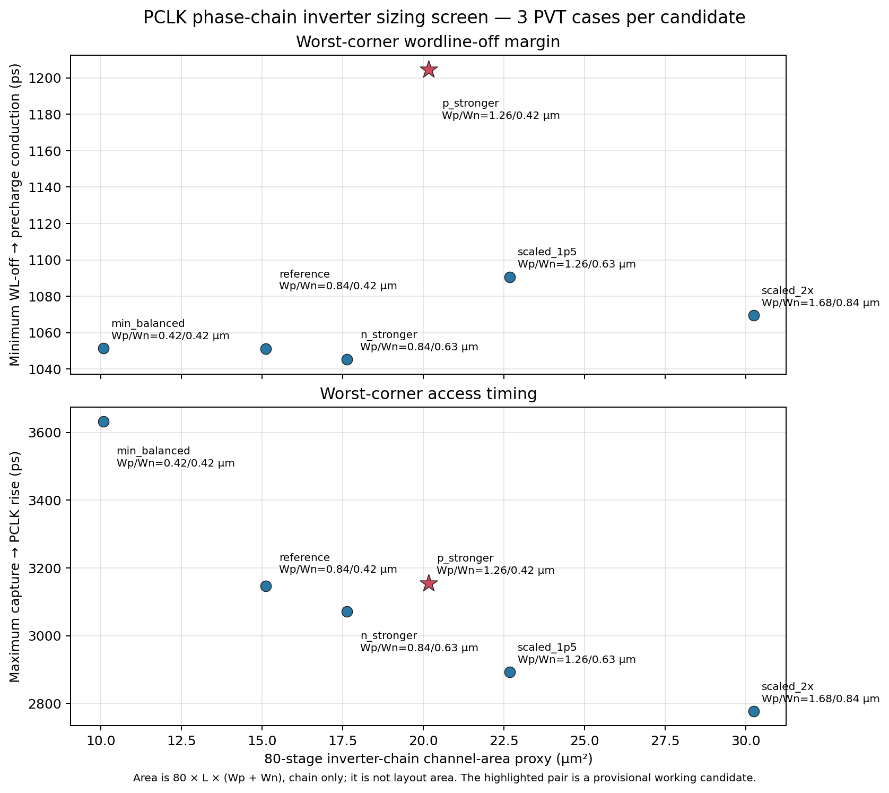

# PCLK phase-chain inverter sizing screen — 2026-10-09

## Status

The provisional working size for the 80 delay-chain inverters is now
`Wp=1.26 µm`, `Wn=0.42 µm`, `L=0.15 µm`, `nf=1`. This pair produced the
largest minimum timing margins in the six-pair screen and passed the selected
candidate's 26-case decoder/precharge interface matrix. The schematic still
has no layout, DRC, LVS, or extracted phase-cell parasitics, so this is a
schematic-level working choice rather than a physical signoff.

This block-level choice follows the stated priority of electrical margin and
robustness. It does not change the open system-level trade-off in §24 of the
technical specification, and it does not establish an allowed clock period or
maximum operating frequency.

## Method

The checked-in Xschem hierarchy contains an 80-stage CMOS inverter chain with
taps at stages 24, 60, and 80. The phase equations, tap counts, output-gate
sizes, PDK models, decoder, wordline driver, precharge PEX, and loads were held
constant. The screen applied candidate PFET/NFET widths to the
`phase_delay_inv` subcircuit after Xschem generated its SKY130A netlist. The
checked-in schematic was not changed during the six-candidate sweep. Once a
candidate was selected, its PFET width was updated in the generated schematic
and generator; a direct-source run then confirmed the generated subcircuit is
byte-for-byte identical to the subcircuit used in the selected candidate's
26-case matrix.

All candidates use `nf=1` and widths at or above `0.42 µm`. The SKY130 Xschem
dimension helper flags a `pfet_01v8` or `nfet_01v8` finger narrower than
`0.42 µm`; this is a schematic geometry floor, not a replacement for layout
DRC. See the [SKY130 Xschem device-dimension check](https://github.com/StefanSchippers/xschem_sky130/blob/main/xschemrc#L2559-L2588).

Each candidate was simulated at TT (`1.80 V`, `27 °C`), SS (`1.62 V`,
`−40 °C`), and FF (`1.80 V`, `125 °C`) for one valid read from address 0 to 3.
The 5 ps transient maximum step, 24/60/80 taps, 22 ns clock falling edge,
3.4 ns settling allowance, 102.873935496 fF row load, and 597.056241 fF
bitline effective-load ceiling were common to all runs. Each case uses the
current decoder and wordline-driver PEX and eight instances of Danilo's pinned
W2.52 precharge PEX. That precharge source remains unchanged.

The area figure below is only a chain channel-area proxy:
`80 × L × (Wp + Wn)`. It excludes diffusion, wells, contacts, routing, phase
logic, and all placement/layout effects. No power or energy result was
measured.

## Six-pair sweep

| Candidate | Wp / Wn (µm) | Chain area proxy (µm²) | Capture→PCLK range (ps) | Minimum PRECH release lead (ps) | Minimum PCLK-fall→precharge (ps) | Minimum WL-off clearance (ps) | Minimum BL before evaluation (V) | Result |
|---|---:|---:|---:|---:|---:|---:|---:|---|
| Minimum balanced | 0.42 / 0.42 | 10.08 | 1740–3633 | 268.9 | 2110.7 | 1051.4 | 1.624994 | 3/3 pass |
| Reference | 0.84 / 0.42 | 15.12 | 1725–3147 | 265.7 | 2110.5 | 1051.1 | 1.624981 | 3/3 pass |
| PFET stronger | 1.26 / 0.42 | 20.16 | 1837–3155 | 334.2 | 2263.9 | 1204.6 | 1.624982 | 3/3 pass |
| NFET stronger | 0.84 / 0.63 | 17.64 | 1727–3071 | 266.2 | 2104.5 | 1045.2 | 1.624977 | 3/3 pass |
| Scaled 1.5× | 1.26 / 0.63 | 22.68 | 1757–2892 | 285.7 | 2150.0 | 1090.6 | 1.624962 | 3/3 pass |
| Scaled 2× | 1.68 / 0.84 | 30.24 | 1742–2777 | 277.3 | 2128.7 | 1069.4 | 1.624946 | 3/3 pass |

The PFET-stronger pair had the highest minimum PRECH release lead and WL-off
clearance among these six pairs. Compared with the reference pair, it increased
the chain-only area proxy by 33.3%, increased the worst measured WL-off
clearance by about 153 ps, and increased the worst measured PRECH release lead
by about 68 ps. Its maximum capture-to-PCLK delay was about 8 ps higher than
the reference in this three-corner sample. These values are measured at the
listed test conditions; no project timing limits have yet been assigned to
them.



Sweep data and per-candidate netlists are in
[`phase_delay_sizing_20261009`](../sims/row_decoder/results/phase_delay_sizing_20261009/summary.csv)
and its neighboring candidate directories. The campaign manifest records the
inputs, sizing pairs, tool runs, and result paths.

## Selected-pair full matrix

The `Wp=1.26 µm`, `Wn=0.42 µm` pair was then checked with the broader
decoder/WL/precharge PEX matrix:

| Profile | Cases | Minimum release lead (ps) | Minimum PCLK-fall→precharge (ps) | Minimum WL-off clearance (ps) | Capture→PCLK (ns) |
|---|---:|---:|---:|---:|---:|
| TT | 14 | 436.6 | 2604.0 | 1451.8 | 2.119 |
| SS | 4 | 692.5 | 3877.1 | 2302.1 | 3.155 |
| FF | 8 | 334.1 | 2263.9 | 1203.3 | 1.837 |
| **Total** | **26** |  |  |  |  |

All **26/26 cases passed**, with **3,540/3,540 checks passing**. TT includes
eight valid read/write address cases and six invalid/idle control vectors; SS
contains two address transitions for both read and write; FF covers all four
rows for both read and write. The minimum bitline voltage before evaluation
was `1.624982 V` in SS, above the bench threshold of `1.458 V` (90% of 1.62 V).
The valid cases passed the decoder model-envelope and terminal-magnitude
screens. Invalid/idle cases kept PCLK suppressed and PRECH active.

The full-matrix outputs are preserved here:

- [TT valid, 8 cases](../sims/row_decoder/results/phase_delay_sizing_p_stronger_full_20261009/tt_valid/manifest.json)
- [TT invalid/idle, 6 cases](../sims/row_decoder/results/phase_delay_sizing_p_stronger_full_20261009/tt_invalid/manifest.json)
- [SS valid, 4 cases](../sims/row_decoder/results/phase_delay_sizing_p_stronger_full_20261009/ss_valid/manifest.json)
- [FF valid, 8 cases](../sims/row_decoder/results/phase_delay_sizing_p_stronger_full_20261009/ff_valid/manifest.json)
- [Direct-source TT check, 1 case](../sims/row_decoder/results/phase_delay_sizing_p_stronger_full_20261009/direct_source_tt_check/manifest.json)

The direct-source TT check used the updated Xschem schematic without width
overrides and passed 1/1 case. Its generated phase subcircuit SHA-256 matches
the subcircuit used for the full matrix:
`f882066ff08c9f412473bf9400e0ec1a19509d4bc1a3f0aeb7b5b1cbf568b8f9`.

## Limits and remaining work

- The external `CLK` and `VALID_ACCESS_Q` are still ideal sources; capture and
  qualification logic are not part of this cell.
- The matrix checks decoder, wordline, and precharge timing. It does not include
  6T access devices, actual stored-data readback, the sense amplifier, or a
  complete SRAM transaction.
- The 22 ns clock-fall schedule and 3.4 ns settling allowance are bench
  settings. The project has not approved a minimum clock period or maximum
  frequency from this result.
- The phase cell still needs reviewed layout, DRC, LVS, and parasitic
  extraction. No new extraction was run here; phase-cell extraction is a
  compute-heavy follow-up and should be scheduled on the stronger machine.
- The phase source must be checked again with captured control timing, legal
  access-period and low-phase requirements, and the integrated bitcell and
  sense-amplifier path before electrical signoff.

The next targeted check varies idealized `VALID_ACCESS_Q` arrival and enforces
the experimental 250 ps PRECH-release guard in transistor-level phase-source
mode. Results and the remaining capture/qualification work are recorded in
the [arrival-skew report](row_decoder_valid_access_arrival_skew_20261009.md).

## Reproduction

Run the six-candidate screen from the repository root with a fresh output
directory:

```bash
./tools/sram-eda python3 sims/row_decoder/run_phase_delay_sizing_screen.py \
  --output-dir sims/row_decoder/results/phase_delay_sizing_repro
```

To reproduce the selected pair's full matrix, use:

```bash
COMMON=(--phase-ps 2100 --clk-fall-ps 22000 --settling-allowance-ns 3.4 \
  --wl-cap-ff 102.873935496 --step-ps 5 \
  --phase-source xschem-tapped-delay-chain \
  --delay-release-stages 24 --delay-evaluation-stages 60 \
  --delay-reassert-stages 80 --phase-delay-pfet-w-um 1.26 \
  --phase-delay-nfet-w-um 0.42)

./tools/sram-eda python3 sims/row_decoder/run_precharge_phase_interface.py \
  --profiles tt --transitions 0:0 0:1 0:2 0:3 \
  --control-vectors 001 010 --transitions-per-vector "${COMMON[@]}" \
  --output-dir sims/row_decoder/results/phase_sizing_repro/tt_valid

./tools/sram-eda python3 sims/row_decoder/run_precharge_phase_interface.py \
  --profiles tt --transitions 0:3 \
  --control-vectors 000 011 100 101 110 111 "${COMMON[@]}" \
  --output-dir sims/row_decoder/results/phase_sizing_repro/tt_invalid

./tools/sram-eda python3 sims/row_decoder/run_precharge_phase_interface.py \
  --profiles slow --transitions 1:2 3:0 \
  --control-vectors 001 010 --transitions-per-vector "${COMMON[@]}" \
  --output-dir sims/row_decoder/results/phase_sizing_repro/ss_valid

./tools/sram-eda python3 sims/row_decoder/run_precharge_phase_interface.py \
  --profiles fast --transitions 0:0 0:1 0:2 0:3 \
  --control-vectors 001 010 --transitions-per-vector "${COMMON[@]}" \
  --output-dir sims/row_decoder/results/phase_sizing_repro/ff_valid
```

Regenerate the comparison plot with:

```bash
./tools/sram-eda python3 sims/row_decoder/plot_phase_delay_sizing_screen.py
```
