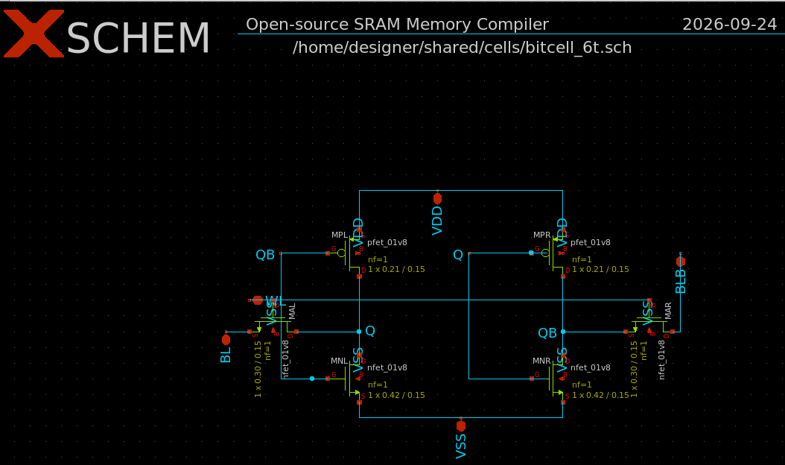

# Relatório de desenvolvimento e validação da bitcell SRAM 6T

## Escopo

Este documento registra o desenvolvimento da célula SRAM 6T single-port para SKY130A, incluindo a preparação dos esquemáticos, a criação do testbench hierárquico no Xschem, os testes manuais em ngspice e a automação da varredura de leitura.

O relatório separa resultados executados daqueles que continuam pendentes. A presença de um resultado PASS neste documento não substitui netlist final, caracterização completa, DRC, LVS ou validação do layout.

## Ambiente utilizado

Os testes foram executados no container:

~~~text
isaiassh/unic-cass-tools:1.1.0
~~~

Configuração usada:

~~~text
PDK=sky130A
PDK_ROOT=/opt/pdks
ngspice=44.2
~~~

O projeto foi montado no container em:

~~~text
/home/designer/shared
~~~

O PDK SKY130A usado nos decks está em:

~~~text
/opt/pdks/sky130A
~~~

Biblioteca de modelos:

~~~text
/opt/pdks/sky130A/libs.tech/combined/continuous/sky130.lib.spice
~~~

## 1. Topologia definida

A bitcell possui uma porta de leitura/escrita e seis transistores:

- dois inversores CMOS cruzados, formando o biestável;
- dois NMOS de acesso conectados a BL e BLB;
- uma linha de palavra WL comum aos transistores de acesso;
- nós internos complementares Q e QB;
- alimentação VDD e VSS.

O contrato externo da bitcell é:

~~~text
BL BLB WL VDD VSS
~~~

O sizing de projeto definido inicialmente foi:

| Dispositivos | Função | W (um) | L (um) |
|---|---|---:|---:|
| PMOS pull-up | restauração lógica | 0,21 | 0,15 |
| NMOS pull-down | estabilidade de leitura | 0,42 | 0,15 |
| NMOS de acesso | leitura e escrita | 0,30 | 0,15 |

As razões previstas são:

~~~text
beta  = Wpull-down / Waccess = 0,42 / 0,30 = 1,40
gamma = Wpull-up   / Waccess = 0,21 / 0,30 = 0,70
~~~

Esses valores são requisitos de projeto. Eles ainda não foram validados no modelo contínuo usado nos testes, porque o runtime não encontrou bins válidos para W=0,21 um e W=0,30 um na forma de instância utilizada.

## 2. Captura manual dos esquemáticos

### Esquemático da bitcell 6T no Xschem

*Figura 1. Captura do esquemático da bitcell SRAM 6T com os nós Q, QB, BL, BLB, WL, VDD e VSS.*

### Testbench hierárquico de leitura no Xschem

Foi criado um símbolo hierárquico para a bitcell e um testbench visual de
leitura com a seguinte estrutura:

~~~text
tb_bitcell_6t_read.sch
└── bitcell_6t.sym
    └── bitcell_6t.sch
~~~

O testbench contém a instância `XBITCELL`, fontes de `VDD`, `WL` e `PRE`,
chaves ideais de pré-carga em `BL` e `BLB`, capacitores de 5 fF nas bitlines e
um bloco de controle com as medições de leitura. A sequência representada é:

- pré-carga de 0 ns a 10 ns;
- leitura com `WL` ativo de 20 ns a 30 ns;
- observação de `BL`, `BLB` e `Q`.

*Figura 2. Testbench hierárquico de leitura com a bitcell, pré-carga, capacitâncias de bitline e bloco de controle SKY130A.*

Arquivos criados:

~~~text
cells/bitcell_6t.sym
cells/tb_bitcell_6t_read.sch
~~~

A geração do netlist hierárquico foi verificada. O símbolo expandiu a célula
com a interface `VDD BL BLB VSS WL`, preservando a conectividade dos seis
transistores e dos nós internos `Q` e `QB`. A captura é usada para inspeção
visual e edição dos estímulos; a validação elétrica oficial continua sendo
executada pelo deck externo `sims/tb_bitcell_6t_read.spice`.

Foram preparados os seguintes arquivos em cells/:

| Arquivo | Função | Estado |
|---|---|---|
| bitcell_6t.sch | bitcell SRAM 6T | captura canônica, ainda não aprovada por netlist |
| sense_amp.sch | voltage-latch sense amplifier | rascunho estrutural |
| precharge.sch | pré-carga e equalização | rascunho estrutural |
| wl_driver.sch | driver de WL | rascunho estrutural |
| write_driver.sch | driver diferencial de escrita | rascunho estrutural |
| cells/README.md | contrato de pinos | documentado |

Os nomes de sinais foram padronizados como:

~~~text
BL BLB WL SCLK PRECH DATA DATA_B WE VDD VSS SA_OUT SA_OUTB
~~~

O sense_amp foi definido como um latch diferencial habilitado por SCLK. Os símbolos .sym ainda não foram considerados aprovados, pois a inspeção de conectividade e a geração de netlist do Xschem não foram concluídas.

## 3. Preparação do ambiente gráfico

Inicialmente foi tentado o modo VNC. A porta 80 já estava ocupada pelo container esafe-traefik, causando:

~~~text
Bind for :::80 failed: port is already allocated
~~~

O problema foi contornado usando portas alternativas durante a tentativa VNC:

~~~text
WEBSERVER_PORT=8081
VNC_PORT=5902
JUPYTER_PORT=8889
~~~

Em seguida foi escolhido o modo local, sem VNC, com DISPLAY=:0 e o socket X11 do host:

~~~bash
make \
  SHARED_DIR=/home/danilo_cunha/projetos/ueletronica/projeto-sram/Open-source-sram-memory-compiler \
  PDK=sky130A \
  DOCKER_TAG=1.1.0 \
  start
~~~

Dentro do container, o Xschem foi aberto com:

~~~bash
cd /home/designer/shared
export PDK=sky130A
export PDK_ROOT=/opt/pdks
xschem cells/bitcell_6t.sch
~~~

## 4. Problema encontrado no netlist Xschem

Ao tentar simular diretamente bitcell_6t.sch, o Xschem gerou instâncias como:

~~~text
XMP1 ... sky130_fd_pr__pfet_01v8
~~~

O ngspice reportou:

~~~text
Unknown subckt: xmp1 ... sky130_fd_pr__pfet_01v8
~~~

Os símbolos sky130_fd_pr/pfet_01v8.sym e nfet_01v8.sym geram instâncias X, enquanto a biblioteca contínua usada pelo smoke test fornece modelos compatíveis com outra forma de instanciação. Por isso, a simulação direta do esquemático Xschem ficou pendente.

Os avisos sobre arquivos OSDI, como psp103_nqs.osdi, não foram a causa fatal desse erro.

### 4.1 Separação entre captura hierárquica e deck elétrico

O testbench hierárquico foi criado para permitir a inspeção visual da
conexão entre a bitcell e o circuito de pré-carga. A expansão Xschem foi
confirmada no arquivo de simulação com a instância:

~~~spice
XBITCELL VDD BL BLB GND WL bitcell_6t
.subckt bitcell_6t VDD BL BLB VSS WL
~~~

Essa verificação comprova a hierarquia e a ordem dos pinos, mas não substitui
a execução elétrica do deck externo já validado. A simulação hierárquica pelo
botão de simulação do Xschem permanece condicionada à compatibilidade entre os
modelos gerados pelos símbolos `sky130_fd_pr` e a biblioteca contínua carregada
no container.

## 5. Testes manuais sem automação

### 5.1 Testbench manual de retenção, leitura inicial e escrita

Arquivo:

~~~text
sims/tb_bitcell_6t.spice
~~~

Execução:

~~~bash
cd /home/designer/shared/sims
ngspice -n -b tb_bitcell_6t.spice | tee tb_bitcell_6t_tt.log
~~~

Resultado obtido:

~~~text
q_hold              = 1.800000e+00
qb_hold             = 3.777216e-08
bl_read             = 1.800000e+00
blb_read            = 1.800000e+00
q_read_min          = 1.799998e+00
q_after_write       = 3.769092e-08
qb_after_write      = 1.800000e+00
ngspice-44.2 done
~~~

Interpretação:

| Verificação | Resultado |
|---|---|
| retenção de Q=1, QB=0 | passou |
| escrita para Q=0, QB=1 | passou |
| execução do ngspice | passou |
| diferencial real de leitura | não validado neste deck |

A leitura não foi validada nesse primeiro deck porque BL e BLB estavam presas a fontes ideais de 1,8 V.

Esse deck também usou, por limitação do modelo contínuo, o sizing provisório:

~~~text
WPU=WPD=WACC=0,42 um
~~~

### 5.2 Testbench manual de leitura com bitlines capacitivas

Arquivo:

~~~text
sims/tb_bitcell_6t_read.spice
~~~

O segundo deck acrescentou:

- chaves controladas para pré-carga;
- capacitâncias em BL e BLB;
- liberação das bitlines durante WL;
- medição de BLB mínimo para o estado Q=1, QB=0;
- medição de BL mínimo para o estado inverso Q=0, QB=1;
- medição do nó armazenado em nível alto para verificar read disturb.

Execução manual:

~~~bash
cd /home/designer/shared/sims
ngspice -n -b tb_bitcell_6t_read.spice | tee tb_bitcell_6t_read_5f.log
~~~

Para CBL=CBLB=5 fF, o resultado foi:

~~~text
bl_pre              = 1.800000 V
blb_pre             = 1.800000 V
blb_read_min        = 0.9531515 V
delta_max           = 1.8 - 0.9531515 = 0.8468485 V
q_read_min          = 1.799998 V
~~~

O valor medido em 29 ns foi somente 1,08432 mV, porque o diferencial já havia se recuperado nesse instante. A métrica correta passou a ser a maior queda durante toda a janela de leitura:

~~~spice
.meas tran blb_read_min MIN V(blb) FROM=20n TO=30n
~~~

Uma diretiva .meas deve estar dentro do arquivo SPICE. Ela não pode ser digitada diretamente no Bash.

## 6. Automação da varredura

Foi criado o script:

~~~text
sims/run_bitcell_read_sweep.py
~~~

O script:

1. lê tb_bitcell_6t_read.spice como template;
2. troca a capacitância de BL e BLB;
3. testa os estados Q=1/QB=0 e Q=0/QB=1;
4. troca automaticamente o corner do .lib;
5. executa o ngspice em arquivos temporários;
6. extrai bl_read_min, blb_read_min, q_read_min e qb_read_min;
7. calcula delta_max na bitline que deve descarregar;
8. verifica o nó armazenado em nível alto;
9. salva o resultado em CSV;
10. retorna código diferente de zero se algum caso falhar.

Critérios usados pelo script:

~~~text
delta_max >= 50 mV
nó armazenado em nível alto >= 0,9 V
~~~

O segundo critério é selecionado corretamente para cada estado. Quando Q=0, Q próximo de zero é esperado; nesse caso, o script verifica QB.

### 6.1 Execução padrão

~~~bash
cd /home/designer/shared/sims
python3 run_bitcell_read_sweep.py
~~~

Essa execução usa o corner padrão tt e quatro capacitâncias:

~~~text
5 fF, 10 fF, 20 fF e 50 fF
~~~

### 6.2 Execução em todos os corners

~~~bash
python3 run_bitcell_read_sweep.py --corners tt ff ss fs sf
~~~

Essa execução cobre:

~~~text
5 corners × 4 capacitâncias × 2 estados = 40 simulações
~~~

Relatório gerado:

~~~text
sims/bitcell_read_sweep.csv
~~~

## 7. Resultado automatizado nos corners SKY130A

Todos os 40 casos executados retornaram PASS com os critérios provisórios do script.

O pior caso foi:

| Corner | Capacitância | Estado | Bitline descarregada | delta_max |
|---|---:|---:|---|---:|
| ss | 50 fF | Q=1 ou Q=0 | BLB ou BL | 67,325 mV |

Menores margens por corner em 50 fF:

| Corner | delta_max mínimo |
|---|---:|
| tt | 90,174 mV |
| ff | 116,404 mV |
| ss | 67,325 mV |
| fs | 71,310 mV |
| sf | 111,131 mV |

Esses resultados mostram margem acima do critério automatizado de 50 mV para o modelo e o sizing provisório usados.

## 8. Limitações e interpretação dos resultados

Os resultados não constituem sign-off da bitcell. Permanecem as seguintes limitações:

1. O teste automatizado usa WPU=WPD=WACC=0,42 um, não o sizing alvo WPU=0,21 um, WPD=0,42 um e WACC=0,30 um.
2. O modelo contínuo disponível rejeitou os bins necessários para os valores menores de largura na forma de instância usada.
3. O critério automatizado foi delta_max >= 50 mV, enquanto a especificação inicial registra como meta provisória 100 mV. No pior caso ss/50 fF, a margem de 67,325 mV passa o critério automatizado, mas não passa a meta de 100 mV.
4. O netlist gerado diretamente pelos símbolos Xschem ainda não foi validado contra a biblioteca carregada no container.
5. sense_amp, precharge, wl_driver e write_driver ainda não possuem testbenches elétricos aprovados.
6. Não foram executados SNM de retenção, SNM de leitura, write margin, leakage, Monte Carlo de mismatch, DRC, LVS ou extração parasitária.
7. A bitline foi representada por um modelo simples de chave e capacitor. Esse modelo ainda não representa a coluna completa, a resistência dos drivers, o sense amplifier ou a distribuição real de parasitas.

## 9. Estado atual

| Item | Estado |
|---|---|
| topologia 6T | definida |
| contrato de pinos | definido |
| captura inicial Xschem | criada, pendente de netlist compatível |
| retenção manual | passou no sizing provisório |
| escrita manual | passou no sizing provisório |
| leitura com bitlines ideais | não conclusiva |
| leitura com bitlines capacitivas | passou com critério de 50 mV |
| sweep de capacitância | automatizado |
| corners tt/ff/ss/fs/sf | 40 casos executados, todos PASS no critério de 50 mV |
| símbolo hierárquico da bitcell | criado e expandido no netlist Xschem |
| testbench hierárquico de leitura | criado para inspeção visual; deck externo permanece oficial |
| sizing alvo 0,21/0,42/0,30 um | pendente |
| sense amplifier | pendente |
| drivers e pré-carga | pendentes |
| SNM, write margin e leakage | pendentes |
| layout, DRC e LVS | pendentes |

## 10. Próximos testes

A sequência recomendada é:

1. Resolver a compatibilidade entre os símbolos Xschem e os modelos SKY130A usados no ngspice.
2. Reexecutar a varredura com o sizing alvo.
3. Automatizar retenção e escrita nos cinco corners.
4. Testar o precharge com equalização e desligamento correto.
5. Testar o write_driver com DATA, DATA_B e WE.
6. Testar o wl_driver, medindo amplitude e atraso de WL.
7. Criar o testbench do sense_amp com diferenças de entrada de 5 mV a 20 mV.
8. Integrar a sequência precharge -> write -> hold -> read -> SCLK.
9. Medir SNM, write margin, leakage e variação Monte Carlo.
10. Só depois iniciar layout, DRC, LVS e extração parasitária.
