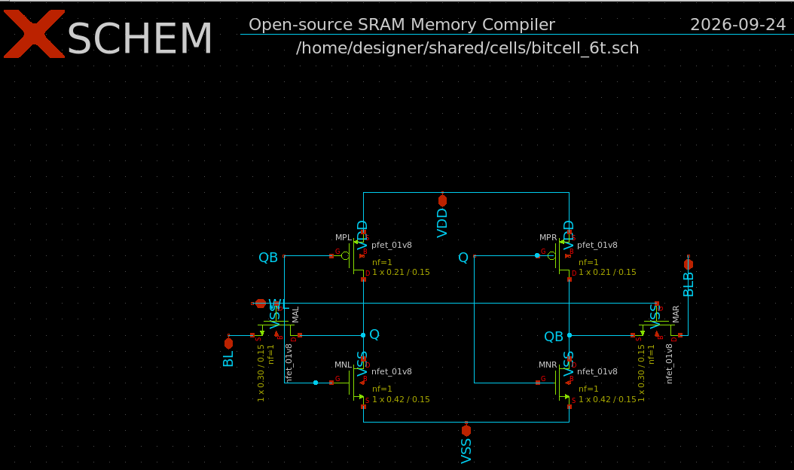
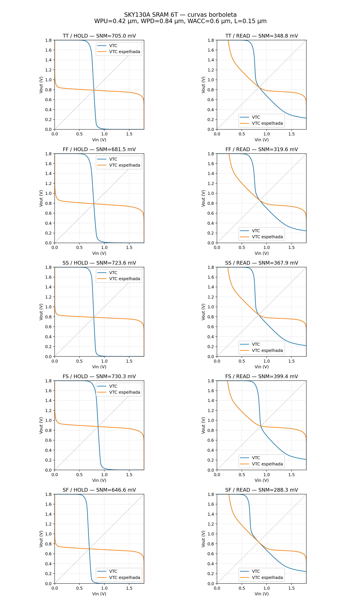
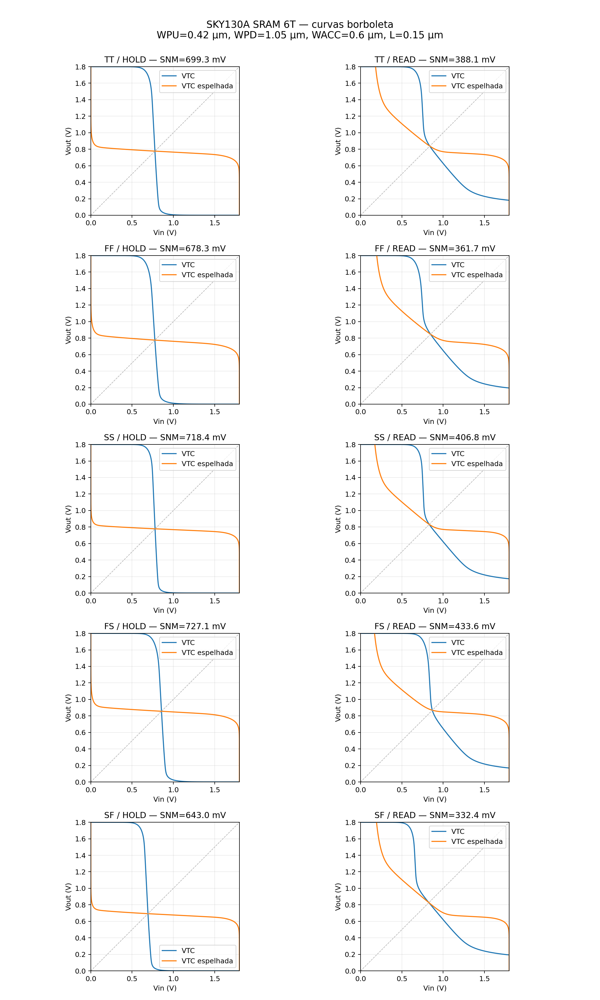
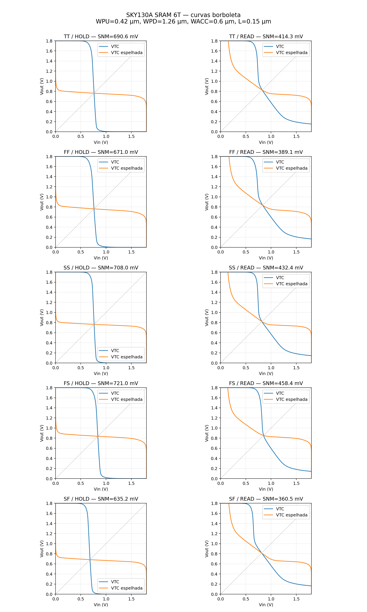

# Relatório de desenvolvimento e validação da bitcell SRAM 6T

> **Atualização de 03/10/2026:** este relatório preserva resultados de
> caracterizações anteriores, muitas delas a 50 fF e com periféricos ainda em
> desenvolvimento. A entrada do sense amplifier atual foi medida em
> `7,853676–9,004605 fF` e o write driver desligado acrescenta até
> `4,033129 fF`, elevando o orçamento de 32 linhas a `62,409659 fF`.
> A triagem histórica em 60 fF foi supersedida; a revalidação conservadora
> corrente usa 65 fF. O estado atual
> e os gates da Fase 1 estão em
> [`phase1_leaf_cell_closure.md`](phase1_leaf_cell_closure.md).

## Escopo

Este documento registra o desenvolvimento da célula SRAM 6T single-port para SKY130A, incluindo a preparação dos esquemáticos, a criação do testbench hierárquico no Xschem, os testes manuais em ngspice e a automação da varredura de leitura.

O relatório separa resultados executados daqueles que continuam pendentes. A presença de um resultado PASS neste documento não substitui netlist final, caracterização completa, DRC, LVS ou validação do layout.

## Ambiente utilizado

Os testes foram executados no container:

~~~text
isaiassh/unic-cass-tools:1.1.0
~~~

Configuração usada:

~~~text
PDK=sky130A
PDK_ROOT=/opt/pdks
ngspice=44.2
~~~

O projeto foi montado no container em:

~~~text
/home/designer/shared
~~~

O PDK SKY130A usado nos decks está em:

~~~text
/opt/pdks/sky130A
~~~

Biblioteca de modelos:

~~~text
/opt/pdks/sky130A/libs.tech/combined/continuous/sky130.lib.spice
~~~

## 1. Topologia definida

A bitcell possui uma porta de leitura/escrita e seis transistores:

- dois inversores CMOS cruzados, formando o biestável;
- dois NMOS de acesso conectados a BL e BLB;
- uma linha de palavra WL comum aos transistores de acesso;
- nós internos complementares Q e QB;
- alimentação VDD e VSS.

O contrato externo da bitcell é:

~~~text
BL BLB WL VDD VSS
~~~

O sizing de projeto definido inicialmente foi:

| Dispositivos | Função | W (um) | L (um) |
|---|---|---:|---:|
| PMOS pull-up | restauração lógica | 0,21 | 0,15 |
| NMOS pull-down | estabilidade de leitura | 0,42 | 0,15 |
| NMOS de acesso | leitura e escrita | 0,30 | 0,15 |

As razões previstas são:

~~~text
beta  = Wpull-down / Waccess = 0,42 / 0,30 = 1,40
gamma = Wpull-up   / Waccess = 0,21 / 0,30 = 0,70
~~~

Esses valores são requisitos de projeto. Eles ainda não foram validados no modelo contínuo usado nos testes, porque o runtime não encontrou bins válidos para W=0,21 um e W=0,30 um na forma de instância utilizada.

## 2. Captura manual dos esquemáticos

### Esquemático da bitcell 6T no Xschem

*Figura 1. Captura do esquemático da bitcell SRAM 6T com os nós Q, QB, BL, BLB, WL, VDD e VSS.*

### Testbench hierárquico de leitura no Xschem

Foi criado um símbolo hierárquico para a bitcell e um testbench visual de
leitura com a seguinte estrutura:

~~~text
tb_bitcell_6t_read.sch
└── bitcell_6t.sym
    └── bitcell_6t.sch
~~~

O testbench contém a instância `XBITCELL`, fontes de `VDD`, `WL` e `PRE`,
chaves ideais de pré-carga em `BL` e `BLB`, capacitores de 5 fF nas bitlines e
um bloco de controle com as medições de leitura. A sequência representada é:

- pré-carga desligada após 10 ns;
- leitura com `WL` ativo de 20 ns a 30 ns;
- observação de `BL`, `BLB` e `Q`.

*Figura 2. Testbench hierárquico de leitura com a bitcell, pré-carga, capacitâncias de bitline e bloco de controle SKY130A.*

Arquivos criados:

~~~text
cells/bitcell_6t.sym
cells/tb_bitcell_6t_read.sch
~~~

A geração e a simulação do netlist hierárquico foram verificadas no corner
`tt`. O símbolo expande a interface `VDD BL BLB VSS WL` e permite passar
`WPU`, `WPD` e `WACC`. Após a atualização de 01/10/2026, a instância e o
símbolo usam `0,42/0,84/0,60 µm`, sizing aceito pelo modelo contínuo.

Foram preparados os seguintes arquivos em cells/:

| Arquivo | Função | Estado |
|---|---|---|
| bitcell_6t.sch | bitcell SRAM 6T | netlist hierárquico e simulação `tt` verificados com sizing candidato |
| sense_amp.sch | latch regenerativo diferencial de sete transistores, com amostragem PMOS `W=2,0 µm` | topologia atual netlistada; 330/330 casos determinísticos e capacitância de entrada PVT caracterizada; offset/mismatch, ruído e timing ainda abertos |
| precharge.sch | pré-carga e equalização | rascunho estrutural |
| wl_driver.sch | driver de WL | rascunho estrutural |
| write_driver.sch | driver diferencial de escrita | netlist e smoke funcional verificados; sizing provisório |
| cells/README.md | contrato de pinos | documentado |

Os nomes de sinais foram padronizados como:

~~~text
BL BLB WL SCLK PRECH DATA DATA_B WE VDD VSS SA_OUT SA_OUTB
~~~

O `sense_amp` atual é um latch regenerativo diferencial de sete transistores,
habilitado por `SCLK`, com dois dispositivos PMOS de amostragem `W=2,0 µm`
conectados a BL/BLB. O netlist extraído do próprio `cells/sense_amp.sch` passou
`330/330` casos determinísticos com fontes de bitline ideais; a capacitância de
entrada foi caracterizada em PVT (`60/60`, `7,853676–9,004605 fF` em `SCLK=0`).
Esses resultados fixam a topologia corrente, mas não fecham offset/mismatch,
ruído, `ΔV_min` nem setup/janela de `SCLK`.

## 3. Preparação do ambiente gráfico

Inicialmente foi tentado o modo VNC. A porta 80 já estava ocupada pelo container esafe-traefik, causando:

~~~text
Bind for :::80 failed: port is already allocated
~~~

O problema foi contornado usando portas alternativas durante a tentativa VNC:

~~~text
WEBSERVER_PORT=8081
VNC_PORT=5902
JUPYTER_PORT=8889
~~~

Em seguida foi escolhido o modo local, sem VNC, com DISPLAY=:0 e o socket X11 do host:

~~~bash
make \
  SHARED_DIR=/home/danilo_cunha/projetos/ueletronica/projeto-sram \
  PDK=sky130A \
  DOCKER_TAG=1.1.0 \
  start
~~~

Dentro do container, o Xschem foi aberto com:

~~~bash
cd /home/designer/shared
export PDK=sky130A
export PDK_ROOT=/opt/pdks
xschem cells/bitcell_6t.sch
~~~

## 4. Dificuldades com o netlist e a simulação Xschem

Ao tentar simular diretamente bitcell_6t.sch, o Xschem gerou instâncias como:

~~~text
XMP1 ... sky130_fd_pr__pfet_01v8
~~~

O ngspice reportou:

~~~text
Unknown subckt: xmp1 ... sky130_fd_pr__pfet_01v8
~~~

Os símbolos `sky130_fd_pr` geram instâncias `X`. Ao netlistar a folha
isoladamente, a biblioteca contínua não estava incluída e o ngspice não
reconhecia `sky130_fd_pr__pfet_01v8` e `sky130_fd_pr__nfet_01v8`. Foi incluído
em `bitcell_6t.sch` um bloco `netlist.sym` marcado `only_toplevel=true`, com a
biblioteca SKY130A `tt` e parâmetros provisórios de 0,42 µm. Assim, o modelo
fica disponível ao netlist isolado; dentro da hierarquia esse bloco é omitido,
pois o testbench já carrega a biblioteca e fornece os parâmetros da instância.

A bitcell continua sendo uma leaf cell. Para que o botão **Simulate** também
seja útil quando `bitcell_6t.sch` estiver aberta diretamente, o bloco top-level
foi ampliado com um smoke test local: fontes de VDD, WL e PRE, duas chaves de
pré-carga, cargas de 5 fF, condições iniciais e análise transitória. Todo esse
conteúdo usa `only_toplevel=true`, portanto não entra no subcircuito quando a
bitcell é instanciada por outro esquemático.

Os avisos sobre arquivos OSDI ausentes, como `psp103_nqs.osdi`, são distintos
da falha `Unknown subckt`; eles não impedem essa simulação com a biblioteca
contínua.

### 4.1 Tentativa de simulação da bitcell isolada

O erro observado foi:

~~~text
Error: unknown subckt: xmpl q qb vdd vdd sky130_fd_pr__pfet_01v8 ...
~~~

O netlist gerado referenciava subcircuitos SKY130 sem carregar a biblioteca e
usava parâmetros de sizing sem valores no contexto top-level. O primeiro
ajuste carregou `sky130.lib.spice tt` e definiu
`WPU=WPD=WACC=0.42 µm`. Isso removeu `unknown subckt`, mas revelou a mensagem:

~~~text
Warning: No job (tran, ac, op etc.) defined:
run simulation not started
~~~

Essa segunda mensagem não indicava falha de modelo. Ela mostrava que a folha
não possuía uma análise. O bloco foi então convertido em `STANDALONE_TEST`,
com estímulos equivalentes aos do testbench hierárquico e o comando
`tran 10p 40n 0 10p uic`.

A simulação isolada passou a produzir:

~~~text
No. of Data Rows : 4038
blb_read_min = 3.727678e-08 V
bl_read_min  = 1.799997 V
bl_21n       = 1.835385 V
blb_21n      = 3.727678e-08 V
delta_21n    = 1.835385 V
q_read_min   = 1.778301 V
qb_read_min  = 3.060375e-08 V
binary raw file "bitcell_6t.raw"
~~~

Esse smoke test valida a leitura de Q=1/QB=0 no corner `tt`, com 5 fF e
sizing uniforme de 0,42 µm. Ele não substitui o sweep de corners, estados e
capacitâncias executado pelo deck externo.

### 4.2 Simulação hierárquica de leitura

O testbench hierárquico permite inspecionar as conexões e executar a leitura
no Xschem. A expansão foi confirmada com:

~~~spice
XBITCELL VDD BL BLB GND WL bitcell_6t WPU=0.42 WPD=0.42 WACC=0.42
.subckt bitcell_6t VDD BL BLB VSS WL WPU=0.21 WPD=0.42 WACC=0.30
~~~

O erro `could not find a valid modelname` ocorria porque as larguras alvo de
0,21 e 0,30 µm não selecionam bins válidos dos modelos contínuos instalados.
Com a instância provisória de 0,42 µm, `.lib .../sky130.lib.spice tt` e
condições iniciais nos nós `xbitcell.Q`/`xbitcell.QB`, o netlist hierárquico
foi simulado pelo ngspice sem esse erro. A diferença em 21 ns foi
`1,835385 V`; o mínimo de Q durante a leitura foi `1,778301 V`. O deck
externo produziu `1,83618 V` e `1,773700 V`, respectivamente. A pequena
diferença reflete detalhes distintos de parasitas das instâncias.

## 5. Testes manuais sem automação

### 5.1 Testbench manual de retenção, leitura inicial e escrita

Arquivo:

~~~text
sims/tb_bitcell_6t.spice
~~~

Execução:

~~~bash
cd /home/designer/shared/sims
ngspice -n -b tb_bitcell_6t.spice | tee tb_bitcell_6t_tt.log
~~~

Resultado obtido:

~~~text
q_hold              = 1.800000e+00
qb_hold             = 3.777216e-08
bl_read             = 1.800000e+00
blb_read            = 1.800000e+00
q_read_min          = 1.799998e+00
q_after_write       = 3.769092e-08
qb_after_write      = 1.800000e+00
ngspice-44.2 done
~~~

Interpretação:

| Verificação | Resultado |
|---|---|
| retenção de Q=1, QB=0 | passou |
| escrita para Q=0, QB=1 | passou |
| execução do ngspice | passou |
| diferencial real de leitura | não validado neste deck |

A leitura não foi validada nesse primeiro deck porque BL e BLB estavam presas a fontes ideais de 1,8 V.

Esse deck também usou, por limitação do modelo contínuo, o sizing provisório:

~~~text
WPU=WPD=WACC=0,42 um
~~~

### 5.2 Testbench manual de leitura com bitlines capacitivas

Arquivo:

~~~text
sims/tb_bitcell_6t_read.spice
~~~

O segundo deck acrescentou:

- chaves controladas para pré-carga;
- capacitâncias em BL e BLB;
- liberação das bitlines durante WL;
- medição de BLB mínimo para o estado Q=1, QB=0;
- medição de BL mínimo para o estado inverso Q=0, QB=1;
- medição do nó armazenado em nível alto para verificar read disturb.

Execução manual:

~~~bash
cd /home/designer/shared/sims
ngspice -n -b tb_bitcell_6t_read.spice | tee tb_bitcell_6t_read_5f.log
~~~

Para CBL=CBLB=5 fF, após corrigir o período de `PRE`, o resultado foi:

~~~text
bl_pre              = 1.800000 V
blb_pre             = 1.800000 V
bl_21n              = 1.836183 V
blb_21n             = 0.000000046 V
delta_21n           = 1.83618 V
q_read_min          = 1.773700 V
~~~

Na versão anterior, `PRE` voltava ao nível alto em 20 ns, junto com `WL`.
Por isso, o diferencial de `1,08432 mV` em 29 ns e a queda máxima de
`0,8468485 V` não mediam a leitura com a pré-carga desligada. Esses
resultados foram substituídos. A medição de `blb_read_min` continua útil para
acompanhar a descarga completa, mas o critério automatizado usa a diferença
entre `BL` e `BLB` em 21 ns:

~~~spice
.meas tran bl_21n FIND V(bl) AT=21n
.meas tran blb_21n FIND V(blb) AT=21n
.meas tran blb_read_min MIN V(blb) FROM=20n TO=30n
~~~

Uma diretiva .meas deve estar dentro do arquivo SPICE. Ela não pode ser digitada diretamente no Bash.

## 6. Automação da varredura

Foi criado o script:

~~~text
sims/run_bitcell_read_sweep.py
~~~

O script:

1. lê tb_bitcell_6t_read.spice como template;
2. troca a capacitância de BL e BLB;
3. testa os estados Q=1/QB=0 e Q=0/QB=1;
4. troca automaticamente o corner do .lib;
5. executa o ngspice em arquivos temporários;
6. mede pré-carga antes da leitura, bitlines em 21 ns e extremos de Q/QB;
7. calcula o diferencial em 21 ns com polaridade esperada para cada estado;
8. verifica nível alto, pico do nó baixo e recuperação dos dois nós após WL descer;
9. salva sizing e resultados no CSV;
10. retorna código diferente de zero se algum caso falhar.

Limites provisórios da especificação interna usados pelo script:

~~~text
delta_21n >= 100 mV
pré-carga de BL/BLB >= 1,7 V
nó armazenando 1 >= 0,9 V
pico e estado final do nó armazenando 0 <= 0,2 V
~~~

O segundo critério é selecionado corretamente para cada estado. Quando Q=0, Q próximo de zero é esperado; nesse caso, o script verifica QB.

### 6.1 Execução padrão

~~~bash
cd /home/designer/shared/sims
python3 run_bitcell_read_sweep.py
~~~

Essa execução usa o corner padrão tt e quatro capacitâncias:

~~~text
5 fF, 10 fF, 20 fF e 50 fF
~~~

### 6.2 Execução em todos os corners

~~~bash
python3 run_bitcell_read_sweep.py --corners tt ff ss fs sf
~~~

Essa execução cobre:

~~~text
5 corners × 4 capacitâncias × 2 estados = 40 simulações
~~~

Relatório gerado:

~~~text
sims/bitcell_read_sweep.csv
~~~

## 7. Resultado automatizado nos corners SKY130A

O sweep foi reexecutado em 01/10/2026 com `WPU/WPD/WACC=0,42/0,84/0,60 µm`,
verificando pré-carga, diferencial de bitline, excursão do nó baixo durante
`WL=1`, nível do nó alto e retenção do estado após `WL` descer. Os critérios
numéricos desta triagem são provisórios e vêm da especificação interna, não de
limites universais da literatura.

O menor diferencial em 21 ns foi:

| Corner | Capacitância | Estado | Bitline descarregada | delta_21n |
|---|---:|---:|---|---:|
| ss | 50 fF | Q=1 ou Q=0 | BLB ou BL | 1,78029642 V |

Menores diferenciais por corner em 50 fF:

| Corner | delta_21n mínimo |
|---|---:|
| tt | 1,797223235 V |
| ff | 1,803321265 V |
| ss | 1,780296420 V |
| fs | 1,788083480 V |
| sf | 1,801389761 V |

O critério provisório de diferencial é `>=100 mV`; os 40 casos passaram.
Pré-carga, nó alto e recuperação do estado também passaram nos 40 casos. O
limite provisório para o pico do nó que armazena zero é `<=0,20 V`; esse gate
passou em apenas 12 dos 40 casos:

| Corner | Pico máximo do nó baixo | Casos aprovados |
|---|---:|---:|
| tt | 0,217679 V | 2/8 |
| ff | 0,230547 V | 0/8 |
| ss | 0,210034 V | 4/8 |
| fs | 0,204946 V | 6/8 |
| sf | 0,229181 V | 0/8 |

O estado lógico não se inverteu em nenhum caso; a falha é de margem perante o
limite de excursão provisório, não uma falha funcional observada. A matriz
varia corner de processo e capacitância a `VDD=1,8 V` e temperatura nominal do
ngspice; não é uma varredura PVT completa.

### Exploração de sizing do pull-down

Mantendo `WPU=0,42 µm` e `WACC=0,60 µm`, foram comparadas três larguras de
pull-down. As duas alternativas maiores passaram o gate de read disturb nos
40 casos; `WPD=1,05 µm` é a menor largura testada que passou:

| WPD | β = WPD/WACC | Aprovação | Pico máximo do nó baixo |
|---:|---:|---:|---:|
| 0,84 µm | 1,40 | 12/40 | 0,230547 V |
| 1,05 µm | 1,75 | 40/40 | 0,185621 V |
| 1,26 µm | 2,10 | 40/40 | 0,156793 V |

Os sweeps das alternativas estão em
[`bitcell_read_sweep_wpd1p05.csv`](../sims/bitcell_read_sweep_wpd1p05.csv) e
[`bitcell_read_sweep_wpd1p26.csv`](../sims/bitcell_read_sweep_wpd1p26.csv).
`WPD=1,05 µm` fica como candidato para a próxima rodada, não como sizing
aprovado: aumentar o pull-down pode piorar a escrita de nível alto e exige
write margin antes de qualquer mudança na captura Xschem.

O SNM também foi recalculado para as duas alternativas. O menor Hold/Read SNM
entre os cinco corners foi `642,994/332,353 mV` para `WPD=1,05 µm` e
`635,192/360,472 mV` para `WPD=1,26 µm`, comparado a
`646,567/288,342 mV` para `WPD=0,84 µm`. Assim, `1,05 µm` reduz pouco o menor
Hold SNM e melhora o menor Read SNM, mantendo o melhor equilíbrio entre os
três candidatos testados. Dados completos: [`SNM 1,05`](../sims/bitcell_snm_summary_wpd1p05.csv)
e [`SNM 1,26`](../sims/bitcell_snm_summary_wpd1p26.csv).

### Chaveamento de escrita full-swing

O teste transitório aplicou `BL/BLB=0/1,8 V` ou `1,8/0 V`, pulso de `WL` de
10 ns e verificou os dois nós antes da escrita e 5 ns após `WL` descer. Os
30/30 casos passaram nos cinco corners para `WPD=0,84`, `1,05` e `1,26 µm`.
O resultado e o gerador estão em
[`bitcell_write_smoke_sweep.csv`](../sims/bitcell_write_smoke_sweep.csv) e
[`run_bitcell_write_smoke.py`](../sims/run_bitcell_write_smoke.py). Isso
confirma chaveamento sob drive ideal full-swing, mas não mede write trip point,
margem contra resistência do driver nem tempo mínimo de escrita.

### Margem dinâmica de escrita pela redução de WL

Foi medido o limite WLVM: reduzir a amplitude de WL até encontrar o menor
nível que ainda grava, e calcular `WLVM = 1,8 V - WL_min`. A busca binária
tem resolução de 14 mV, pulso de escrita de 10 ns, bitlines ideais full-swing
e amostragem 5 ns após WL descer. Essa métrica segue a técnica de modulação de
wordline descrita por [Alorda et al.](https://www.sciencedirect.com/science/article/pii/S0026271416303067).

| WPD | WLVM mínimo | Corner limitante | WL mínimo no pior caso |
|---:|---:|---|---:|
| 0,84 µm | 0,619 V | fs | 1,181 V |
| 1,05 µm | 0,605 V | fs | 1,195 V |

Os dois sentidos de escrita deram o mesmo resultado no modelo simétrico. O
arquivo completo está em [`bitcell_write_margin_wlvm.csv`](../sims/bitcell_write_margin_wlvm.csv)
e o script em [`run_bitcell_write_margin.py`](../sims/run_bitcell_write_margin.py).
Não há ainda limite mínimo de WLVM definido no projeto; o resultado compara os
sizings, mas não fecha o gate. Também não modela resistência/limite de corrente
do write driver, capacitância real de bitline nem variação de tensão e temperatura.

## 8. Curva borboleta e SNM

Foi adicionado `sims/run_bitcell_snm.py`, que executa a varredura DC dos
inversores, inclui o transistor de acesso ligado a uma bitline pré-carregada
no modo de leitura, espelha as VTCs e mede o menor quadrado máximo entre os
dois lóbulos no sistema rotacionado em 45 graus.

Sizing medido:

~~~text
WPU=0,42 µm  WPD=0,84 µm  WACC=0,60 µm  L=0,15 µm  VDD=1,8 V
~~~

| Corner | Hold SNM | Read SNM |
|---|---:|---:|
| tt | 704,953 mV | 348,804 mV |
| ff | 681,541 mV | 319,564 mV |
| ss | 723,615 mV | 367,942 mV |
| fs | 730,281 mV | 399,390 mV |
| sf | 646,567 mV | 288,342 mV |

O pior caso medido foi `sf`, com Hold SNM de 646,567 mV e Read SNM de
288,342 mV. Os dados brutos estão em `sims/bitcell_snm_curves.csv`, o resumo
em `sims/bitcell_snm_summary.csv`.

**Baseline histórica — WPD=0,84 µm:**

**Variante exploratória — WPD=1,05 µm:**

**Sizing canônico congelado — WPD=1,26 µm:**

Os gráficos de `WPD=0,84 µm` e `1,05 µm` ficam como comparação histórica. O
gráfico de `WPD=1,26 µm` representa o sizing canônico congelado
`WPU/WPD/WACC=0,42/1,26/0,60 µm`. Todos são resultados esquemáticos
pré-layout e serão reavaliados com os parasitas extraídos no G7.

### 8.1. Triagem PVT provisória em 02/10/2026

A janela solicitada foi `1,62–1,98 V` e `–40–125 °C`. A documentação dos
modelos [NMOS e PMOS 01v8 do SKY130](https://skywater-pdk.readthedocs.io/en/main/rules/device-details.html)
limita as tensões terminais de operação modeladas a `1,95 V` em magnitude.
Por isso, `1,98 V` **não foi usado como ponto de qualificação**. A triagem
executada usa `VDD = 1,62 / 1,80 / 1,95 V`, `T = –40 / 27 / 125 °C` e os
corners `tt/ff/ss/fs/sf`. O ponto de alimentação de `1,95 V` está exatamente
no limite publicado; picos transitórios nas tensões terminais ainda precisam
ser auditados (ver 8.2). A faixa de temperatura foi solicitada pelo projeto e simulada,
mas sua validade de modelo para esta célula ainda requer confirmação.

A leitura transitória usa `50 fF` por bitline, duas polaridades e o mesmo pulso
de WL de 10 ns da triagem nominal: `5 × 3 × 3 × 2 = 90` casos por sizing.
Os limites internos permanecem provisórios: bitline pré-carregada acima de
`VDD–0,10 V`, diferencial de pelo menos `100 mV` em 21 ns, nó alto acima de
`VDD/2` e pico do nó baixo de no máximo `0,20 V` durante a leitura.

| WPU/WPD/WACC (µm) | Leitura PVT em 50 fF | Pior pico do nó baixo | Pior Hold SNM | Pior Read SNM |
|---|---:|---:|---:|---:|
| 0,42/1,05/0,60 | 72/90 | 0,230218 V (`ff`, 1,95 V, 125 °C) | 581,312 mV (`sf`, 1,62 V, –40 °C) | 289,261 mV (`sf`, 1,62 V, 125 °C) |
| 0,42/1,26/0,60 | 90/90 | 0,194778 V (`ff`, 1,95 V, 125 °C) | 577,761 mV (`sf`, 1,62 V, –40 °C) | 312,029 mV (`sf`, 1,62 V, 125 °C) |

Os SNMs foram medidos em 90 pontos DC por sizing (`hold`/`read`) com bitline
ideal no modo read; ainda não há limite formal de aceite para eles. Para
`WPD=1,26 µm`, um smoke test de escrita full-swing com bitlines e WL ideais
passou `90/90` casos PVT, mas isso **não** mede a margem dinâmica de escrita.
Os 30 pontos de leitura com `VDD=1,95 V` sofreram excedência de tensão terminal
na auditoria posterior (8.2); portanto, seu resultado `PASS` não é evidência
de qualificação dentro da faixa válida do modelo.

Como critério de engenharia do projeto, foi adotado `Read SNM >= 0,4 V` no
ponto nominal (`tt`, `VDD=1,8 V`). Sob esse gate, os valores já medidos são:

| WPD | Read SNM nominal | Gate 0,4 V |
|---:|---:|---|
| 0,84 µm | 0,348804 V | FAIL |
| 1,05 µm | 0,388060 V | FAIL |
| 1,26 µm | 0,414349 V | PASS |

Esse critério é uma recomendação de projeto, não um limite prescrito pelas
fontes de referência. Ele tornou `WPD=1,26 µm` o único sizing testado que passa
o gate nominal de Read SNM e serviu como base para o fechamento elétrico posterior.

Resultados reproduzíveis: `sims/bitcell_read_pvt_wpd1p05_50ff.csv`,
`sims/bitcell_read_pvt_wpd1p26_50ff.csv`,
`sims/bitcell_snm_pvt_wpd1p05.csv`,
`sims/bitcell_snm_pvt_wpd1p26.csv` e
`sims/bitcell_write_pvt_wpd1p26.csv`. Os scripts aceitam listas de tensão e
temperatura e rejeitam `VDD > 1,95 V` para estes modelos 01v8.

**Decisão atualizada em 05/10/2026:** `0,42/1,26/0,60 µm` é o sizing canônico
congelado e foi aplicado ao `bitcell_6t.sch/.sym`. G1–G3 fecharam nos budgets
de 65 fF e 17 fF extras de WL; G4 mismatch fechou como screening de engenharia.
O ponto determinístico `SCLK=2,79 ns` permanece evidência histórica de G2, mas
uma seed mismatch apresentou apenas `3,66 ps` de setup. Por isso o contrato
ativo de freeze usa `SCLK=2,84 ns`. A regressão curta pós-aplicação confirmou
Read SNM nominal `0,414349 V`, read-disturb crítico `0,1781393 V`, leitura
integrada crítica `2/2 PASS` e escrita integrada crítica `2/2 PASS`. Layout,
DRC/LVS e validação pós-extração permanecem gates da Fase 1.
A solicitação de `1,98 V` precisa
ser revista ou suportada por orientação/modelo de confiabilidade adequado.

### 8.2. Fuga em hold e tensão terminal na leitura

Para o candidato `0,42/1,26/0,60 µm`, o deck de hold com `WL=0`, `BL=BLB=VDD`
e os dois estados armazenados foi executado nos mesmos 45 pontos PVT
(`90` simulações). Os `90/90` estados permaneceram estáveis. A maior corrente
média fornecida pelas três fontes (`VDD`, `BL`, `BLB`) nos 20 ns finais foi
`21,759 nA` em `fs`, `1,95 V`, `125 °C`, `Q=1`; a parcela da fonte `VDD`
foi `21,751 nA`, equivalente a `42,414 nW` na célula. Isto não inclui o
consumo de pré-carga, driver e sense amplifier e ainda não há orçamento de
potência estática aprovado. Dados: `sims/bitcell_leakage_pvt_wpd1p26.csv`.

A auditoria de terminais calculou, para cada um dos seis MOS, os máximos
absolutos de `VGS`, `VGD`, `VDS` e `VBS` durante a pré-carga e a leitura.
O primeiro `1 ns` da simulação com `.tran ... uic` foi excluído para não
confundir o salto numérico de inicialização com uma borda de operação.
Em `VDD=1,95 V`, houve excedência de `1,95 V` em **30/30 condições**
(cinco corners, três temperaturas, dois estados, `50 fF`), com `330/720`
métricas dispositivo/tensão sinalizadas; o maior pico foi `2,056858 V`
em `sf`, `125 °C`, 20,05 ns, na subida de WL. Em `1,62 V` e `1,80 V`,
não houve excedência nos 30 casos de cada tensão; os maiores módulos
medidos foram `1,714736 V` e `1,901264 V`, respectivamente.
Em `1,85 V`, quatro métricas excederam o limite; máximo `1,953102 V`
em `sf`, `125 °C`. Dados:
`sims/bitcell_read_terminal_audit_wpd1p26_1p95.csv`,
`sims/bitcell_read_terminal_audit_1p62.csv` e
`sims/bitcell_read_terminal_audit_1p8_1p85.csv`.

Esses picos são do **testbench pré-layout**, que usa borda ideal de WL de
50 ps e não inclui o driver nem os parasitas extraídos. Logo, apontam um
bloqueio de validade de modelo para a leitura a `1,95 V` nesse estímulo,
mas não determinam por si só o limite de alimentação seguro do circuito
final. Uma revisão de borda/driver e a auditoria correspondente de escrita
e pré-carga após integração são necessárias. Validade do modelo também não
equivale a sign-off de confiabilidade.

Uma sensibilidade limitada no pior ponto `sf/1,95 V/125 °C` reduziu a
borda ideal de WL de `50 ps` para `200/500/1000 ps`. O maior módulo caiu de
`2,056858 V` para `1,989012/1,965104/1,957151 V`, respectivamente, mas
**ainda excedeu 1,95 V**. Portanto, apenas desacelerar essa borda não fechou
o gate nem substitui a caracterização do `wl_driver`. Dados em
`sims/bitcell_terminal_slew_sf_1p95_125_{200,500,1000}ps.csv`.

O `cells/write_driver.sch` foi corrigido para uma topologia diferencial
tri-state. O netlist headless do Xschem passou sem o curto `DATA_B–BLB` e sem
redes de controle abertas. No smoke standalone em `tt`, 1,8 V e 50 fF, o
driver forçou os dois sentidos complementares de `BL/BLB`; durante `WE=0`, a
deriva observada em 3 ns foi `3,391 mV` em BL e `1,459 mV` em BLB.

Também foi executada uma triagem integrada com a bitcell: `tt/ss/ff`, 1,8 V,
27 °C, ambos os sentidos de escrita e `WPD=0,84/1,26 µm`. Os **12/12 casos**
trocaram o estado armazenado dentro da janela de 10 ns. O cruzamento de
`Q=VDD/2` ocorreu entre `0,148` e `0,212 ns` após a subida de WL. Evidência:
`sims/bitcell_write_driver_exploratory.csv`, gerada por
`sims/run_bitcell_write_driver_smoke.py`.

Esse resultado fecha o gate funcional de conectividade, complementaridade e
isolamento do write driver. Não fecha write margin: `50 fF`, janela de `10 ns`,
borda de `200 ps` e `Wdriver=0,84 µm` continuam hipóteses de triagem até a
arquitetura definir carga/impedância da coluna, tempo de escrita e critério de
aceite.

A métrica de timing do mesmo script foi refinada para medir o **flip completo**:
ambos os nós internos devem atingir os níveis `90%/10%` de `VDD`. Para
`WPD=1,26 µm`, um sweep adicional em `VDD=1,62 V`, cinco corners,
`-40/27/125 °C` e ambos os sentidos passou **30/30** escritas. O pior tempo de
flip completo foi `0,3216 ns`, em `ss`, `-40 °C`, escrita 0→1. Aplicando a
margem de engenharia de 30%, o limite inferior provisório de WL é
`0,4181 ns`. Evidência: `sims/bitcell_write_driver_timing_1p62.csv`.

Esse limite inferior ainda foi obtido com `50 fF` por bitline. O bound
pré-layout corrente é
`C_BL = Nrows × (Ccell_access + Cwire/célula) + Cprecharge + Cwrite + Cmux + Csense`.
Com os máximos esquemáticos/PVT e a restrição de roteamento já documentados,
o caso de 32 linhas resulta em `C_BL,max=62,409659 fF`; por isso `65 fF` é o
ponto de screening conservador adotado para a revalidação pré-freeze. A arquitetura atual
usa uma palavra por linha física e um par de bitlines por bit, sem column mux
(`Cmux=0`), com `Nrows=4/8/16/32`. PEX é executado somente pós-freeze; após a
extração, a requalificação passa a usar `1,15 × C_BL,PEX`.

### 8.3. Condição para iniciar o layout e o tiling 4×8

Após o freeze elétrico de uma revisão específica, o `bitcell_6t.mag` deve
ser conferido isoladamente e nas quatro linhas por oito colunas. O espelho
`MX` na convenção usual inverte topo e base; no comando
[`getcell` do Magic](https://opencircuitdesign.com/magic/commandref/get.html),
a orientação correspondente é `v`. Ela **não** troca as posições horizontais
de `BL` e `BLB` e, sozinha, não prova compartilhamento legal de N-well,
contatos de substrato, nem continuidade elétrica dos trilhos. O comando
[`array` do Magic](https://opencircuitdesign.com/magic/commandref/array.html)
repete a orientação selecionada; alternância de linhas requer posicionamento
explícito no gerador. Validar VDD com VDD e VSS com VSS em cada fronteira,
passo da célula, poços/taps, pinos, quatro WLs e oito pares BL/BLB. DRC/LVS
da folha e do array inteiro são gates distintos do Marco 1.

### 8.4. Monte Carlo de mismatch local (triagem de SNM)

No PDK contínuo instalado, a seção `.lib mc` habilita **variação de processo**
(`MC_PR_SWITCH=1`), mas não mismatch local. A seção `.lib sf_mm` habilita
`MC_MM_SWITCH=1`; por isso foi usada com dois inversores independentes,
uma VTC por lado da curva borboleta. Foram executadas `200` seeds reproduzíveis
(`1001–1200`) por condição crítica para `WPU/WPD/WACC=0,42/1,26/0,60 µm`:

| Condição | N | SNM mínimo | Média | Desvio-padrão |
|---|---:|---:|---:|---:|
| Read, `sf_mm`, 1,62 V, 125 °C | 200 | 269,936 mV | 300,933 mV | 11,065 mV |
| Hold, `sf_mm`, 1,62 V, –40 °C | 200 | 541,229 mV | 569,536 mV | 10,468 mV |

Os CSVs `sims/bitcell_read_snm_mismatch_sf_1p62_125.csv` e
`sims/bitcell_hold_snm_mismatch_sf_1p62_minus40.csv` registram todas as
seeds. Quatro amostras iniciais foram repetidas com CSV idêntico. Isto mede
uma distribuição exploratória de SNM pré-layout. A meta de `Read SNM >=0,4 V`
foi definida somente para o ponto nominal; **ainda não há critério
estatístico/yield para esta distribuição de mismatch**, nem amostragem de
mismatch para read disturb e margem de escrita com driver real. Portanto, não
conclui o gate estatístico completo.

## 9. Limitações e interpretação dos resultados

Os resultados não constituem sign-off da bitcell. Permanecem as seguintes limitações:

1. O sizing original `0,21/0,42/0,30 µm` foi substituído pelo candidato
   escalado `0,42/0,84/0,60 µm`, que preserva beta/gamma, mas aumenta área.
2. A triagem histórica usa `delta_21n >= 100 mV`, mas o G2 mostrou que esse
   valor não é robusto sob mismatch (`480/500`). No sweep de transição
   110–150 mV, `140 mV` ainda teve 1 falha em 500 decisões, enquanto
   `150 mV` passou `500/500`; somado ao sweep anterior, são `800/800` em
   `150 mV`. Por isso, `150 mV` passa a ser o piso efetivo de mismatch e o
   alvo integrado é `200 mV`, reservando `50 mV` como guarda pré-layout de
   entrada. Essa guarda não é sign-off de ruído/yield. O bound pré-layout atual
   da coluna é `62,409659 fF` para 32 linhas e a revalidação usa `65 fF`;
   `1,15 × C_BL,PEX` só passa a valer na requalificação pós-freeze.
3. A triagem PVT de 8.1 cobre leitura em 50 fF e SNM dos sizings exploratórios,
   além de escrita full-swing para `WPD=1,26 µm`; os pontos de leitura a
   `1,95 V` excedem o limite de modelo neste testbench. Falta a extração
   parasitária para substituir os modelos lumped pré-layout e requalificar os
   gates elétricos. A triagem de mismatch de 8.4 cobre somente SNM em dois
   pontos críticos.
4. O testbench hierárquico foi validado no corner `tt`; o sweep de cinco
   corners e dois estados usa o deck externo.
5. O sense_amp atual já possui caracterização determinística, capacitância de
   entrada, mismatch e setup de SCLK. Em `150 mV`, setup de `0 ps` até `SCLK50`
   passou `60/60`, enquanto `-50 ps` teve `2/60` falhas; a guarda provisória é
   `>=25 ps` e a janela alta de avaliação proposta é `>=0,25 ns`. Ruído/yield
   formal ainda não está fechado. Precharge e wl_driver têm screening
   esquemático selecionado, mas ainda precisam ser requalificados com PEX;
   o write_driver já passou screening integrado e também reabre no G7.
6. WLVM foi medido com drivers ideais. O driver real já possui timing de
   triagem: o full-PVT histórico em 60 fF teve pior flip completo `0,3210 ns`
   em 1,62 V, dando WL mínimo provisório de `0,4173 ns` com +30%; o ponto crítico
   de 65 fF em 10 ps passou com `0,3192 ns` e `0,41496 ns`. Esses números são
   baseline pré-layout e devem ser confrontados com a carga física de WL e os
   parasitas extraídos.
7. O G6 físico foi concluído em 05/10/2026: `bitcell_6t`, `sense_amp`,
   `precharge`, `wl_driver` e `write_driver` têm Magic DRC `0` e Netgen LVS com
   `Circuits match uniquely`. A bitcell passou também abutment em gap zero nas
   orientações normal e espelhada horizontalmente. A extração parasitária
   permanece aberta no G7.
8. Os modelos de bitline/wordline usados nos screenings continuam lumped e
   pré-layout. Eles são referência histórica até serem substituídos por PEX.

## 10. Estado atual

| Item | Estado |
|---|---|
| topologia 6T | definida |
| contrato de pinos | definido |
| captura inicial Xschem | netlist e conectividade verificados |
| smoke isolado da bitcell | simulação `tt`, 4038 pontos e arquivo RAW gerado |
| retenção manual | passou no sizing candidato em `tt` |
| escrita manual | passou no sizing candidato em `tt` |
| escrita transitória full-swing | 30/30 casos passaram |
| margem dinâmica de escrita (WLVM) | medida em 20 combinações; limite de aceite e driver real pendentes |
| leitura com bitlines ideais | não conclusiva |
| leitura com bitlines capacitivas | 40 casos; falhou no limite provisório de excursão do nó baixo em 28 |
| sweep de capacitância | automatizado; teste inclui pico do nó baixo e estado após leitura |
| corners tt/ff/ss/fs/sf | diferencial passou 40/40; excursão do nó baixo passou 12/40 |
| símbolo hierárquico da bitcell | criado e expandido no netlist Xschem |
| testbench hierárquico de leitura | simulado em `tt`; deck externo usado para sweep |
| baseline histórica 0,42/0,84/0,60 um | Hold/Read SNM preliminares; gate de read disturb reprovado em 28/40; não é mais o sizing canônico |
| alternativa exploratória 0,42/1,05/0,60 um | read disturb passou 40/40 nominal, mas apenas 72/90 em PVT/50 fF |
| sizing canônico 0,42/1,26/0,60 um | Read SNM nominal `0,414349 V` PASS; G1–G4 fechados para screening pré-layout; aplicado e congelado em 05/10/2026 |
| SNM exploratório 0,42/1,05/0,60 um | mínimo Hold/Read = 642,994/332,353 mV; sem mismatch |
| sense amplifier | topologia definida: latch regenerativo diferencial de 7 transistores, amostragem PMOS `W=2,0 µm`; 330/330 determinísticos; `Csense=7,853676–9,004605 fF`; `100 mV` mismatch=`480/500`, `150/200 mV`=`300/300` cada; setup `0 ps`=`60/60`, guarda provisória `>=25 ps`; ruído/yield formal pendente |
| write driver | netlist/smoke corrigidos; 30/30 trocas em 1,62 V para WPD=1,26 µm; pior flip 90/10% `0,3216 ns`, WL mínimo provisório `0,4181 ns`; layout com DRC `0` e LVS único |
| carga de bitline | baseline pré-layout `C_BL,max=62,409659 fF` para 32 linhas; screening em 65 fF; será substituído por `C_BL,PEX` e requalificado até `1,15 × C_BL,PEX` no G7 |
| wl_driver e pré-carga | layouts fechados com DRC `0` e LVS único; caracterização pós-PEX permanece aberta |
| Hold/Read SNM | medidos nos cinco corners; pior Read SNM=288,342 mV |
| leakage em hold | 90/90 estados estáveis; pior corrente total `21,759 nA` em `fs/1,95 V/125 °C`; orçamento pendente |
| tensão terminal na leitura | excedeu 1,95 V em 30/30 casos a VDD=1,95 V; pior 2,056858 V; bloqueio de validade do modelo |
| write_driver.sch | netlist Xschem corrigido; complementaridade e isolamento com `WE=0` verificados em smoke |
| Monte Carlo de SNM | 200 seeds de Read e 200 de Hold em `sf_mm`; critério estatístico/yield e mismatch de escrita pendentes |
| G6 — layout, DRC e LVS das leafs | **fechado em 05/10/2026** nas cinco leafs; Magic DRC `0`, Netgen LVS `Circuits match uniquely`; bitcell com abutment gap zero normal/espelhado DRC `0` |
| G7 — PEX e requalificação | **aberto**; substituir os bounds lumped pré-layout por parasitas extraídos e reabrir G1–G4 onde necessário |

## 11. Próximos testes

A sequência corrente é o **G7 — PEX e requalificação pós-layout**:

1. Extrair os parasitas das cinco leafs já fechadas em G6 e registrar os netlists PEX reproduzíveis.
2. Substituir `C_BL,max=62,409659 fF` e a carga adicional de WL de `17 fF` como referências de decisão pelos valores extraídos; manter os números antigos identificados como baseline pré-layout.
3. Requalificar leitura, escrita, SNM/read-disturb, precharge, wl_driver e sense amplifier com os parasitas extraídos. Para a coluna, usar o teto interno `1,15 × C_BL,PEX`.
4. Reabrir G1–G4 somente onde PEX alterar o contrato elétrico; preservar os PASS pré-layout como evidência histórica, sem tratá-los como sign-off pós-layout.
5. Reavaliar a guarda de `50 mV` do sense amplifier e o timing ativo `SCLK=2,84 ns` com a carga pós-layout.
6. Consolidar a integração/tiling 4×8 e verificações de nível de array que ainda forem necessárias após a requalificação das leafs.
7. Manter como trabalhos posteriores o critério formal de yield/ruído e expansões estatísticas que não bloqueiam o G7 atual.
