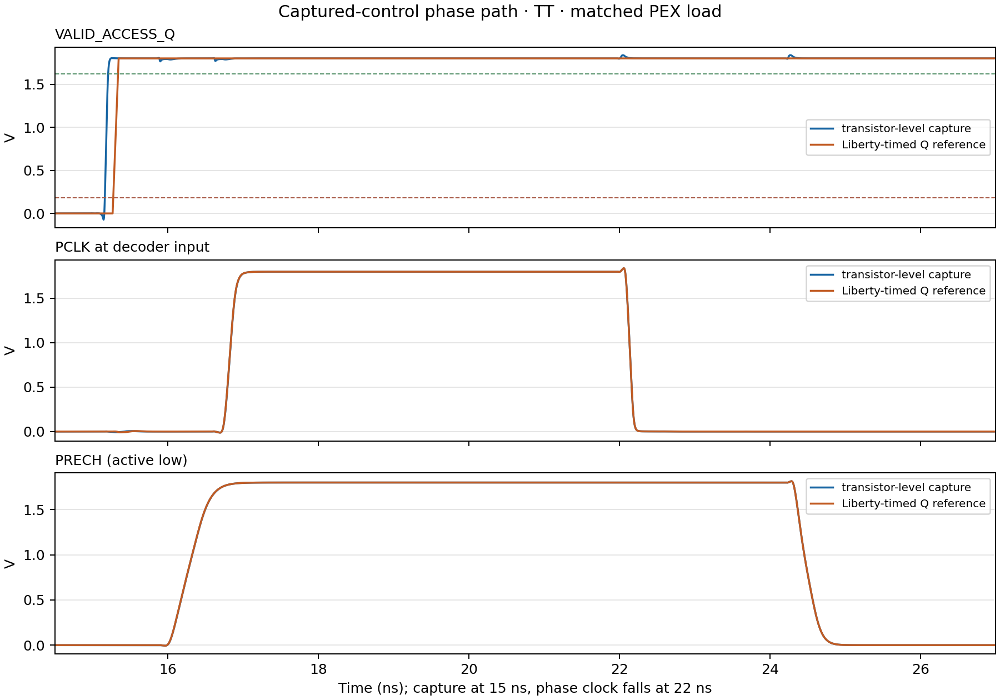

# Captured row-address interface — 2026-10-09

## Purpose and topology

The technical specification requires address inputs to be captured on the
rising edge of `CLK`, and the dynamic row decoder to use the captured row
address. The existing `valid_access_capture.sch` registers only the qualified
read/write condition, so it does not satisfy the address part of that
interface.

Added `cells/control/row_address_capture.sch`, a separate two-bit register
using two SKY130 FD SC HD `dfxtp_1` cells:

```text
A0_Q = capture(A0, rising edge of CLK)
A1_Q = capture(A1, rising edge of CLK)
```

The cell interface is `CLK, A0, A1, VDD, VSS → A0_Q, A1_Q`. The separate
`captured_row_decoder_control.sch` wrapper combines it with the existing
qualified access bit and PCLK/PRECH phase source. The wrapper exposes the
captured address outputs for connection to the decoder while keeping the
decoder and phase-source leaf cells separate.

## Evidence

The Xschem/functional runner netlists the register, checks its symbol pin
order, netlists the composed control wrapper, and runs the generated structural
Verilog against the SKY130 functional models. Results:

- 4/4 two-bit row-address values captured correctly at rising clock edges;
- 4/4 outputs retained their values after live address inputs changed while CLK
  remained high;
- 4/4 outputs retained their values through the falling edge;
- composed Xschem hierarchy connected `A0_Q/A1_Q`, `VALID_ACCESS_Q`, `PCLK`,
  and `PRECH` to the wrapper pins as intended, with no missing symbol.

This verifies logic behavior and structural connectivity, not analog timing.

## Follow-up: address capture connected to decoder PEX

The captured outputs have now been connected to the existing decoder PEX in
`run_captured_phase_interface.py`. The actual path freshly netlists
`captured_row_decoder_control.sch`, then drives the current dynamic decoder
and four WL-driver PEX instances. It also includes the pinned read-only
precharge PEX and the same lumped bitline residual used in the phase-interface
screen. The paired reference uses Liberty-timed `dfxtp_1` address and control
Q waveforms with the same downstream network.

The representative test is TT, 1.80 V, 27 °C, valid-read control `001`, and
address transition `0→3`. A0/A1 reach their target levels 500 ps before the
15 ns rising capture edge. At 15.8 ns, both live inputs switch to the
complementary address while CLK remains high. The actual captured outputs are
sampled 700 ps and 1,500 ps after the capture edge. All four actual-mode
address checks passed; the full paired run passed **350/350 checks** with no
simulation errors or screen rejections.

| Measurement | Captured transistor-level path | Liberty-timed reference | Difference |
|---|---:|---:|---:|
| CLK capture edge to PCLK 50% rise | 1,828.679 ps | 1,827.562 ps | +1.117 ps |
| PRECH 75% release to PCLK 50% rise | 391.916 ps | 391.968 ps | −0.052 ps |
| PCLK 50% fall to PRECH 75% assertion | 2,254.000 ps | 2,253.994 ps | +0.006 ps |
| Valid-access Q 50% clock-to-Q rise | 184.009 ps | 307.041 ps | −123.032 ps |

The measurements show the captured address feeding the PEX decoder while the
live address changes, and the selected-row contract passes for this vector.
They do not characterize the external address setup/hold boundary: 500 ps is
one exercised setup point, and the post-edge input change is one retention
challenge. The address register has no reset, so its outputs remain unspecified
until the first rising edge.



The [integrated run manifest](../sims/row_decoder/results/captured_row_address_interface_tt_20261009/manifest.json),
[350 per-check results](../sims/row_decoder/results/captured_row_address_interface_tt_20261009/checks.csv),
and [matched timing summary](../sims/row_decoder/results/captured_row_address_interface_tt_20261009/matched_comparison.csv)
record the exact inputs, model and source hashes. The run uses existing PEX
files; no extraction was performed.

## Follow-up: isolated address setup/hold screen — 2026-10-10

The address register has now been screened independently at its D inputs in
TT, SS, and FF. The **168-point** matrix covers A0 and A1, rising and falling
data transitions, and 14 offsets around the rising clock edge. All
**114/114** samples with nonnegative margin against the matching Liberty
reference captured the expected value. Four points per profile put the D
crossing exactly at the clock edge and therefore have no side-specific
reference; no tested point was outside its Liberty table range.

The closest sampled pre-edge crossing that captured new data was −50/−75 ps
(rising/falling) in TT, −75/−200 ps in SS, and −25/−50 ps in FF. At the nearest
tested post-edge crossing of +10 ps, all four address-bit/polarity paths
retained the old value. Falling-data setup references were larger than rising
references in all three Liberty profiles; SS falling data was the largest at
352.786 ps. These are sampled observations from an isolated DFF screen, not
setup/hold limits or signoff. See the [setup/hold report](row_decoder_address_setup_hold_20261010.md)
for exact transition brackets, corner conditions, waveform, and limitations.

The runner freshly netlists the schematic and derives a testbench-only
single-bit wrapper from the Xschem `dfxtp_1` instance pin mapping; it does not
change the project schematic. The [manifest](../sims/row_decoder/results/row_address_setup_hold_tt_ss_ff_20261010/manifest.json),
[measurements](../sims/row_decoder/results/row_address_setup_hold_tt_ss_ff_20261010/checks.csv),
and [plot](../sims/row_decoder/results/row_address_setup_hold_tt_ss_ff_20261010/setup_hold_aperture.png)
preserve the run and model provenance.

## Limits and next checks

The isolated address-register setup/hold screen is complete, but only one
address transition, one valid-read vector, and one TT operating point have been
tested with the captured address connected to decoder/WL/precharge PEX. There
is no write-vector screen, full integrated control/address matrix, or SS/FF
qualification for this loaded path. The register has no reset and write-data
capture is not included. A physical bitcell row and read/write/readback path
are not connected.

Next, extend the captured-address PEX matrix across valid read/write controls,
all ordered row transitions, and available PVT profiles. Keep these loaded
path checks separate from the isolated address-pin timing and existing
valid-access control setup/hold measurements. Then connect a physical bitcell
row and evaluate read/write/readback when the shared interfaces are ready.

## Reproduction and evidence files

```bash
./tools/sram-eda python3 sims/row_decoder/run_row_address_capture.py \
  --output-dir sims/row_decoder/results/row_address_capture_repro
```

Reproduce the isolated address setup/hold screen with:

```bash
./tools/sram-eda python3 sims/row_decoder/run_row_address_setup_hold.py \
  --output-dir sims/row_decoder/results/row_address_setup_hold_repro
```

Reproduce the captured-address-to-decoder PEX case in a separate result
directory with:

```bash
./tools/sram-eda python3 sims/row_decoder/run_captured_phase_interface.py \
  --output-dir sims/row_decoder/results/captured_row_address_interface_tt_repro \
  --profiles tt --control-vectors 001 --transitions 0:3
```

- [runner](../sims/row_decoder/run_row_address_capture.py)
- [testbench](../sims/row_decoder/tb_row_address_capture.v)
- [manifest, generated module netlist, wrapper netlist, logs, and VCD](../sims/row_decoder/results/row_address_capture_integrated_20261009/manifest.json)
- [cell schematics](../cells/control/row_address_capture.sch) and [composed control wrapper](../cells/control/captured_row_decoder_control.sch)
