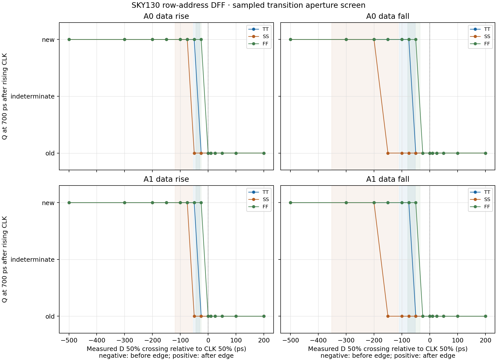

# Captured row-address setup/hold screen — 2026-10-10

## Result

The two address-register inputs in `row_address_capture.sch` were swept around
the rising `CLK` edge using the SKY130 `dfxtp_1` SPICE model. The matrix
contains 14 requested transition offsets for each combination of A0/A1 and
rising/falling data, across TT, SS, and FF: **168 timing points**. All three
ngspice runs completed with no fatal errors. The Xschem netlist reported both
register instances with the expected `CLK, D, VGND, VNB, VPB, VPWR, Q` pin
mapping. Logs reported `No compatibility mode selected!`; no missing OSDI
library was reported.

Q was sampled 700 ps after the measured rising clock edge. For points where the
measured D-to-CLK margin met or exceeded the matching Liberty constraint, the
sampled Q matched the expected value in **114/114 checks**. Four points per
profile placed the D 50% crossing exactly on the clock 50% crossing and have
no side-specific Liberty reference. The other points with negative Liberty
slack remain observations of the transition aperture, not deterministic
pass/fail checks. No tested side-specific point fell outside its Liberty table
range.

| Native PM3 profile | Setup constraint, D rise / fall | Hold constraint, D rise / fall | Closest sampled pre-edge crossing that captured new data, D rise / fall | Closest sampled post-edge crossing retaining old data | Liberty-safe Q checks |
|---|---:|---:|---:|---:|---:|
| TT, 1.80 V / 27 °C | 53.548 / 109.503 ps | −30.882 / −52.583 ps | −50 / −75 ps | +10 ps | 40/40 |
| SS, 1.62 V / −40 °C | 118.781 / 352.786 ps | −57.120 / −113.009 ps | −75 / −200 ps | +10 ps | 30/30 |
| FF, 1.80 V / 125 °C | 44.190 / 79.568 ps | −25.191 / −34.995 ps | −25 / −50 ps | +10 ps | 44/44 |

The values in the fourth column are the closest sampled D 50% crossings before
the clock at which the output had captured the new value. They are coarse
sampled observations, not measured setup limits. The post-edge values likewise
show the nearest tested crossing at which Q retained the old value. A 50 ps
input transition and a single Q sample cannot establish a metastability window
or guarantee an operating limit.

The transition behavior was the same for A0 and A1 in this model and setup.
Falling data needed more setup than rising data in all three Liberty references;
the largest case was the SS falling-data table value, 352.786 ps. The observed
Q sample changed between the adjacent tested offsets as follows:

| Profile | D rising: last sampled new → first sampled old | D falling: last sampled new → first sampled old |
|---|---|---|
| TT | −50 ps → −25 ps | −75 ps → −50 ps |
| SS | −200 ps → −150 ps | −200 ps → −150 ps |
| FF | −25 ps → 0 ps | −50 ps → −25 ps |

These transition brackets refer only to the isolated cell sample at 700 ps.
The Liberty setup/hold values are comparative references at the measured
10–90% clock and data slews. Native PM3 points do not exactly match the Liberty
characterization points: TT uses 1.80 V/27 °C versus 1.80 V/25 °C; SS uses
1.62 V/−40 °C versus 1.60 V/−40 °C; FF uses 1.80 V/125 °C versus
1.65 V/100 °C.

## Method

The runner freshly netlists `cells/control/row_address_capture.sch` in Xschem,
checks the A0/A1 `dfxtp_1` pin mapping, then derives a simulation-only single-bit
wrapper from the generated instance. The project schematic and symbols are not
modified. Each timing point has an independent flip-flop instance.

A first rising edge at 1 ns primes the register with its old D value. A single
50 ps D transition is then swept around a second 50 ps rising clock edge at
3 ns. Negative offsets mean the measured D 50% crossing precedes the clock
50% crossing; positive offsets mean it follows. The transient maximum step is
2 ps. Each Q output has a 3.434554 fF load, matching the nominal `dfxtp_1`
Liberty table load used for the comparison. The register has no reset, so Q
before the priming edge is not evaluated.

For each transition before CLK, the measured D margin is compared with the
matching `setup_rising` table; for a transition after CLK, it is compared with
the corresponding `hold_rising` table. The `rise_constraint` or
`fall_constraint` table is selected according to the D transition direction.
This comparison only labels samples that have nonnegative Liberty slack as
checks; it does not convert a Liberty reference into a project acceptance
limit.

## Evidence and reproduction

Reproduce the default TT/SS/FF matrix in a new output directory:

```bash
./tools/sram-eda python3 sims/row_decoder/run_row_address_setup_hold.py \
  --output-dir sims/row_decoder/results/row_address_setup_hold_repro
```

The run records the generated Xschem netlist, simulation-only wrapper, SPICE
decks, logs, per-point CSV, plot, and source/PDK hashes in
[`manifest.json`](../sims/row_decoder/results/row_address_setup_hold_tt_ss_ff_20261010/manifest.json).
The main run's large transient RAW files were removed after measurement.



- [Runner](../sims/row_decoder/run_row_address_setup_hold.py)
- [Per-point measurements](../sims/row_decoder/results/row_address_setup_hold_tt_ss_ff_20261010/checks.csv)
- [TT, SS, and FF decks and logs](../sims/row_decoder/results/row_address_setup_hold_tt_ss_ff_20261010/)
- [Xschem source](../cells/control/row_address_capture.sch)

## Limits and next work

This is an isolated register-input screen with a nominal capacitive Q load. It
does not model the external address source, clock-tree or routing parasitics,
metastability statistics, repeated-cycle timing, or a project-approved setup/
hold budget. The single sample of Q is not a reliability or timing signoff.
The captured-address PEX integration now selects all four row outputs under
valid-read control `001` from old address 0 at TT, and has one valid-write
case (`010`, `3→0`). It does not yet cover all 16 ordered old/new address
pairs or the full control/corner matrix, and the address setup/hold sweep is
not integrated with the decoder PEX.

Next, extend the actual captured-address-to-decoder/WL/precharge PEX path across
valid read and write controls, all ordered address transitions, and available
PVT profiles. Then connect the physical bitcell-row data path for read, write,
and readback when the shared owner interfaces are ready. No parasitic
extraction was performed for this screen.
