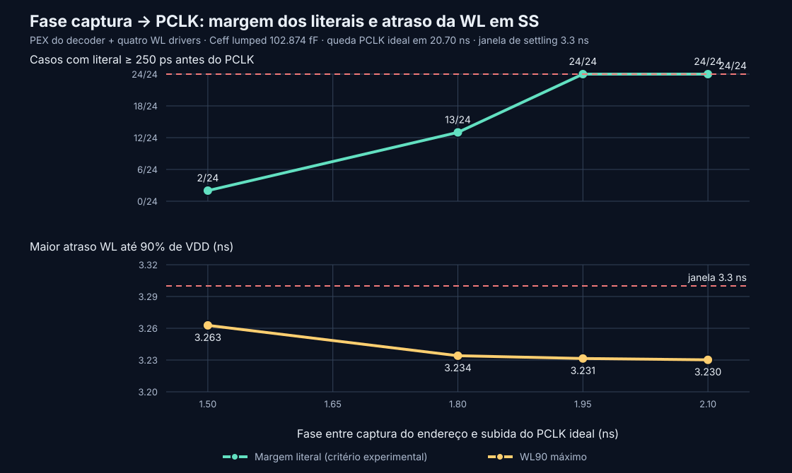

# Captured-address/PCLK study with decoder and WL-driver PEX — 2026-10-09

## Result

The current dynamic row-decoder PEX and four existing wordline-driver PEX
instances were combined in the captured-address/PCLK bench. Each WL output also
received the corrected maximum full-row capacitance, `102.873935496 fF`, as a
lumped capacitor to VSS. The 72-case matrix is complete with no ngspice
execution errors.

In the original setup (1.50 ns capture-to-PCLK, 20.00 ns falling edge and a
3 ns settling allowance), TT and FF each passed all 24 functional,
voltage-screen and experimental timing-guard cases. SS passed the custom
voltage screen in 24/24 cases, but none met the functional/settling contract;
only 2/24 met the experimental 250 ps address-literal guard. Overall, 48/72
cases passed the functional and timing screens, and 72/72 passed the separate
1.95 V terminal-magnitude screen. The terminal screen is a diagnostic, not
signed model-domain or reliability signoff.

The largest WL90 delay is `3.262722 ns` in SS, compared with `2.883069 ns` for
the matched schematic-only decoder/WL-driver bench. The PEX therefore adds
`0.379652 ns` in that worst case. Across TT, SS and FF, the per-profile maximum
WL90 increases by `0.240086 ns`, `0.379652 ns` and `0.213304 ns`, respectively.
The worst SS address-literal lead is `−279.707 ps`, meaning the latest literal
crosses the measured 10–90% threshold after PCLK rises in that case.

The timing failure is specific to the measured screens and setup: the current
3 ns output-settling allowance and 250 ps literal guard are exploratory values,
not requirements in the project specification. The results identify SS as the
critical profile for further capture-phase and clock-window characterization;
they do not establish a maximum operating frequency.

## PEX interface and provenance checks

Before simulation, the runner checked that the row-decoder PEX still matches
its current schematic/layout provenance and contains 29 MOS, 762 resistors and
389 capacitors, with no negative capacitors. The WL-driver PEX contains four
MOS, 99 resistors and 43 capacitors, also with no negative capacitors. Its MOS
topology and dimensions were compared with both the freshly netlisted Xschem
source and `wl_driver_flat_extracted.spice`.

The Xschem WL-driver instance order is `VDD WL_IN WL VSS`; Magic's extracted
subcircuit uses `VDD VSS WL_IN WL`. The runner retained the Xschem top-level
instances and exposed the PEX body through the Xschem formal-pin order. The
functional matrix then exercised all four paths. No schematic, layout, or PEX
source file was modified, and no extraction was run.

| Source | SHA-256 |
|---|---|
| Row-decoder schematic | `90f6aa170d7f9b7019b55d3cd43ee4482d9c5d2927f0b0b011a6f5b492c8ec50` |
| Row-decoder PEX | `8ee6b99aabf94bde9a1de2a13f0c040cda41dd55bb9568672e38a7f6bb54a6dc` |
| WL-driver schematic | `fcbd66081215bbbc32ff3ddb2655bf74f5ad55c6ac952b31159b64d3fb0b86d4` |
| WL-driver flat Magic layout | `785d5fb367572e85514471ff3c6b1634b7b613bf1a1e106ce4c0a403a14e365a` |
| WL-driver extraction source (`.ext`) | `2e3acdbe46cb741907271b337c6881092326b9e139e51f817fd26b5f13672956` |
| WL-driver flat extracted netlist | `ef7faf1175cf9a4c3e19a30cd7c60319f5050234a4c9f1eeec3ee5b3c1d53e9e` |
| WL-driver PEX | `68a3d7234d6d002d38655c10eace999729222b4a9078568feb71c0867eecfdc0` |
| Corrected row-load table | `b1f7da873879c30228c183d99eae5aa5c6f19214d09cc03153ce817eb07e36ca` |

## Full-row load and bench scope

The 60-row `.t0` source table is the corrected extracted Ceff for an eight-bit
physical row. Since this bench does not instantiate bitcells or the distributed
row, it applies the full-row value at each WL output. The WL-driver PEX adds the
driver's local extracted parasitics; the row value remains separate. This is a
leaf-PEX plus lumped-row-load study, not a distributed decoder-to-bitcell
layout simulation.

Address Q remains a table-derived PWL waveform from `dfxtp_1` Liberty. PCLK is
ideal. The Liberty output-load points are 3.434554 fF and 9.001619 fF; the
captured-address Q-pin load itself has not been extracted. External setup/hold,
metastability, clock-source loading, coupling on a routed row, read/write
operation, and reliability are outside this bench.

## Matched results at 1.50 ns

The comparison uses the same 72 address/profile/load cases and the matched
schematic-only matrix at the same row Ceff, phase and 3 ns settling allowance.

| Profile | Functional | 1.95 V screen | Literal guard ≥250 ps | Timing contract | Max WL90, schematic | Max WL90, combined PEX |
|---|---:|---:|---:|---:|---:|---:|
| TT, 1.80 V, 27 °C | 24/24 | 24/24 | 24/24 | 24/24 | 1.908132 ns | 2.148218 ns |
| SS, 1.62 V, −40 °C | 0/24 | 24/24 | 2/24 | 0/24 | 2.883069 ns | 3.262722 ns |
| FF, 1.80 V, 125 °C | 24/24 | 24/24 | 24/24 | 24/24 | 1.623762 ns | 1.837066 ns |
| **Total** | **48/72** | **72/72** | **50/72** | **48/72** | | |

The 48 failed waveform checks are all `settled_min_v` checks on selected WLs
during the declared 3 ns settling window: two checks per SS case. All 72
ngspice return codes are zero. The remaining 22 SS cases also miss the 250 ps
literal guard, even where no extra waveform check fails.

## Targeted phase/window diagnostic

Two worst-case SS/stress transitions were repeated at a 2.10 ns capture-to-PCLK
phase, with the next CLK/PCLK falling edge moved from 20.0 ns to 20.7 ns and the
settling screen set to 3.3 ns. This preserves a 3.60 ns PCLK evaluation high
phase while shifting PCLK later. Both cases completed with 160/160 waveform
checks, passed the voltage screen and timing guard, and showed about 448 ps of
literal lead and 3.23 ns WL90 delay.

| Transition | Literal lead | WL90 delay | Waveform checks | Experimental timing contract |
|---|---:|---:|---:|---|
| `01 → 10` | 448.394 ps | 3.230220 ns | 160/160 | PASS |
| `11 → 00` | 448.494 ps | 3.227076 ns | 160/160 | PASS |

This is only a two-transition diagnostic with an extended clock window and a
changed settling allowance. It does not qualify all address changes or approve
a longer cycle. The actual PCLK generator, cycle time and accepted settling
margin must be reviewed before choosing an operating point.

## Full SS phase sweep at a fixed falling edge

To separate the address-literal guard from output settling, the full SS matrix
was rerun at four capture-to-PCLK phases while holding the ideal CLK/PCLK
falling edge at 20.70 ns, the settling allowance at 3.3 ns, and all 12 address
transitions and both DFF Q-load points constant. Each phase contains 24 cases
and 3,840 waveform checks. All cases completed without ngspice errors; every
waveform, logic, and 1.95 V terminal-magnitude screen passed. The 250 ps
literal guard is reported separately:

| Capture-to-PCLK | PCLK high phase | Functional / voltage screens | Literal guard ≥250 ps | Minimum literal lead | Maximum WL90 | WL90-to-fall margin* |
|---:|---:|---:|---:|---:|---:|---:|
| 1.50 ns | 4.20 ns | 24/24 | 2/24 | −279.707 ps | 3.262722 ns | 937.278 ps |
| 1.80 ns | 3.90 ns | 24/24 | 13/24 | 141.738 ps | 3.234038 ns | 665.962 ps |
| 1.95 ns | 3.75 ns | 24/24 | 24/24 | 291.738 ps | 3.231437 ns | 518.563 ps |
| 2.10 ns | 3.60 ns | 24/24 | 24/24 | 441.738 ps | 3.230220 ns | 369.780 ps |

*Calculated as PCLK high phase minus the maximum measured WL90 delay in that
phase matrix; it is the remaining time from the latest 90% WL crossing to the
ideal PCLK fall, not an independently simulated guard.

At 1.50 ns the waveforms meet the 3.3 ns settling allowance in this run, even
though most cases miss the separate literal guard. At 1.80 ns the waveforms
also pass, but 11 cases still miss the guard. Of these sampled points, 1.95 ns
is the earliest one where all 24 cases meet the experimental 250 ps guard. It
is a measured diagnostic point, not an approved minimum phase, supported
frequency, or Fmax. The phase sweep changes the PCLK high phase while preserving
the same 20.70 ns fall, so it must not be read as testing one fixed-duty-cycle
clock. This also exposes a tradeoff: later PCLK improves address-literal lead,
while reducing the evaluation time available to the WL; the derived WL90-to-fall
margin decreases from 937 ps at 1.50 ns to 370 ps at 2.10 ns.

The chart is generated from the four committed campaign summaries and checks
that their inputs, case sets and run status match:



Generator: [`plot_combined_pex_phase_sweep.py`](../sims/row_decoder/plot_combined_pex_phase_sweep.py).

## Reproduction

Run from the repository root in the configured EDA container:

```bash
repro_root=sims/row_decoder/results/reproduction_combined_pex_20261009_run01

./tools/sram-eda python3 sims/row_decoder/run_row_decoder_capture_timing.py \
  --output-dir "$repro_root/capture_combined_pex_wlcap102p874_p1500_s3ns_20261009" \
  --profiles tt slow fast --phase-ps 1500 --settling-allowance-ns 3 \
  --wl-cap-ff 102.873935496 \
  --wl-load-evidence-csv sims/row_decoder/inputs/row_8_wl_pex_capacitance_latch_t0_requal_20261008.csv \
  --post-layout-pex --workers 2

./tools/sram-eda python3 sims/row_decoder/run_row_decoder_capture_timing.py \
  --output-dir "$repro_root/capture_combined_pex_phase2100_clk20700_s3p3ns_20261009" \
  --profiles slow --phase-ps 2100 --transitions 1:2 3:0 --loads stress \
  --clk-fall-ps 20700 --settling-allowance-ns 3.3 \
  --wl-cap-ff 102.873935496 \
  --wl-load-evidence-csv sims/row_decoder/inputs/row_8_wl_pex_capacitance_latch_t0_requal_20261008.csv \
  --post-layout-pex --workers 1

for phase in 1500 1800 1950 2100; do
  ./tools/sram-eda python3 sims/row_decoder/run_row_decoder_capture_timing.py \
    --output-dir "$repro_root/capture_combined_pex_slow_phase${phase}_clk20700_s3p3ns_20261009" \
    --profiles slow --phase-ps "$phase" --clk-fall-ps 20700 \
    --settling-allowance-ns 3.3 --wl-cap-ff 102.873935496 \
    --wl-load-evidence-csv sims/row_decoder/inputs/row_8_wl_pex_capacitance_latch_t0_requal_20261008.csv \
    --post-layout-pex --workers 2
done

./tools/sram-eda python3 sims/row_decoder/plot_combined_pex_phase_sweep.py \
  --results-root "$repro_root" \
  --output docs/assets/row_decoder_combined_pex_phase_sweep_20261009.svg
```

The `capture_combined_pex_wlcap102p874_p1500_s3ns_20261009/` directory keeps
the 72 case decks/results, `summary.csv`, `checks.csv`, `terminals.csv`,
`simulation_input_netlist.spice`, PEX/source hashes, tool information and the
executed runner. The targeted phase pilot is retained in
`capture_combined_pex_phase2100_clk20700_s3p3ns_20261009/`. The four full SS
matrices are retained under `capture_combined_pex_slow_phase*`.

## Next work

1. Repeat the phase/window sweep with the actual address-register fanout and
   PCLK-generation path when those interfaces are available. The present
   1.95 ns point only passes the chosen experimental guard in the sampled
   ideal-PCLK bench; verify model-domain and margin acceptance with the
   advisors before adopting any timing limit.
2. Review the WL sizing/path and check whether the SS settling margin should be
   improved before any clock-window change is proposed.
3. Integrate a distributed physical row and the actual PCLK source when the
   owner interfaces are available; retain separate row and driver parasitics
   without double counting.
4. Keep model-domain/reliability review separate from the 1.95 V diagnostic.
   No new DRC, LVS or extraction was performed in this study.
