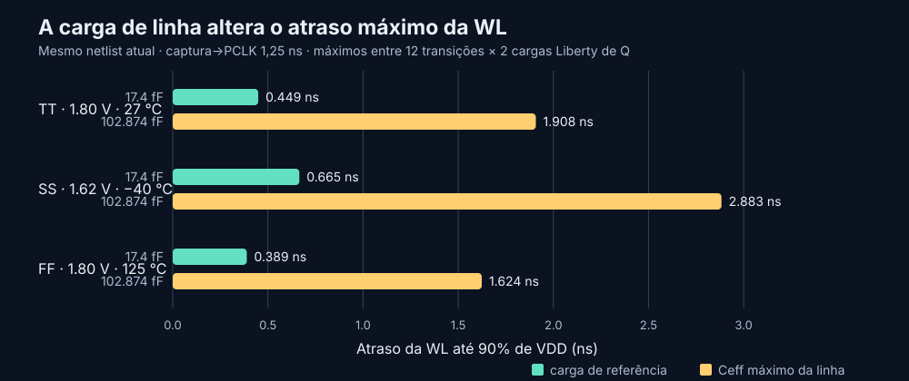

# Decoder captured-address and WL-load requalification — 2026-10-08

## Result

The current 29-MOS decoder netlist and four schematic WL buffers were exercised
with the corrected eight-bit row capacitance as a lumped load. The complete
72-case matrix passed functional waveform checks at both a 1.25 ns and 1.50 ns
capture-to-PCLK phase when the output settling allowance was set to 3 ns. The
experimental 250 ps internal-literal guard also passed all 72 cases at both
phases. The separate 1.95 V terminal-magnitude screen passed only 28/72 cases
(TT 4/24, SS 24/24, FF 0/24), so overall electrical qualification remains open.

The 102.874 fF load raises the maximum WL-to-90% delay by about 4.27× on
average compared with 17.4 fF in a matched run of the **same current netlist**.
The worst measured WL delay is 2.883 ns in SS/1.62 V/−40 °C. At a 1.50 ns
capture-to-PCLK phase, the ideal PCLK evaluation phase lasts 3.50 ns, leaving
about 617 ps between that WL crossing and PCLK's falling edge. This is a
schematic-level timing result, not an integrated SRAM timing or frequency claim.

## Row-capacitance input and interpretation

The source table was copied byte-for-byte from Danilo's remote branch
`feat/sram-6t-cell`, commit
[`95c23c0`](https://github.com/leofernandesc/Open-source-sram-memory-compiler/commit/95c23c03ddc29f0d4bf40adf5fe7adb1b4af0a6a),
without changing that branch. It contains 60/60 PASS rows across five process
corners, two supply values, three temperatures and two stored states.

| Evidence | Value |
|---|---|
| Local input | [`row_8_wl_pex_capacitance_latch_t0_requal_20261008.csv`](../sims/row_decoder/inputs/row_8_wl_pex_capacitance_latch_t0_requal_20261008.csv) |
| Provenance record | [`row_8_wl_pex_capacitance_latch_t0_requal_20261008.provenance.json`](../sims/row_decoder/inputs/row_8_wl_pex_capacitance_latch_t0_requal_20261008.provenance.json) |
| CSV SHA-256 | `b1f7da873879c30228c183d99eae5aa5c6f19214d09cc03153ce817eb07e36ca` |
| Row PEX SHA-256 recorded in the source table | `160b65544e12481aa99b287329ef2798e80c184c8f91566a23177ed8f0fb2dd6` |
| Full extracted row Ceff range | 102.328671–102.873935 fF |
| Maximum case | FF, 1.62 V, −40 °C, stored state 0: `102.873935496 fF` |
| Maximum paired row-minus-selected-cell load | `93.351918068 fF` |

This capture bench does not instantiate the eight bitcells, so each WL output
uses the **full row value** as a capacitor to VSS. If the bitcell load were
explicitly present, the corresponding additional row load from the paired
source data would be the 93.352 fF value. The linear capacitor represents
extracted Ceff; it does not reproduce distributed row resistance, coupling,
or nonlinear device loading.

## Simulation setup

- The current Xschem decoder was freshly netlisted. Its netlist SHA-256 is
  `2c8e802f8a5392eb2680e67cd6381627f9a680f8972325296ead1c387955202d`.
- The dynamic decoder and all four WL drivers remain schematic devices. The
  decoder's current physical PEX was not inserted into these capture runs.
- Each matrix has 12 non-repeat address transitions, two Liberty DFF output
  load points (`3.434554 fF` and `9.001619 fF`) and three decoder model
  profiles, for 72 cases. Address Q edges use table-derived PWL values from
  `sky130_fd_sc_hd__dfxtp_1`; PCLK is an ideal PWL source.
- Decoder profiles are TT/1.80 V/27 °C, SS/1.62 V/−40 °C and FF/1.80 V/125 °C.
  The Liberty timing lookup files use their documented nearby TT/SS/FF table
  conditions; those are timing proxies, not exact same-file device corners.
- The acceptance screens include correct selected/unselected DEC/WL behavior,
  a 3 ns output settling allowance, a 250 ps lead from the latest address
  literal's 10–90% settling to PCLK evaluation, and the existing experimental
  1.95 V terminal-magnitude/model-envelope screen. The 3 ns and 250 ps values
  are bench criteria, not approved project requirements.

## Matched load results at a 1.25 ns capture-to-PCLK phase

The two campaigns below use the same decoder netlist, address transitions,
Liberty lookups, PCLK edges and output-settling allowance. Each profile's WL90
value is the largest of its 24 transition/DFF-load cases.

| Profile | WL load | Logic checks | Voltage screen | Maximum WL90 | Minimum literal lead to PCLK |
|---|---:|---:|---:|---:|---:|
| TT | 17.4 fF | 24/24 | 4/24 | 0.449299 ns | 736.112 ps |
| TT | 102.873935 fF | 24/24 | 4/24 | 1.908236 ns | 736.112 ps |
| SS | 17.4 fF | 24/24 | 24/24 | 0.665397 ns | 286.518 ps |
| SS | 102.873935 fF | 24/24 | 24/24 | 2.883215 ns | 286.518 ps |
| FF | 17.4 fF | 24/24 | 0/24 | 0.389122 ns | 809.040 ps |
| FF | 102.873935 fF | 24/24 | 0/24 | 1.623869 ns | 809.040 ps |

Across all 72 paired cases, moving from 17.4 fF to 102.874 fF increases WL90
delay by 1.235–2.218 ns (mean 1.637 ns), or 4.17–4.37× (mean 4.27×). The
separate address-literal lead is unchanged by WL load, as expected for these
idealized address/PCLK sources.



The comparison graphic is generated by
[`plot_capture_wl_load_sensitivity.py`](../sims/row_decoder/plot_capture_wl_load_sensitivity.py)
from the two campaign `summary.csv` files.

## Capture phase check at the measured maximum row load

| Capture-to-PCLK | PCLK high evaluation phase | Logic checks | 250 ps literal guard | Voltage screen | Worst WL90 | Minimum literal lead |
|---:|---:|---:|---:|---:|---:|---:|
| 1.25 ns | 3.75 ns | 72/72 | 72/72 (minimum lead 286.518 ps) | 28/72 | 2.883215 ns | 286.518 ps |
| 1.50 ns | 3.50 ns | 72/72 | 72/72 (minimum lead 536.518 ps) | 28/72 | 2.883069 ns | 536.518 ps |

At 1.25 ns, the minimum literal lead exceeds the experimental 250 ps guard by
only 36.518 ps. At 1.50 ns that margin is 286.518 ps. The worst WL reaches
90% VDD about 617 ps before PCLK falls at 1.50 ns, under this ideal waveform.
The sampled evidence therefore supports keeping 1.50 ns as the provisional
capture-to-PCLK point for the next integration study; it does not establish a
system clock period or read/write timing closure.

An initial 1.50 ns run with the historical 1 ns output-settling allowance
produced 0/72 logic-contract passes: the WL did not meet the short settling and
recovery windows under this row load. Its voltage screen passed 28/72. The
follow-up 3 ns allowance made the waveform checks pass 72/72 while leaving the
voltage screen unchanged at 28/72. The longer allowance reports the actual
settling behavior and must not be mistaken for a specification change.

## Reproduction

Run all commands from the repository root with the configured EDA wrapper:

```bash
# Check the historical 1 ns settling criterion at the measured full-row load
./tools/sram-eda python3 sims/row_decoder/run_row_decoder_capture_timing.py \
  --output-dir sims/row_decoder/results/capture_to_pclk_wlpexmax_20261008 \
  --profiles tt slow fast --phase-ps 1500 \
  --wl-cap-ff 102.873935496 \
  --wl-load-evidence-csv sims/row_decoder/inputs/row_8_wl_pex_capacitance_latch_t0_requal_20261008.csv \
  --workers 2

# Matched load sensitivity, current decoder and PCLK phase 1.25 ns
./tools/sram-eda python3 sims/row_decoder/run_row_decoder_capture_timing.py \
  --output-dir sims/row_decoder/results/capture_to_pclk_wl17p4_p1250_s3ns_20261008 \
  --profiles tt slow fast --phase-ps 1250 --settling-allowance-ns 3 \
  --wl-cap-ff 17.4 --workers 2

./tools/sram-eda python3 sims/row_decoder/run_row_decoder_capture_timing.py \
  --output-dir sims/row_decoder/results/capture_to_pclk_wlpexmax_p1250_s3ns_20261008 \
  --profiles tt slow fast --phase-ps 1250 --settling-allowance-ns 3 \
  --wl-cap-ff 102.873935496 \
  --wl-load-evidence-csv sims/row_decoder/inputs/row_8_wl_pex_capacitance_latch_t0_requal_20261008.csv \
  --workers 2

# Check the previous 1.50 ns point at the measured row load
./tools/sram-eda python3 sims/row_decoder/run_row_decoder_capture_timing.py \
  --output-dir sims/row_decoder/results/capture_to_pclk_wlpexmax_p1500_s3ns_20261008 \
  --profiles tt slow fast --phase-ps 1500 --settling-allowance-ns 3 \
  --wl-cap-ff 102.873935496 \
  --wl-load-evidence-csv sims/row_decoder/inputs/row_8_wl_pex_capacitance_latch_t0_requal_20261008.csv \
  --workers 2

python3 sims/row_decoder/plot_capture_wl_load_sensitivity.py \
  --reference sims/row_decoder/results/capture_to_pclk_wl17p4_p1250_s3ns_20261008/summary.csv \
  --loaded sims/row_decoder/results/capture_to_pclk_wlpexmax_p1250_s3ns_20261008/summary.csv \
  --output docs/assets/row_decoder_wl_load_capture_delay_20261008.svg
```

All three selected campaigns are complete with no ngspice execution errors.
Their `summary.csv`, detailed `checks.csv`, per-case terminal extrema,
manifests, netlists and executed scripts are retained under
[`sims/row_decoder/results/`](../sims/row_decoder/results/).

## Remaining work and limits

1. Repeat the capture/PCLK study with the current decoder R-C PEX and WL-driver
   PEX, if the available extracted interfaces can be combined without changing
   their source ownership. The current three matrices use a schematic decoder
   and schematic WL drivers.
2. Test additional address/PCLK edge slew and capture-phase points using the
   measured load. The two phase points here are a selected-point check, not a
   sampled minimum or a clock-frequency sweep.
3. Connect the actual row or a reviewed distributed row model, including
   coupling and the correct WL-driver interface. The lumped 102.874 fF load
   does not replace this integration.
4. Review the 44/72 custom voltage-screen failures with the model/PDK owner.
   The screen is an engineering diagnostic, not a formal reliability limit.
5. Revisit noise, retention and phase-duration characterization under the
   corrected load and agreed electrical acceptance criteria.

No new layout, DRC, LVS or extraction was performed as part of this work.
