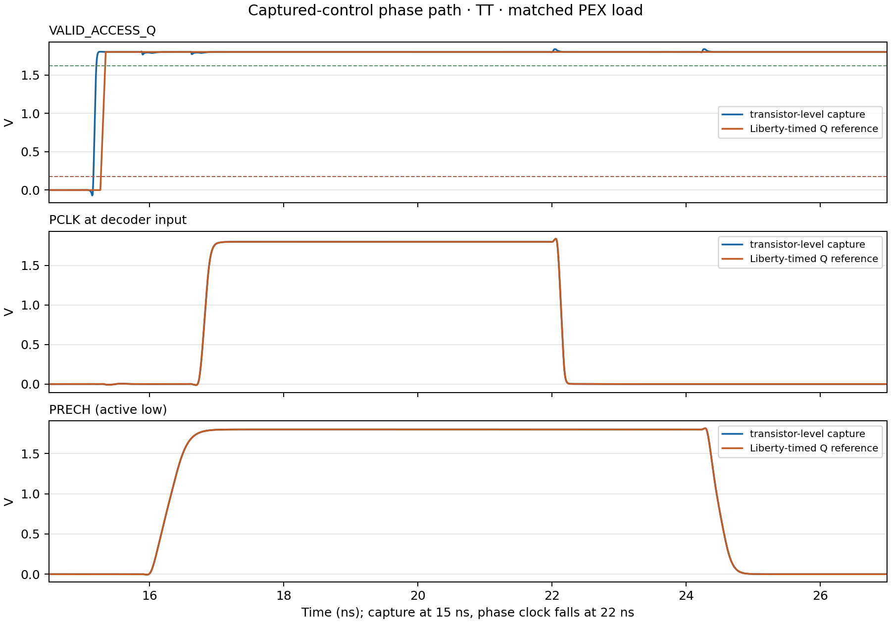

# Captured control to PCLK/PRECH interface screen — 2026-10-09

## Result

The captured qualifier and transistor-level phase source were simulated as one
electrical path for two representative SKY130 conditions at TT, 1.80 V and
27 °C: valid read vector `001` with address transition `0→3`, and invalid
vector `000`. Each was compared with a Liberty-timed `dfxtp_1` Q waveform
feeding the same transistor-level phase source and downstream PEX. The valid
read pair passed **342/342 checks**; the invalid pair passed **66/66 checks**.
There were no ngspice errors or screen rejections in either run.

The valid-read measurement shows close agreement with the Liberty reference at
this one TT operating point. The invalid-vector measurement shows that the
captured Q remains low at its post-capture sample points, `PCLK` stays below
5.0 mV, and active-low `PRECH` stays below 0.385 mV, so the phase source
continues to hold precharge active. These are representative screens, not a
completed PVT qualification.

| Measurement | Captured transistor-level path | Liberty-timed Q reference | Difference |
|---|---:|---:|---:|
| CLK capture edge to PCLK 50% rise | 1,828.682 ps | 1,827.562 ps | +1.120 ps |
| PRECH 75% rise to PCLK 50% rise | 391.913 ps | 391.968 ps | −0.054 ps |
| PCLK 50% fall to PRECH 75% falling crossing | 2,253.998 ps | 2,253.994 ps | +0.004 ps |
| Valid-read Q 50% clock-to-Q rise | 184.009 ps | 307.041 ps | −123.032 ps |

The comparison reference uses the nominal `dfxtp_1` Liberty lookup load of
3.434554 fF and 53.1329 ps clock slew to shape Q. That Liberty TT table is
characterized at 25 °C, while the native-PM3 circuit deck runs at 27 °C. It is
a timing-table reference, not a transistor-level DFF instance or an exact
extracted-load match to the qualifier's phase-logic input.



## Follow-up: registered row address connected to PEX

The earlier paired runs above used transistor-level capture of the qualified
access bit but supplied the row address from a Liberty-timed PWL source. A
follow-up run now uses `captured_row_decoder_control.sch`, which composes the
two-bit rising-edge row-address register with the captured access qualifier
and the existing PCLK/PRECH source. Its `A0_Q/A1_Q` outputs directly drive the
current dynamic decoder PEX. The same decoder/WL/precharge network is used in
the Liberty-timed reference mode.

For the TT valid-read `001`, address `0→3` case, the input address is presented
500 ps before the 15 ns rising edge and inverted at 15.8 ns while CLK remains
high. The captured A0/A1 values remain high at the post-capture and live-input
change samples. Both paired modes pass all **350 checks** in the run; the
actual-mode register-to-decoder path passes its four sampled address checks.

| Measurement | Captured address/control/phase path | Liberty-timed reference | Difference |
|---|---:|---:|---:|
| CLK capture edge to PCLK 50% rise | 1,828.679 ps | 1,827.562 ps | +1.117 ps |
| PRECH 75% release to PCLK 50% rise | 391.916 ps | 391.968 ps | −0.052 ps |
| PCLK 50% fall to PRECH 75% assertion | 2,254.000 ps | 2,253.994 ps | +0.006 ps |
| Valid-access Q 50% clock-to-Q rise | 184.009 ps | 307.041 ps | −123.032 ps |

This advances the address path from a structural/functional wrapper check to
one loaded transistor-level PEX case. It is not an address setup/hold sweep or
a PVT/control/address qualification. The wrapper still has no reset, no
captured write-data path, and no attached physical bitcell row. The
[dedicated address report](row_decoder_address_capture_20261009.md) and
[integrated manifest](../sims/row_decoder/results/captured_row_address_interface_tt_20261009/manifest.json)
contain the detailed evidence. No extraction was performed for this run.

## Simulated path and setup

The actual case freshly netlists `captured_pclk_phase_source.sch`, which
connects the SKY130 FD SC HD standard-cell qualifier to the existing
transistor-level `pclk_phase_source.sch`. The phase equations and selected
24/60/80-stage inverter taps are unchanged. The simulations use the native
SKY130 PM3 models for the phase logic, qualifier standard cells, decoder,
wordline drivers, and precharge devices.

Downstream loading consists of the current row-decoder R-C PEX, four
wordline-driver R-C PEX instances at 102.873935496 fF per row, eight pinned
read-only copies of Danilo's `precharge_w2p52_flat` PEX, and 583.992055 fF of
lumped bitline residual per side. The effective bitline target is 597.056241
fF. This is not a distributed bitline or a physical 6T read/write path.

Controls start disabled at `111`; a priming clock edge captures an invalid
value before the test applies the selected control vector and captures it on
the next rising edge at 15 ns. The controls then change to the opposite
validity class during the high phase to check that the captured Q holds.
The transient maximum step is 5 ps. Experimental 250 ps PRECH-release and
1,800 ps WL-turnoff guards are used by the testbench; neither is a requirement
from the project specification.

## Limits and review items

- Only one valid control vector, one address transition, and one invalid vector
  were run, all at TT, 1.80 V and 27 °C. The other valid address transitions,
  write vector, invalid vectors, SS/FF profiles, and setup/hold skew remain
  open.
- The captured Q reaches −72.2 mV and 1.9471 V in the valid run, and −7.2 mV
  and 1.9471 V in the invalid run. This bench has no rail-excursion acceptance
  criterion; the overshoot remains for electrical/model review. Passing the
  sampled logic and timing checks does not close that review.
- The phase-source chain has no layout, DRC, LVS, or PEX. The test does not
  establish metastability behavior, startup before a valid clock edge, clock
  frequency, a complete row read/write/readback, or reliability/signoff.
- Both ngspice logs print `No compatibility mode selected!`. They report no
  missing OSDI libraries, and both transient simulations completed without a
  model-resolution error. The compatibility notice remains part of the model
  environment record.
- Danilo's precharge PEX is consumed read-only and pinned to commit `5dc00fe`
  with SHA-256
  `cf0fa457b4ab84a1d19e6202541b6a43149b575e492a108e36d0de62489cc423`.
  This test does not replace or revise the shared precharge source.

## Reproduction

Run the default representative valid-read case:

```bash
./tools/sram-eda python3 sims/row_decoder/run_captured_phase_interface.py \
  --output-dir sims/row_decoder/results/captured_phase_interface_tt_read_repro
```

Run the representative invalid-vector case:

```bash
./tools/sram-eda python3 sims/row_decoder/run_captured_phase_interface.py \
  --output-dir sims/row_decoder/results/captured_phase_interface_invalid_repro \
  --profiles tt --control-vectors 000 --transitions 0:3
```

Both result directories contain manifests, exact simulation input netlists,
case JSON, checks, and ngspice logs. The valid-read directory also contains
representative waveform CSVs and the comparison plot. Large transient RAW
files are not retained by default; use `--keep-raw` only when detailed
waveform inspection is needed.

## Remaining matrix

On the stronger machine, first cover both valid operations, all four row
transitions, and all three model profiles:

```bash
./tools/sram-eda python3 sims/row_decoder/run_captured_phase_interface.py \
  --profiles tt slow fast --control-vectors 001 010 \
  --transitions 0:0 0:1 0:2 0:3 --transitions-per-vector \
  --output-dir sims/row_decoder/results/captured_phase_interface_valid_3profile
```

Then cover all six invalid/idle control vectors in TT/SS/FF:

```bash
./tools/sram-eda python3 sims/row_decoder/run_captured_phase_interface.py \
  --profiles tt slow fast --control-vectors 000 011 100 101 110 111 \
  --transitions 0:3 \
  --output-dir sims/row_decoder/results/captured_phase_interface_invalid_3profile
```

At the observed runtime of roughly one to one-and-a-half minutes per ngspice
netlist, these 84 paired-mode simulations are expected to take around 1.5–2
hours, depending on the machine. The matrix still does not sweep setup/hold
skew, phase placement, clock period, or supply/temperature within a model
profile; those need separate scoped runs after this matrix is reviewed.
