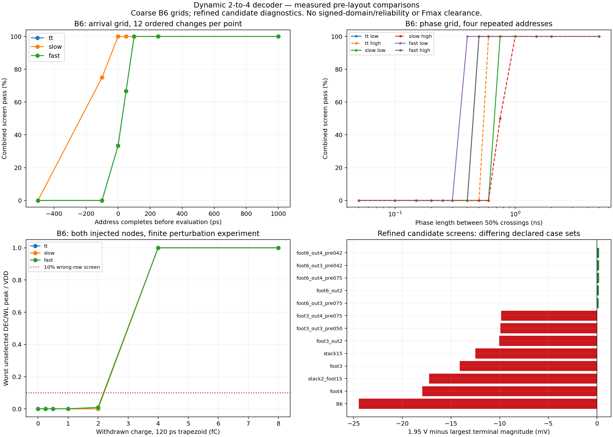
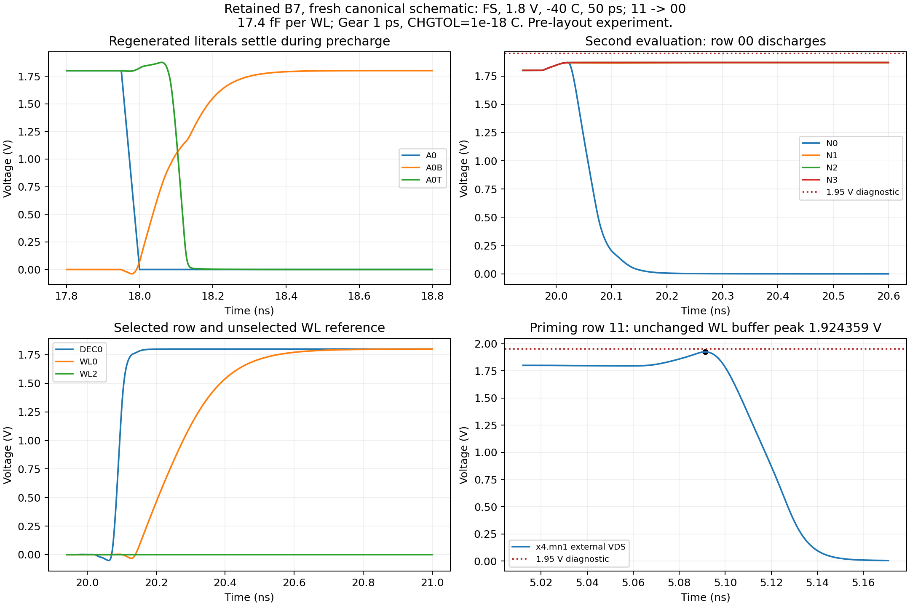

# Dynamic decoder: address contract, phase limits and robustness study

> Compact-layout update (2026-10-08): source sizing from 7ad0348 is unchanged,
> but the new geometry only has DRC/LVS closure. New R-C extraction and matched
> electrical tests are pending on the other machine. The passing matrix below
> belongs to the archived 7ad0348 layout. See the
> [compaction handoff](row_decoder_layout_compaction_20261008.md).

> Current-source update (2026-10-07 UTC): decoder layout closure changed the
> address inverters to W=0.84 um, precharge PFETs to W=1.25 um, evaluation
> stacks to W=2 um and output PFETs to W=3 um. The selected 13-case
> schematic/PEX matrix passes at 5 ps and 1 ps. Broad B7 and capture-budget
> results below remain evidence for their archived source revisions and need
> requalification for the current source. See the
> [closure record](feature_peripherals_validation_log.md#2026-10-07-utc-decoder-all-network-rc-and-selected-electrical-closure).

Historical status before layout closure: buffered candidate B7 retained after the complete pre-layout
voltage/temperature/edge qualification and completed internal contract study.
Physical closure was pending at that stage. The architecture and nine-pin
interface remain the specified dynamic 2-to-4 NAND decoder. Experimental screens
below are not a macro operating specification, external setup time, Fmax,
foundry reliability clearance, or decoder DRC/LVS result.

On 2026-10-07 Leonardo explicitly selected **electrical margin and robustness**
as the priority for choosing this decoder's sizing. Delay, supply energy and
area remain reported costs. This scoped choice does not silently finalize the
global macro tradeoff or the nominal characterization temperature still open
in the technical specification.

## What the new executor checks

`sims/row_decoder/run_row_decoder_contract.py` freshly netlists the current
Xschem sizing bench and audits its hierarchy. Simulation-only PWL and dimension
overrides are applied to disposable decks. Every case primes the old address
through an evaluation, precharges, then tests the new address. Four unchanged
WL buffers drive independent estimated 17.4 fF loads, or the declared 50 fF
stress load. No bitcell, WL-driver, write-driver or other owner's source is edited.

Both evaluations, intervening precharge and final recovery are checked.
Unselected DEC/WL outputs must remain below 10% VDD throughout evaluation,
including the first nanosecond; selected outputs must reach 90% VDD and remain
there. A separate experimental 1 ns settling allowance is retained. Full
waveform checks distinguish a late selected transition from a spurious row,
residual precharge pulse or loss of a previously established high level.

The original 41 MOS instances (25 decoder, 16 in four WL buffers) have signed external
VGS/VGD/VDS/VBS extrema recorded. The 1.95 V upper/magnitude diagnostics do not
establish the full signed model domain. A logical PASS can still be rejected
by these voltage checks. Missing/truncated/nonfinite waveforms are errors.

Each completed case is atomically checkpointed before its temporary raw file
can be removed. `--resume` requires the same declared cases and input netlist.
Existing complete raw files are reused only when their deck matches exactly.
An incomplete campaign has `complete=false`, an error list and exit code 2;
the summarizer refuses to treat it as a complete matrix.

## B6 address history and load experiment

The archived [history campaign](../sims/row_decoder/results/b6_contract_history/summary.csv)
contains all 16 ordered old/new pairs, including four repeats, and both signs
of 100 ps A0/A1 skew for the four two-bit transitions. The latest changing
input reaches its final value 2 ns before PCLK's 50% rising crossing.
Each of three profiles is tested at 17.4 and 50 fF, giving 144 cases.

| Profile | Experimental condition | Largest WL 90% delay, 17.4 fF | At 50 fF |
|---|---|---:|---:|
| TT | 1.8 V, 27 C | 491.37 ps | 1048.19 ps |
| Slow | SS, 1.62 V, -40 C | 730.75 ps | 1577.16 ps |
| Fast | FF, 1.8 V, 125 C | 423.94 ps | 895.15 ps |

All cases reach the correct final row without a spurious selected row. All
72 cases at the estimated 17.4 fF load pass the declared screens. At 50 fF,
24 FF cases pass; 24 TT and 24 SS cases fail the experimental 1 ns selected-WL
settling allowance. Those 48 failures are retained, not reclassified as passes
because the final output eventually becomes correct. These measurements used
5 ps maximum steps and the original charge truncation default; the finer
voltage review below supersedes any inference of final B6 robustness.

## B6 address arrival and phase experiment

The [810-case suite](../sims/row_decoder/results/b6_contract_suite/summary.csv)
and its [manifest](../sims/row_decoder/results/b6_contract_suite/manifest.json)
are complete. They contain 252 arrival cases, 36 deliberately invalid
evaluation-time address changes, 168 low-phase and 168 high-phase points,
36 retention points, 48 asymmetric-clock points, 60 address-slew points and
42 calibrated charge-withdrawal points. Rejected boundary and perturbation
points are characterization results, not tool failures.

Address lead is the time from the latest changed input reaching its final
value to PCLK crossing 50% on the next rising edge. It is **not** setup to the
external CLK capture register. With 50 ps edges and 17.4 fF, all 12 nonrepeat
transitions pass the combined logic and voltage diagnostics at 100, 250 and
1000 ps lead in the tested TT/slow/fast profiles. A 50 ps lead does not pass
every TT/FF voltage diagnostic despite all sampled logic states passing.
This agrees with the specification's requirement to allow captured address
and complements to settle before decoder assertion.

| B6 sampled phase grid | TT | Slow profile | Fast profile |
|---|---:|---:|---:|
| Shortest tested low phase passing all four repeated addresses | 0.50 ns | 0.75 ns | 0.40 ns |
| Shortest tested high phase passing all four repeated addresses | 0.60 ns | 1.00 ns | 0.50 ns |

Phase lengths are between PCLK 50% crossings; end-of-evaluation checks finish
at the beginning of its falling ramp. These are sampled bounds under repeated
addresses, not exact minima or a safe macro frequency. Both phase constraints,
input-register delay, bitcell access, sense and output-capture timing matter.
All 36 deliberate address changes during evaluation produce the expected
wrong-row evidence: a discharged dynamic node cannot recover until precharge.

Evaluation holds of 10, 100 and 1000 ns pass their defined screens for all
four rows in the three profiles. The 1000 ns cases use a 25 ps maximum step;
the shorter cases use 5 ps. This is a finite tested retention interval, not
unlimited clock-stop tolerance. Asymmetric 25/250, 250/25, 50/1000 and
1000/50 ps clock edges pass the coarse declared screens. A 25 ps address edge
exposes additional voltage failures in three TT/FF cases.

## Numerical failure and finer voltage finding

Some PWL breakpoint cases abort with `Timestep too small` while ngspice's
`.control quit 0` still returns zero. The executor rejects the error log and
truncated raw file. Smaller maximum steps, a different integrator, more Newton
iterations and temporary diagnostic shunts did not resolve the reference
case. The successful adopted retry sets `MINBREAK=1 fs`; this controls transient
breakpoint handling without adding a circuit element or relaxing voltage checks.
The ngspice [transient source](https://raw.githubusercontent.com/ngspice/ngspice/master/src/spicelib/analysis/dctran.c)
shows the breakpoint-spacing handling and its default initialization.

Tightening `CHGTOL` to 1e-18 C independently completes the reference case and
resolves a previously undersampled address-inverter peak. Evidence is archived
in [the numerical comparison](../sims/row_decoder/results/b6_numeric_breakpoints/summary.csv),
including the failing deck/log and both successful settings.

| Same B6 circuit, TT, simultaneous 00 to 11, 250/25 ps clock | M2 maximum VDS |
|---|---:|
| Gear, 5 ps maximum step, MINBREAK=1 fs, default charge tolerance | 1.946750 V |
| Gear, 5 ps maximum step, CHGTOL=1e-18 C | 1.950579 V |

The tighter maximum occurs at 17.97445 ns during the simultaneous 50 ps
address changes, compared with 17.97250 ns in the coarser record. Thus the
previous roughly 3 mV B6 headroom is not sufficient evidence to freeze it.
The earlier 54-condition report remains correct for its archived schedule;
it did not establish every address history under this tighter charge criterion.
New robustness comparisons use Gear, maximum step 1 ps, MINBREAK=1 fs and
CHGTOL=1e-18 C consistently.

## Static transfer and charge sensitivity

[24 DC transfer curves](../sims/row_decoder/results/b6_inverter_dc/summary.csv)
measure the address, decoder-output and both buffer-stage inverters under
TT/slow/fast/SS-cold profiles and additional SF/FS diagnostics. VOUT=VIN is
interpolated on a 1 mV input grid. The decoder-output trip is 0.83601 V at
TT/1.8 V/27 C and 0.73735 V at SS/1.62 V/-40 C. These are actual transfer
references, not bitcell SNM or dynamic noise qualification.

Charge tests withdraw Q from unselected N1 or N3 using a 120 ps trapezoid:
10 ps ramps, 100 ps plateau, amplitude Q/110 ps. In the coarse B6 suite,
0, 0.25, 0.5, 1 and 2 fC pass all six node/profile combinations; 4 and 8 fC
produce false-row predictions. Some 8 fC waveforms also exceed the magnitude
screen. The tested transition between 2 and 4 fC is an experimental bracket
for this injection waveform, not an approved system noise budget or silicon
failure rating. A selected row remains asserted until the next precharge.

## Family comparison and selection status

The [38-size TT sweep](../sims/row_decoder/results/contract_tables/sizing_candidates.csv)
holds other families at B6, not the older B0. Each candidate exercises four
two-bit histories. All 152 runs pass logic; only 21 candidates pass every
coarse voltage diagnostic. The nominal comparisons include decoder + four
buffers' VDD energy and sum(W*L) channel-area proxy, not physical area. Ideal
clock/address source energies are reported separately as delivered energy;
they are not actual upstream-driver losses.

The first shortlist tests footer W=3, precharge W=0.5, output Wn/Wp=0.42/0.84
and output Wn/Wp=0.75/0.75 at 80 corner/clock cases. Every shortlisted candidate
fails at least one voltage or excursion check; none is adopted from its TT
performance alone. Larger footers also worsen negative DEC excursions in
some SS cases. Therefore robustness refinement includes address length/ratio,
footer/output interactions and evaluation-stack capacitance with the tighter
numeric settings. No candidate is labeled final merely because its logic passes; B7 retention
is supported by the complete broad matrix and finer comparisons below.

## Expanded interactions: measured screening results

The refined [132-case study](../sims/row_decoder/results/decoder_robustness_refinement/summary.csv)
uses simultaneous two-bit transitions in TT, FF/1.8 V/125 C and SS/1.8 V/-40 C.
All runs pass logic, but 35 exceed the magnitude screen. B6 reaches **1.974458 V**
at M2 VDS in SS-cold. Increasing address channel length or transistor width
alone does not close the issue. Footer W=6 plus output Wp/Wn=2/2 passes its
12 cases with only **0.184865 mV** headroom, which does not justify a robustness
freeze or qualify untested stimulus conditions.

The [80-case stack study](../sims/row_decoder/results/decoder_stack_robustness/summary.csv)
adds TT, SS/1.62 V/-40 C, FF-hot and SS-cold profiles. It retains six logical
failures and 29 magnitude findings. Enlarging stack gates changes both address
loading and dynamic-node coupling; it is not a universally beneficial correction.

The [96-case capacitance study](../sims/row_decoder/results/decoder_capacitance_robustness/summary.csv)
passes all logical checks but has two magnitude findings. Four footer-W6,
output-W3/W4 combinations pass their 16-case sets, yet their maximum terminal
magnitude is still 1.949779--1.949836 V. The smallest headroom is about 0.16 mV.
Increasing output-node capacitance suppresses dynamic-row feedthrough while
leaving the address-inverter peak nearly unchanged. These points remain
experimental candidates, not finalized schematic dimensions.

Additional address-ratio, joint-stack and balanced-footer studies retain
failed cases in their own directories. A buffered-address diagnostic adds
four MOS to regenerate the true address literals after the existing complement
inverters; it is explicitly a disposable 29-MOS candidate with all 45 MOS
terminals (including the four unchanged WL drivers) measured. It introduces
no clock, state machine or external pin. Its added input delay, coupling,
energy and area must be measured before considering a schematic adoption.



The [standalone PDF](assets/row_decoder_contract.pdf) and figure provenance
accompany the exported chart. Its green bars mean only that a particular
candidate's declared case set passes. Differing case sets are not a common
qualification or a final ranking.

## Buffered-address candidate B7

The disposable buffered variant keeps A0B=~A0 and A1B=~A1. Two additional
static inverters regenerate A0T=~A0B and A1T=~A1B for the true-literal NAND
gates. The four evaluation paths use (A1B,A0B), (A1B,A0T), (A1T,A0B) and
(A1T,A0T). The dynamic NAND core and external nine-pin interface remain
unchanged; the decoder contains 29 MOS rather than 25. It has no internal
clock generator, state machine or added external signal.

The additional gates load each original complement inverter, and the true
literal's driver isolates the evaluation gates from the ideal address source.
This changes capacitive feedthrough and adds literal-path delay; capture-to-
evaluation timing must include both paths. Four new MOS are real circuit
costs, not artificial shunts used only to make a simulator converge.

| Device family | B7 W (um) | L (um) | nf |
|---|---:|---:|---:|
| M1--M4, original complement inverters | 0.42 | 0.15 | 1 |
| M26--M29, regenerated true literals | 2.00 | 0.15 | 1 |
| Four precharge PMOS | 0.50 | 0.15 | 1 |
| Eight evaluation-stack NMOS | 1.00 | 0.15 | 1 |
| M8, shared footer | 1.50 | 0.15 | 1 |
| Eight DEC output-inverter MOS | 2.00 | 0.15 | 1 |

The four WL buffers stay at their existing 0.42/0.84 um stage widths. Their
16 MOS are included in terminal checks, giving 45 devices in the loaded bench.

[32 buffered sizing cases](../sims/row_decoder/results/decoder_buffered_sizing/summary.csv)
compare true-buffer W=0.75/1/2/3 with simultaneous two-bit changes at 25/50 ps
edges in SS-cold and FF-hot. All pass their logic and voltage screens. Maximum
terminal magnitudes are respectively 1.926971, 1.922934, 1.920627 and 1.920730 V.
W=2 has the largest measured headroom in this finite grid; W=3 adds area and
energy while slightly worsening the measured peak. This is a defensible retained
candidate, not a proof of a global mathematical sizing optimum.

The [matched comparison](../sims/row_decoder/results/buffered_b7_candidate/matched_comparison.json)
uses the same four ordered transitions/profiles, 50 ps edges, 17.4 fF, phase
lengths and refined numerical settings:

| Matched four-case comparison | B6 | Buffered B7 |
|---|---:|---:|
| Largest terminal magnitude | 1.974458 V | 1.920627 V |
| Largest WL 90% delay | 590.08 ps | 550.95 ps |
| Mean VDD cycle energy, decoder plus four buffers | 136.35 fJ | 200.13 fJ |
| Decoder sum(W*L), channel-area proxy | 2.979 um2 | 5.577 um2 |

The energy and proxy-area costs are about +46.8% and +87.2% in that matched
experiment. They are recorded explicitly under the chosen robustness priority.
Neither is the power or physical area of a completed macro.

A generated [candidate schematic](../sims/row_decoder/results/buffered_b7_candidate/row_decoder.sch)
has a fresh Xschem netlist and an independent topology/dimension comparison
against the derived test circuit. All 29 MOS D/G/S/B, models, W/L/NF and the
WL connections match after normalizing anonymous stack names. The canonical `cells/row_decoder/row_decoder.sch` now contains the retained B7
source after all 264 qualification cases passed. The symbol and external pin
order are unchanged; its canonical SVG was regenerated. [The SVG](assets/row_decoder_b7.svg) is an inspectable circuit view;
its appearance is not electrical evidence.

The 5 ps Gear/trapezoidal numerical comparison still passes the voltage screens,
but underestimates some peaks relative to 1 ps. The retained broad qualification
therefore continues at 1 ps with MINBREAK=1 fs and CHGTOL=1e-18 C. Additional
0.5 ps Gear/trapezoidal and 0.25 ps Gear measurements provide a finer reference.
No failed B6 point is removed to obtain a passing B7 report.

## Completed B7 broad qualification and source rerun

The [264-case qualification](../sims/row_decoder/results/decoder_buffered_pvt/summary.csv)
is complete: 18 TT/SS/FF x 1.62/1.8 V x -40/27/125 C conditions, plus four
SF/FS diagnostics at 1.8 V and -40/125 C. Each condition exercises the four
two-bit transitions with address/PCLK edges of 25, 50 and 250 ps. Loads are
17.4 fF per WL, latest address completion leads evaluation by 2 ns, low/high
phases are 10/5 ns, Gear maximum step is 1 ps, MINBREAK=1 fs and CHGTOL=1e-18 C.
**264/264 pass logic, settling and both voltage diagnostics.** All 45 devices'
signed external terminal extrema are archived.

The largest measured magnitude is **1.924359 V**, x4.mn1 VDS, at FS/1.8 V/-40 C,
50 ps, 11 to 00. Diagnostic headroom to 1.95 V is **25.641 mV**. The limiting
device is in an unchanged WL buffer, not one of the new address MOS. The
[15 finer comparisons](../sims/row_decoder/results/decoder_buffered_fine/summary.csv)
all pass and reach 1.925134 V (24.866 mV headroom) at the 0.25 ps Gear FS-cold
reference. These sampled margins do not establish an approved guardband or
physical reliability.

After adoption, the original loaded TT runner freshly netlists the canonical
source. [Its result](../sims/row_decoder/results/b7_current_tt_samples.json) has
Xschem/ngspice return code 0, 72/72 output samples, 252/252 non-model checks and
no full-transient dynamic/address upper-screen findings. Its 50% DEC/WL delays
are 90.65--93.99 / 267.81--271.31 ps; DEC/WL precharge-10% delays are
243.74--247.40 / 416.78--420.56 ps. These are 50% evaluation measurements and
must not be mixed with the comparison table's 90% WL delays.

The source netlist auditor now checks both the original 25-MOS and explicit
buffered 29-MOS topology, including four regenerated literal devices. The
standard upper-voltage check includes M27/M29 as well as M2/M4. The broader
contract runner remains the all-terminal reference. The source symbol, WL/write
leaves, Danilo's bitcell and root Xschem configuration were preserved.



[The waveform PDF](assets/row_decoder_b7_waveforms.pdf) and its archived samples
are generated from the freshly netlisted canonical source, including the
limiting WL-buffer VDS during priming and regenerated literals during precharge.

## Completed B7 internal-contract study

The [204-case contract study](../sims/row_decoder/results/b7_contract_limits/summary.csv)
is complete at SS/1.62 V/-40 C and FF/1.8 V/125 C, with 25 ps address/PCLK
edges. It retains **168 PASS**, **24 detected invalid-address controls**,
**8 rejected short-phase points**, and **4 rejected charge perturbations**.
There are no unexpected logical/settling failures or tool errors. Voltage
findings occur in nine deliberately invalid evaluation-time address controls;
they are retained and cannot count as legal operation.

- All 32 ordered/repeated histories pass at the 2 ns address lead.
- All 72 arrival cases pass at tested leads of 250, 500 and 1000 ps across
  twelve nonrepeat changes in both profiles. 250 ps is the earliest sampled
  point, not an exact minimum, mixed-corner guarantee or external setup time.
- All four repeated addresses pass sampled low/high phases of 1 and 2 ns in
  the slow profile. Its 0.5 ns low and 0.5 ns high points are rejected. Fast
  passes all three phase samples. This does not approve a macro clock period.
- All 16 finite retention cases pass 10 and 1000 ns. The 1000 ns points use a
  25 ps maximum step; the other points use 1 ps with the same tight charge
  criterion. Long bitcell wordline assertion is a separate integration issue.
- Both injected nodes pass 2 and 4 fC in both profiles; 8 fC produces the
  predicted false-row failures. The experimental charge bracket improves from
  coarse B6's 2--4 fC to B7's 4--8 fC for this particular 120 ps waveform.
  No system noise budget or mismatch yield is inferred.
- All 24 changes during evaluation expose false rows as expected: the address
  must remain stable during evaluation. The new buffers do not remove this
  fundamental dynamic-decoder contract.

B6 and B7 boundary tables are kept separate so different source circuits are
not pooled into a fictitious common timing result.

## Captured-address to PCLK timing budget

The 2026-10-07 timing campaign adds SKY130 `dfxtp_1` clock-to-Q and output
transition data from the standard-cell Liberty files to the pre-layout B7
decoder contract. The runner replaces the address sources with PWL Q edges
using those table arcs, then measures when the raw address and all regenerated
true/complement literals settle relative to the PCLK rising 50% crossing.
The decoder and four WL buffers are freshly netlisted from the current Xschem
source. The four WL output capacitors remain at the 17.4 fF pre-layout row
estimate; that estimate has not yet been replaced with extracted row data.

The DFF table lookup uses a 53.13 ps input slew and 3.434554 fF nominal /
9.001619 fF stress Q loads. The loads are Liberty table points, not extracted
register-output capacitances. DFF libraries are TT/1.80 V/25 C,
SS/1.60 V/-40 C, and FF/1.65 V/100 C. The decoder uses TT/1.80 V/27 C,
SS/1.62 V/-40 C, and FF/1.80 V/125 C. These are close-corner proxies rather
than exact matched DFF/decoder corners. The previous FF/-40 C library was
replaced by the available FF/100 C library for the selected-point campaign.

The slow/stress phase grid has 96 cases: all twelve address transitions at
0, 0.5, 0.75, 1.0, 1.25, 1.5, 1.75 and 2.0 ns from capture to PCLK. Sixty
cases pass the full logic/voltage qualification; early PCLK assertion fails
because the captured address or regenerated literals have not settled. The
experimental 250 ps internal-literal guard passes 41/96 cases over the grid.
This grid is archived in
[`capture_to_pclk_slow_coarse`](../sims/row_decoder/results/capture_to_pclk_slow_coarse/summary.csv)
and its [manifest](../sims/row_decoder/results/capture_to_pclk_slow_coarse/manifest.json).

At 1.50 ns after the capture edge, 72/72 selected-point cases pass the full
logic/voltage checks and the 250 ps internal-literal guard. They comprise the
slow/stress grid point, TT and FF hot at both DFF loads, and slow/nominal load.
The worst literal-settle lead is **431.2 ps** in SS/-40 C with the 9.00 fF
DFF table load, leaving 181.2 ps over the selected guard. The largest
selected-WL delay to 90% is **675.44 ps**; the largest measured terminal
magnitude is **1.910414 V**. PCLK falls at the CLK falling edge in the test
schedule, so a 1.50 ns delay leaves a **3.50 ns high evaluation phase**.

At 1.25 ns, all twelve slow/stress cases pass the output logic/voltage screen,
but only five meet the 250 ps literal guard; the worst lead is 181.2 ps. At
1.0 ns, all twelve pass output logic/voltage checks but none meet that guard.
Therefore 1.50 ns is the recommended conservative **pre-layout timing target
for this modeled 17.4 fF case**, not an exact minimum, a finalized clock
specification, or a claim about maximum macro frequency. Selected-point data
are in [`capture_to_pclk_selected_1500ps`](../sims/row_decoder/results/capture_to_pclk_selected_1500ps/summary.csv)
and [`capture_to_pclk_slow_nominal_1500ps`](../sims/row_decoder/results/capture_to_pclk_slow_nominal_1500ps/summary.csv).

The direct standard-cell SPICE subcircuit did not resolve with this PDK
installation's continuous MOS model set, so those attempts are excluded. The
accepted method uses Liberty table arcs to make PWL Q edges, and PCLK is still
an ideal delayed source. The Q load has not been extracted, no physical PCLK
generator has been characterized, and register setup/hold, metastability,
the 50 fF WL stress case and post-layout timing are not included. The 250 ps
guard is an engineering screening margin awaiting advisor confirmation. Thus
this study establishes a measured interface budget for the next layout and
integration step; it does not close full macro timing.

## Reproduction and remaining work

Run from the checkout through `./tools/sram-eda`. Use new output directories
for independent comparisons. For an interrupted run, reuse its arguments and
add `--resume`; preserve the same cases/netlist. Each manifest includes input,
script/helper and source hashes, explicit conditions, tool versions and any
numerical retry settings. Older datasets fingerprint the top-level model library only. The current
executor fingerprints its recursive `.include` closure (18 files in this
installation), helpers and tool versions before reusing a checkpoint. Legal
qualification cases now return nonzero on a voltage-only failure as well as
a logic failure; older tables with zero tool return codes still require
inspection of the voltage columns.
Exact executed script snapshots accompany historical tables.

```bash
./tools/sram-eda python3 sims/row_decoder/run_row_decoder_contract.py \
  --campaign history --output-dir /tmp/decoder-history-review
./tools/sram-eda python3 sims/row_decoder/run_row_decoder_contract.py \
  --campaign suite --output-dir /tmp/decoder-contract-review
./tools/sram-eda python3 sims/row_decoder/run_row_decoder_contract.py \
  --campaign sizing --profiles tt \
  --netlist sims/row_decoder/results/b6_contract_history/input_netlist.spice \
  --output-dir /tmp/decoder-family-review
./tools/sram-eda python3 sims/row_decoder/run_row_decoder_trip.py \
  --netlist sims/row_decoder/results/b6_contract_history/input_netlist.spice \
  --output-dir /tmp/decoder-trip-review
./tools/sram-eda python3 sims/row_decoder/run_row_decoder_contract.py \
  --campaign selected --case-file sims/row_decoder/contract_robustness_cases.json \
  --output-dir /tmp/decoder-robustness-review
./tools/sram-eda python3 sims/row_decoder/run_row_decoder_contract.py \
  --campaign selected --case-file sims/row_decoder/contract_stack_robustness_cases.json \
  --output-dir /tmp/decoder-stack-review
```

The pre-layout captured-address/PCLK budget is now measured as documented
above. Remaining closure includes the actual captured-address and PCLK driver,
external setup/hold, and margins after parasitic extraction. The ordered Phase 1 work is recorded in
[the Person 3 task plan](person3_phase1_remaining_tasks.md). The leaf
contains no CSb/OEb/WEb qualification; idle/disabled/invalid row suppression
requires the integration control path. Decoder layout, DRC and LVS have not
been executed by this characterization study.


The archived `original_b6.sch` and generated candidate schematic preserve
the original trailing spaces so their source hashes remain reproducible.
`git diff --check` passes for current code/docs/source changes with only those
two byte-preserved archive copies excluded; their whitespace diagnostics do
not indicate an electrical or connectivity failure.
