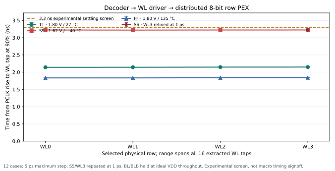
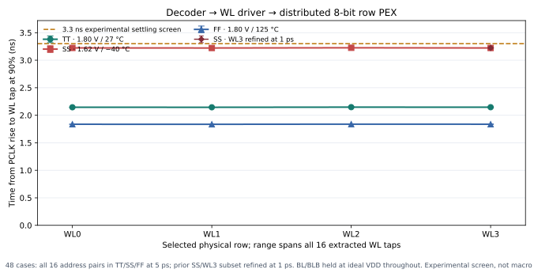

# Decoder-to-distributed-row PEX screen — 2026-10-09

## Initial 12-case subset (historical)

A new transient screen connects the current dynamic decoder PEX, four current
wordline-driver PEX instances, and four extracted eight-bit row instances. The
four physical rows cover the 4×8 array's 32 bitcells and share the eight
BL/BLB column pairs.

The selected-row matrix completed **12/12 cases**: one address transition for
each selected row in TT, SS, and FF. All 4,992 decoder-output and row-tap checks
passed. A targeted 1 ps refinement of the slowest 5 ps case, SS/WL3, also
passed its 416 checks. This is a measured electrical screen under the bench
assumptions below; it does not close read/write operation, model acceptance,
or macro timing.

| Profile | Selected-row WL90 across 16 taps | Highest unselected tap | Highest recovery tap |
|---|---:|---:|---:|
| TT, 1.80 V, 27 °C | 2.142–2.149 ns | 16.2 µV | 0.330 µV |
| SS, 1.62 V, −40 °C | 3.221–3.224 ns | 12.8 µV | 0.577 µV |
| FF, 1.80 V, 125 °C | 1.834–1.840 ns | 170.4 µV | 151.3 µV |

The 1 ps refinement measured 3.224141–3.224215 ns across the SS/WL3 taps,
about 0.131 ps below the 5 ps result. This leaves 75.8 ps before the bench's
3.3 ns settling screen. That screen is an exploratory allowance, not a
specified SRAM requirement or approved timing margin.

The plot shows the measured range across all 16 WL taps in each selected
physical row:



## Full address-transition matrix and access-control screen

The initial subset above has now been expanded to all **16 ordered address
pairs** (`OLD:NEW`), including same-address accesses, in TT, SS, and FF. The
full physical-row matrix completed **48/48 cases** with **19,968/19,968
decoder and physical-row checks passing**. No case was rejected and the runner
manifest is complete.

| Profile | Selected-row WL90 across all 16 taps and old addresses | Highest unselected tap | Highest recovery tap |
|---|---:|---:|---:|
| TT, 1.80 V, 27 °C | 2.142469–2.150495 ns | 16.2 µV | 0.330 µV |
| SS, 1.62 V, −40 °C | 3.220558–3.228800 ns | 12.8 µV | 0.577 µV |
| FF, 1.80 V, 125 °C | 1.833842–1.841717 ns | 170.4 µV | 151.3 µV |

The slowest point is **3.228800 ns** at SS, selected row 2, transition
`1→2`. It is 71.2 ps below the bench's 3.3 ns settling screen. That screen is
an exploratory allowance, not a specified SRAM requirement or approved timing
margin. The earlier targeted 1 ps SS/WL3 refinement remains timestep evidence
for its original `0→3` case; it is not a refinement of this newly identified
worst transition.



The access-control truth-table screen used fixed address `2→2` for every
combination of `CSb/OEb/WEb` in all three corners: **24/24 cases and
3,882/3,882 checks passed**. The two valid operations (`001` read and `010`
write) evaluate row 2. For each of the six other vectors, the bench holds the
ideal PCLK input in precharge and verifies PCLK low, all four internal dynamic
nodes precharged, all DEC/WL outputs low, and all 64 physical-row taps
inactive. Each denied case contributes 77 checks.

| CSb/OEb/WEb | Specification meaning | Bench expectation | TT/SS/FF |
|---|---|---|---:|
| `001` | Read | Evaluate row 2 | 3/3 PASS |
| `010` | Write | Evaluate row 2 | 3/3 PASS |
| `011` | Idle | Suppress evaluation | 3/3 PASS |
| `000` | Invalid | Suppress evaluation | 3/3 PASS |
| `1XX` | Disabled | Suppress evaluation | All four `OEb/WEb` pairs pass in each corner |

The largest selected-row WL90 delay in the valid-control matrix is 3.223037 ns
at SS. The control vectors are classified as static test cases and PCLK is an
ideal testbench source. This checks the specified access policy at the decoder
interface; it does **not** instantiate or qualify a transistor-level control
block, capture timing for `CSb/OEb/WEb`, or a physical PCLK generator. The
result does not establish read/write data behavior because BL/BLB remain held
at ideal VDD throughout the transient.

Both complete matrices and their per-case summaries/checks are archived at
[`physical-row transition matrix`](../sims/row_decoder/results/distributed_row_pex_full_transition_matrix_20261009/manifest.json)
and
[`access-control matrix`](../sims/row_decoder/results/distributed_row_pex_access_control_matrix_20261009/manifest.json).

## PEX input and provenance

The physical-row source is a byte-for-byte copy of Danilo's existing
`layout/row_8_wl/pex/row_8_wl_pex.spice` from branch `feat/sram-6t-cell`, commit
`95c23c03ddc29f0d4bf40adf5fe7adb1b4af0a6a`. The SHA-256 is
`160b65544e12481aa99b287329ef2798e80c184c8f91566a23177ed8f0fb2dd6`. It has
48 MOS, 786 resistors, and 349 capacitors per eight-bit row; the four instances
therefore add 192 MOS, 3,144 resistors, and 1,396 capacitors to the transient
network. The copy and its provenance are under
[`sims/row_decoder/inputs/`](../sims/row_decoder/inputs/row_8_wl_pex_95c23c0.provenance.json).
Danilo's source files and branch were not modified, and no extraction was run.

The physical row has pins `VDD VSS WL BL0 BLB0 ... BL7 BLB7`. Each instance
connects its `WL` pin to the corresponding WL-driver PEX output. Each column
BL/BLB pair is shared by the four row instances.

## Bench assumptions

- Current decoder: 29-MOS schematic replaced with its current Magic R-C PEX.
- Wordline drivers: four instances of current Magic R-C PEX.
- Physical row: four instances of the extracted eight-bit row above.
- Address launch: `dfxtp_1` Liberty clock-to-Q PWL, nominal Q load 3.434554 fF.
- Capture-to-PCLK delay: 1.950 ns; ideal CLK falling edge: 20.700 ns.
- Settling screen: 3.3 ns after PCLK evaluation begins.
- Maximum transient step: 5 ps for the 48-case transition matrix and the
  24-case access-control matrix; the earlier SS/WL3 refinement used 1 ps.
- The full transition matrix covers all 16 ordered `OLD:NEW` address pairs.
- Access-control vectors are static per case; the ideal qualifier evaluates
  `001` and `010`, and holds PCLK low for `000`, `011`, and all `1XX` vectors.
- Every BL and BLB is clamped to VDD for the entire transient. This holds the
  line pair at a stiff high level to keep the simulation numerically defined.

The bench does **not** reproduce the specified bitline timing: its ideal
precharge clamps remain active after PCLK enters evaluation. It has no
precharge/equalizer transistor, sense amplifier, write driver, access-enable
gate, or readback check. Cell state and bitcell terminal model-domain limits
are not qualified. The results establish that the decoder/driver chain can
charge and deassert the distributed WL taps under this explicit loading setup;
they do not establish SRAM read/write correctness.

PCLK remains an ideal source. Its actual generation, capture timing, external
setup/hold, and accepted operating frequency are unresolved. The 1.950 ns phase
and 3.3 ns settling screen are inherited experimental points, not project
specifications. Decoder/WL terminal screens passed in the matrix; model-owner
acceptance and reliability signoff remain open.

## Row-capacitance source and load interpretation

The latest owner closure available on `origin/feat/sram-6t-cell` at
`5dc00fe` identifies the current requalified range as 102.328671–102.873935 fF
for the full eight-bit row and `CWL_EXTRA=93.351918 fF` when the selected
bitcell is already represented. The `98.914001 fF` full-row and `89.925201 fF`
extra values remain in the owner report as explicitly superseded 07/10 history.
The copied `.t0` table and its provenance match the current full-row maximum.

Decoder capture and WL-leaf benches without explicit bitcells use the full-row
maximum. A bench with the selected cell explicitly present uses the paired
extra value. This distributed-row simulation instantiates the extracted row
PEX directly and adds no lumped row Ceff. The current source interpretation
does not change the measured results in this report. See the owner
[`phase1_leaf_cell_closure.md`](https://github.com/leofernandesc/Open-source-sram-memory-compiler/blob/5dc00fe/docs/phase1_leaf_cell_closure.md)
and [`cwl_pre_layout_estimate.md`](https://github.com/leofernandesc/Open-source-sram-memory-compiler/blob/5dc00fe/docs/cwl_pre_layout_estimate.md)
at the referenced commit.

## Reproduction and artifacts

Run from the repository root in the configured EDA environment:

```bash
./tools/sram-eda python3 sims/row_decoder/run_row_decoder_distributed_row.py \
  --profiles tt slow fast \
  --transitions 0:0 0:1 0:2 0:3 1:0 1:1 1:2 1:3 \
                2:0 2:1 2:2 2:3 3:0 3:1 3:2 3:3 \
  --loads nominal \
  --phase-ps 1950 --clk-fall-ps 20700 \
  --settling-allowance-ns 3.3 --step-ps 5 \
  --output-dir sims/row_decoder/results/distributed_row_pex_full_transition_matrix_20261009

./tools/sram-eda python3 sims/row_decoder/run_row_decoder_distributed_row.py \
  --profiles tt slow fast --transitions 2:2 \
  --control-vectors 000 001 010 011 100 101 110 111 \
  --loads nominal --phase-ps 1950 --clk-fall-ps 20700 \
  --settling-allowance-ns 3.3 --step-ps 5 \
  --output-dir sims/row_decoder/results/distributed_row_pex_access_control_matrix_20261009

./tools/sram-eda python3 sims/row_decoder/run_row_decoder_distributed_row.py \
  --profiles slow --transitions 0:3 --loads nominal \
  --phase-ps 1950 --clk-fall-ps 20700 \
  --settling-allowance-ns 3.3 --step-ps 1 --timeout-s 300 \
  --output-dir sims/row_decoder/results/distributed_row_pex_slow_row3_refine_1ps_20261009

./tools/sram-eda python3 sims/row_decoder/plot_distributed_row_pex.py
```

The matrices, per-case decks/logs, checks, tap samples, terminal samples,
manifests, and executed runner snapshots are archived under
`sims/row_decoder/results/distributed_row_pex_*_20261009/`. The access-control
matrix summary was reconstructed from its passing per-case artifacts after
the first CSV aggregation encountered heterogeneous fields; the runner's
union-column writer was fixed and verified with a two-case mixed-control
simulation. No transistor simulation was repeated for that recovery. The
runner and plot generator are `sims/row_decoder/run_row_decoder_distributed_row.py`
and `sims/row_decoder/plot_distributed_row_pex.py`.
The runner refuses to overwrite an existing output directory; use a fresh
directory name when repeating either command.

## Next required work

1. Replace the continuous ideal BL/BLB clamps with the reviewed precharge and
   equalization interface; hold the bitlines during precharge and release them
   for evaluation.
2. Agree the actual PCLK source/phase and access-enable behavior with the
   control/interface owners, then repeat the selected-row and deassertion
   tests at that timing.
3. Add bitcell state, read/write stimulus, and data readback only after the
   bitline and precharge interfaces are agreed.

P3-7 is therefore **advanced, not fully closed**: distributed WL PEX behavior
has been exercised for all four selected rows, while the SRAM electrical
interface and owner acceptance remain open.
