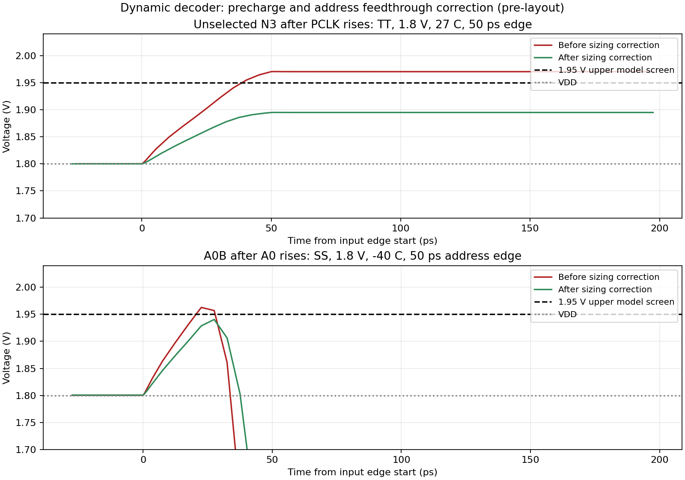

# Dynamic decoder feedthrough investigation and corrective sizing

Status: pre-layout corrective candidate B6, retaining the specified dynamic
2-to-4 NAND architecture and the nine-pin interface. This is a measured
correction of the upper-voltage excursions, not the final sizing freeze.

## Observed failure and structural review

At TT, 1.8 V, 27 C, 17.4 fF per WL and 50 ps PCLK edges, B5 passes all
72 output samples and 252 window/internal/timing checks, but produces a maximum
output-NMOS VGS of 1.97534 V with Gear and a 5 ps maximum timestep. All 16
per-row/per-cycle upper-VGS checks exceed 1.95 V. Gear 10 ps and trapezoidal
5 ps reproduce the excursion. At 25 ps clock edges it reaches 2.00279 V.

The generated hierarchy contains the intended 25 devices. All D/G/S/B
connections, row equations, bulk rails, isolated EVAL_GND node, footer,
distinct stack nodes and four independent loaded outputs pass the netlist
audit. The evidence identifies an electrical sizing issue in this topology;
it does not identify a remaining accidental net short or incorrect row mapping.

The published model operating range for nfet_01v8 includes VGS and VDS up to
1.95 V. This is a model-domain boundary, not an absolute damage rating.
[SKY130 device documentation](https://skywater-pdk.readthedocs.io/en/main/rules/device-details.html#v-nmos-fet).

## Controlled cause isolation

The following experiments use the archived B5 netlist at TT, 1.8 V and 27 C.
Separated internal clocks exist only in diagnostic decks; they are not part of
the source schematic or macro interface.

| Experiment | Maximum dynamic-node/output-NMOS VGS | Interpretation |
|---|---:|---|
| Original precharge and footer clocks, 50 ps | 1.97534 V | Reproduces the failure |
| Only precharge gates slowed to 250 ps; footer remains 50 ps | 1.90022 V | Removes the upper excursion |
| Only footer slowed to 250 ps; precharge remains 50 ps | 1.97380 V | Excursion remains |
| Footer held off; precharge gates remain 50 ps | 1.97061 V | Excursion persists without evaluation discharge |

The footer-off negative control intentionally fails eight selected-output
samples and eight evaluation-window checks: no row can discharge. These failures
are expected for this diagnostic and are retained in the evidence.

The rising PCLK edge couples through the precharge PMOS gate/drain capacitance
and channel charge into each dynamic row node as the PMOS turns off. An
unselected node then retains the elevated charge through evaluation. The peak
is therefore not necessarily a short spike. The independent-clock experiments
and the monotonic response to precharge width identify this precharge path as
the dominant contributor in the simulated circuit. They do not separate every
BSIM charge contribution into a unique physical capacitance.

## Sizing alternatives

All alternatives retain M8 W=0.50 um, L=0.15 um and nf=1. This table uses the
same TT/1.8 V/27 C/50 ps/17.4 fF condition and Gear 5 ps.

| Precharge PMOS W | DEC inverter P/N W | Peak VGS | Max WL evaluation | Max WL precharge completion | Mean VDD cycle energy |
|---:|---:|---:|---:|---:|---:|
| 1.00 um | 1.00/1.00 um | 1.97534 V | 302.91 ps | 292.39 ps | 123.76 fJ |
| 0.75 um | 1.00/1.00 um | 1.94944 V | 300.61 ps | 318.51 ps | 123.16 fJ |
| 0.50 um | 1.00/1.00 um | 1.91491 V | 298.11 ps | 377.38 ps | 122.66 fJ |
| 0.42 um | 1.00/1.00 um | 1.90057 V | 297.24 ps | 411.69 ps | 122.58 fJ |
| 1.00 um | 1.50/1.50 um | 1.94353 V | 310.72 ps | 298.92 ps | 130.67 fJ |
| 1.00 um | 2.00/2.00 um | 1.92139 V | 320.75 ps | 306.51 ps | 137.69 fJ |
| 0.42 um | 1.50/1.50 um | 1.87748 V | 304.96 ps | 427.91 ps | 130.03 fJ |

The 0.75 um precharge case has only 0.56 mV nominal margin to the model screen.
The 0.42 um precharge option reduces coupling while preserving the existing
DEC inverter and WL driver loads. Its longer precharge completion must be
included in the eventual low-phase timing budget. Enlarging the DEC inverters
also suppresses the peak, but increases the measured energy and evaluation
delay in these comparisons. These results support a corrective baseline;
the project's final performance/power/area priority remains open.

## Additional address-inverter finding

Reducing only precharge W to 0.42 um passes the original output-VGS screen in
54 experimental conditions: TT/SS/FF, 1.62/1.80 V, -40/27/125 C, and
25/50/250 ps PCLK edges. Reviewing VGS, VGD, VDS and VBS for all 25 devices
also reveals a separate maximum VDS of 1.96265 V at M2 in SS/1.8 V/-40 C.
It occurs at 22.0225 ns during the 50 ps A0 transition, not at a PCLK edge.
M4 also reaches 1.95230 V during the A1 transition.

The address inverter output couples upward during its input transition before
the NMOS pull-down fully conducts. Reducing the width of both devices in each
address inverter reduces this feedthrough against the existing evaluation-gate
load. All five width comparisons pass functional checks at SS/1.8 V/-40 C:

| Address inverter P/N W | Largest measured magnitude of VGS/VGD/VDS across all decoder devices |
|---:|---:|
| 1.50/1.50 um | 1.97320 V |
| 1.00/1.00 um | 1.96264 V |
| 0.75/0.75 um | 1.95316 V |
| 0.50/0.50 um | 1.94546 V |
| 0.42/0.42 um | 1.94039 V |

## Implemented corrective candidate B6

The source schematic changes eight widths:

- M1, M2, M3, M4: W=0.42 um for the two address-complement inverters.
- M5, M11, M16, M21: W=0.42 um for the four precharge PMOS.

M8 remains W=0.50 um. Evaluation-stack devices and DEC inverter devices remain
W=1.00 um. All devices retain L=0.15 um and nf=1. The existing WL driver
schematic/layout and write-driver work are preserved.

Fresh Xschem netlisting of this source produces the same netlist SHA256 as the
netlist used for the B6 qualification campaign:
`c4bf9485fd7ccf5703ccc82fb4e6cdb5c01e2485e1488935e67d5e17dc077e63`.
The source schematic and its exported SVG are updated together.

| TT, 1.8 V, 27 C, 50 ps, 17.4 fF/WL, Gear 5 ps | B5 | B6 |
|---|---:|---:|
| Output samples | 72/72 PASS | 72/72 PASS |
| Maximum output-NMOS VGS | 1.97534 V | 1.90111 V |
| Per-cycle upper-VGS excursions | 16 | 0 |
| Maximum DEC evaluation delay | 122.06 ps | 121.36 ps |
| Maximum WL evaluation delay | 302.91 ps | 302.04 ps |
| Maximum DEC precharge completion | 116.16 ps | 240.05 ps |
| Maximum WL precharge completion | 292.39 ps | 413.64 ps |
| Mean VDD energy per stimulus cycle | 123.76 fJ | 120.46 fJ |
| Sum(W*L) decoder channel-area proxy | 3.675 um2 | 2.979 um2 |

The VDD energy includes the decoder and four WL drivers, excludes ideal
clock/address-source energy, and includes the preserved address activity during
the low phase. Channel area is an arithmetic proxy, not layout area.



## Qualification scope and remaining margins

The B6 experiment covers 54 combinations of TT/SS/FF, VDD=1.62/1.80 V,
temperature=-40/27/125 C, and equal PCLK rise/fall times of 25/50/250 ps.
Address rise/fall times remain 50 ps; the four-address schedule and 17.4 fF
WL loads are preserved. These voltage, temperature and edge values are
experimental conditions, not newly approved product limits or nominal temperature.

All 3,888 output samples pass. All 13,608 non-model window/internal/timing
checks pass. There are no output-NMOS upper-VGS excursions and no measured
|VGS|, |VGD| or |VDS| magnitude above 1.95 V in this grid. The maximum full-run
output-NMOS VGS is 1.91830 V at FF/1.8 V/125 C/25 ps. The largest measured
terminal magnitude is 1.94576 V at M1 VGD in that same condition.
Worst WL evaluation is 510.81 ps and worst precharge completion is 701.23 ps,
both at SS/1.62 V/-40 C/250 ps. The 20 ns clock period is a test stimulus,
not a measured maximum operating frequency.

At nominal TT, Gear 10 ps, Gear 5 ps and trapezoidal 5 ps all retain the logic
and upper-voltage passes. Four additional runs refine SS/-40 C and FF/125 C
at 1.8 V and 25 ps clock edges with Gear/trapezoidal 1 ps maximum steps.
All four pass the same screens. The refined maximum output-NMOS VGS is
1.91939 V; the largest terminal magnitude is 1.94688 V, leaving only 3.12 mV
to the magnitude screen in that diagnostic. That measured margin must remain
visible during noise, mismatch, asymmetric-edge and parasitic characterization;
it does not justify declaring final robustness.

The standard runner now checks address-inverter NMOS VDS across the entire
90 ns transient, including address changes during precharge, and checks the
four dynamic-node VGS maxima over the full transient in addition to the
original per-cycle checks. It returns nonzero on either upper-voltage finding.
The console separately counts these model checks, avoiding the previous
inclusion of passing model checks in the window-check count. Sixteen regression
tests pass, including device-family isolation and full-transient measurement
coverage.

## Evidence and reproduction

- [Clock/width/isolation exploration](../sims/row_decoder/results/feedthrough_exploration/summary.csv)
- [Precharge-only campaign](../sims/row_decoder/results/feedthrough_pre042_qualification/summary.csv)
- [Precharge-only terminal extrema that exposed the address issue](../sims/row_decoder/results/feedthrough_pre042_qualification/terminals.csv)
- [Address-width comparison](../sims/row_decoder/results/feedthrough_address_exploration/summary.csv)
- [B6 54-condition summary](../sims/row_decoder/results/feedthrough_b6_qualification/summary.csv)
- [B6 device terminal extrema](../sims/row_decoder/results/feedthrough_b6_qualification/terminals.csv)
- [B6 archived qualification input netlist](../sims/row_decoder/results/feedthrough_b6_qualification/input_netlist.spice)
- [Nominal numeric sensitivity](../sims/row_decoder/results/feedthrough_b6_numeric/summary.csv)
- [1 ps numerical refinement](../sims/row_decoder/results/feedthrough_b6_refinement/summary.csv)
- [B6 loaded output samples](../sims/row_decoder/results/b6_tt_samples.csv)
- [B6 loaded metrics](../sims/row_decoder/results/b6_tt_samples_metrics.csv)
- [B6 source/tool manifest](../sims/row_decoder/results/b6_tt_samples.json)
- [B6 bare-decoder functional samples](../sims/row_decoder/results/b6_functional_tt_samples.csv)

The investigation runner audits the baseline, applies declared simulation-only
width/clock overrides and saves summary, metrics, node peaks and terminal
extrema. Its footer-off case explicitly omits nonexistent selected-output
crossings. Simulation/tool failures and missing measurements abort a campaign.
Expected original failures remain archived as failures.

```bash
./tools/sram-eda python3 sims/row_decoder/run_row_decoder_feedthrough.py \
  --campaign explore --output-dir /tmp/decoder-exploration \
  --artifacts-dir /tmp/decoder-feedthrough-explore-final

./tools/sram-eda python3 sims/row_decoder/run_row_decoder_feedthrough.py \
  --campaign address --output-dir /tmp/decoder-address-comparison \
  --artifacts-dir /tmp/decoder-address-explore

./tools/sram-eda python3 sims/row_decoder/run_row_decoder_tt.py \
  --bench sizing --candidate B6 --method gear --max-step-ps 5 \
  --output /tmp/b6_tt_samples.csv --artifacts-dir /tmp/decoder-B6-live-loaded

./tools/sram-eda python3 sims/row_decoder/run_row_decoder_feedthrough.py \
  --campaign qualify \
  --netlist sims/row_decoder/results/feedthrough_b6_qualification/input_netlist.spice \
  --output-dir /tmp/decoder-b6-qualification

./tools/sram-eda python3 sims/row_decoder/run_row_decoder_feedthrough.py \
  --campaign refine \
  --netlist sims/row_decoder/results/feedthrough_b6_qualification/input_netlist.spice \
  --output-dir /tmp/decoder-b6-refinement

./tools/sram-eda python3 -m unittest discover \
  -s sims/row_decoder -p 'test_*.py' -v

./tools/sram-eda python3 sims/row_decoder/plot_row_decoder_feedthrough.py \
  /tmp/decoder-feedthrough-explore-final/B5_clock50/waveform.raw \
  /tmp/decoder-B6-live-loaded/row_decoder.raw \
  /tmp/decoder-address-explore/addr1/waveform.raw \
  /tmp/decoder-address-explore/addr0.42/waveform.raw \
  --output /tmp/row_decoder_feedthrough_fix.png
```

The complete signed model domain, internal BSIM source/drain handling and
reliability assessment remain separate from the upper-voltage/magnitude
screens. Off-state stacks have negative signed VGS, and some terminals reverse
polarity briefly; these extrema are retained rather than relabeled as a full
model-domain PASS. The circuit still needs the remaining address-history,
captured-address setup, asymmetric edge, phase-duration, noise, actual-clock
driver and post-layout tests in [the sizing campaign](row_decoder_sizing_plan.md).


## 2026-10-07: expanded address-history qualification supersedes the sizing inference

The earlier B6 results remain measurements for their archived stimulus. They
do not qualify every address history: simultaneous two-bit changes with
Gear 1 ps and CHGTOL=1e-18 C expose an M2 VDS maximum of **1.974458 V**
at SS/1.8 V/-40 C. B6 remains the source schematic, not a final robust sizing.

Leonardo selected greater electrical margin and robustness as the decoder
selection priority. The implemented contract executor now measures all ordered
histories, address arrival, phase lengths, finite retention, edge asymmetry,
charge perturbations, signed external MOS terminal extrema and family
interactions. Failed comparisons are retained. The new
[characterization record](row_decoder_contract_characterization.md) contains
the current evidence, numerical-breakpoint investigation and reproducible
commands. Physical closure and full signed model-domain review remain open.
