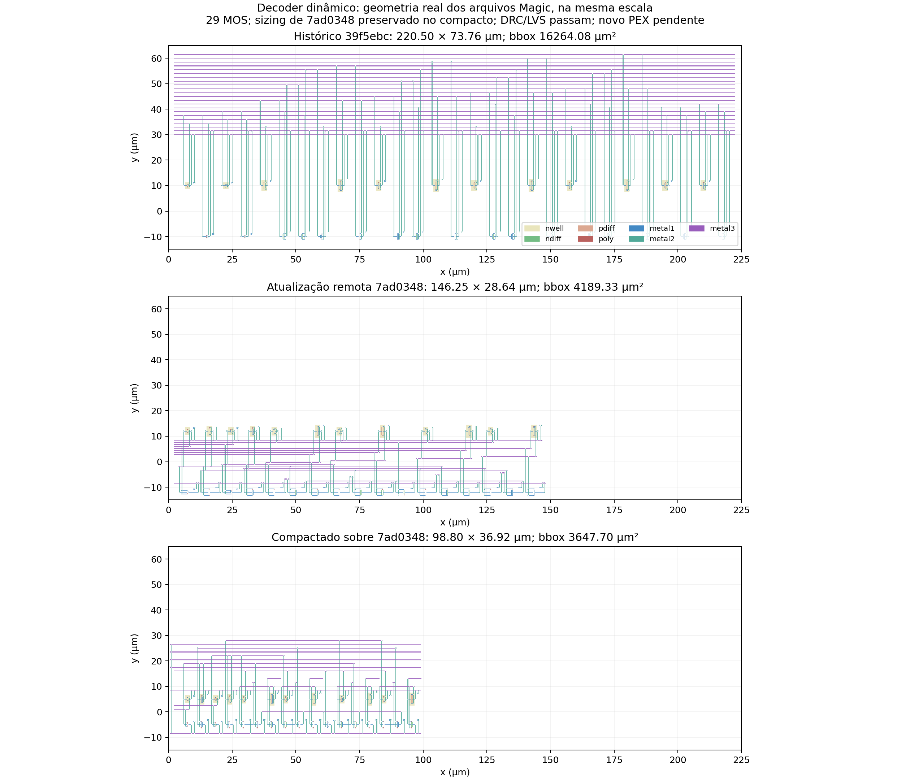

# Decoder dinâmico — compactação e entrega para nova extração

## Estado da entrega

Branch: `feature/peripherals`. A compactação foi aplicada sobre o commit
`7ad034823ccaebb761a112501317c3a3ea57b008`, incorporado por avanço direto da
branch. O esquemático, a topologia e o sizing desse commit foram preservados.
O trabalho de bitcell, sense amplifier, precharge, WL driver e write driver
não foi alterado.

**Estado no handoff original de `d20f509`, antes desta execução:** DRC
hierárquico/achatado zero e LVS único (29 MOS, 22 redes); nova extração R-C e
simulação ainda pendentes. O resultado atualizado abaixo encerra essa etapa
para o layout compacto.

O commit remoto já tinha melhorado o layout, ajustado o sizing e registrado
13/13 casos aprovados nas campanhas de 5 ps e 1 ps. Esses resultados pertencem
à revisão remota arquivada, não à geometria compactada entregue agora.

## Resultado após o handoff - 2026-10-08

No checkout `d20f509`, o helper
`./tools/sram-eda bash tools/extract_row_decoder.sh` concluiu com código 0.
Magic 8.3.684, SKY130A tech 1.0.493: DRC roteado e achatado 0/0. Netgen
1.5.293: “Circuits match uniquely”, 29 MOS, 22 redes e nove pinos. A extração
gerou 762 resistores positivos e 389 capacitores não negativos, com cobertura
resistiva de todas as 22 redes. A interface permanece
`VDD PCLK A0 A1 DEC0 DEC1 DEC3 DEC2 VSS`; não há capacitores negativos.
PEX SHA-256:
`8ee6b99aabf94bde9a1de2a13f0c040cda41dd55bb9568672e38a7f6bb54a6dc`.
O manifesto e `pex/provenance.json` registram os hashes e o estado atual.

As matrizes pareadas passam 13/13 casos no baseline e PEX, tanto a 5 ps como
a 1 ps, sem achados nos checks de lógica, pré-carga, segmentos dinâmicos ou
tensão. A 1 ps, o atraso de 90% do WL no PEX é 551.858–815.389 ps,
pré-carga até 10% é 524.334–789.564 ps e slew de subida 10–90% é
294.811–445.935 ps. O máximo de magnitude terminal PEX é 1.878 V.

```bash
./tools/sram-eda bash tools/extract_row_decoder.sh
./tools/sram-eda python3 sims/row_decoder/run_row_decoder_pex_contract.py --output-root sims/row_decoder/results/compact_decoder_5ps --max-step-ps 5 --workers 2 --timeout-s 900
./tools/sram-eda python3 sims/row_decoder/run_row_decoder_pex_contract.py --output-root sims/row_decoder/results/compact_decoder_1ps --max-step-ps 1 --workers 2 --timeout-s 900
```

Os resultados completos ficam em
`sims/row_decoder/results/compact_decoder_{5ps,1ps}/`; o stdout completo
da extração está em `layout/row_decoder/reports/extract_run_d20f509_20261008.log`.
O escopo continua limitado ao decoder, com WL buffers esquemáticos e carga de
linha estimada em 17,4 fF. Esses casos não qualificam ampla PVT, ruído,
retenção, linha física, macro completa ou confiabilidade.

## Alterações físicas

- 17 colunas com dispositivos PFET/NFET alinhados por função e pitch de 5,5 µm.
- Redes dinâmicas `N0..N3`, nós intermediários e saídas `DEC0..DEC3` usam
  trechos locais de M3. Redes diferentes reutilizam a altura apenas quando
  seus trechos estão separados fisicamente.
- Escapes de gate separados para evitar curto entre `PCLK` e os literais de
  endereço. Os sources dos NMOS superiores das pilhas têm escape próprio.
- Quatro trilhas ligadas a VSS entre PCLK e os endereços internos, com retorno
  explícito à alimentação. A redução de acoplamento é uma hipótese a medir
  com o novo PEX; essas trilhas também acrescentam capacitância à alimentação.
- Preservados os nove pinos: `VDD PCLK A0 A1 DEC0 DEC1 DEC3 DEC2 VSS`.
- Preservados os tamanhos de 7ad0348: M1–M4 com W=0,84 µm; PFETs de
  pré-carga com W=1,25 µm; pilhas de avaliação com W=2 µm; PFETs de saída
  com W=3 µm. Todos os W/L restantes continuam no esquemático aprovado
  nessa revisão; L=0,15 µm, nf=1, mult=1.

## Medidas geométricas

| Revisão | Largura × altura | Área do retângulo envolvente | Trechos horizontais de M3 |
|---|---:|---:|---:|
| Histórico 39f5ebc | 220,50 × 73,76 µm | 16.264,08 µm² | 4.851,00 µm |
| Atualização remota 7ad0348 | 146,25 × 28,645 µm | 4.189,33 µm² | 1.386,30 µm |
| Compactado sobre 7ad0348 | 98,80 × 36,92 µm | 3.647,70 µm² | 1.071,85 µm |

Comparado ao remoto imediatamente anterior: **12,93% menos área e 22,68%
menos comprimento horizontal de M3**. Comparado a 39f5ebc: 77,57% e 77,90%,
respectivamente. A altura aumentou em relação a 7ad0348; a largura diminuiu.
Os comprimentos incluem as novas blindagens, mas não os segmentos verticais.
Área envolvente não é área somada de polígonos nem dimensão de macro integrada.
Essas medidas não comprovam redução de capacitância, atraso, energia ou ruído.



Figura produzida a partir dos retângulos reais dos arquivos `.mag`, sem
extração de parasitas. Escala conferida no Magic: 2.000 unidades internas =
10 µm. [Métricas](../layout/row_decoder/reports/compaction/metrics.json) e
[figura em PDF](../layout/row_decoder/reports/compaction/layout_comparison.pdf).

## Evidências do handoff antes da extração R-C

Magic 8.3.684, SKY130A tech 1.0.493 e Netgen 1.5.293:

```text
Xschem MOS: 29 (12 PFET, 17 NFET)
Magic DRC hierarchical/top: 0
Magic DRC flattened: 0
DRC PASS
Magic connectivity extraction: 29 MOS devices; no RC PEX requested
Netgen LVS: Circuits match uniquely
RC PEX was stale at this handoff; extresist had not yet been run.
```

- [Execução do builder](../layout/row_decoder/reports/compaction/build.txt)
- [DRC hierárquico](../layout/row_decoder/reports/route.txt) e
  [DRC achatado](../layout/row_decoder/reports/drc_flat.txt)
- [LVS](../layout/row_decoder/reports/lvs.txt) e
  [extração apenas de conectividade](../layout/row_decoder/reports/lvs_connectivity.txt)
- [Versões, hashes e escopo](../layout/row_decoder/reports/compaction/verification.json)
- Dez testes automatizados de roteamento/proveniência aprovados, incluindo
  detecção de alterações de geometria, sizing e PEX e portabilidade de EOL.
- Mais 21 regressões dos checkers/runner elétricos aprovadas; ver
  [relatório](../layout/row_decoder/reports/compaction/electrical_runner_regressions.txt).
- Bloqueio de PEX obsoleto conferido antes de criar saída ou iniciar ferramentas.
  Os arquivos históricos preservam inclusive o espaçamento original dos logs
  e PEX; o diff das alterações atuais passou no check de whitespace excluindo
  somente esse arquivo histórico de evidências.

Reprodução local sem R-C:

```bash
./tools/sram-eda python3 layout/row_decoder/build_layout.py --skip-import --lvs-only
python3 -m unittest discover -s layout/row_decoder -p test_compact_routing.py -v
./tools/sram-eda python3 layout/row_decoder/compare_layouts.py
```

## Preservação e bloqueio de PEX antigo

As geometrias e extrações anteriores estão em
layout/row_decoder/archive/precompact_20261008/ e
layout/row_decoder/archive/remote_7ad0348/, com manifests de hashes. O PEX
de 7ad0348 foi preservado no arquivo histórico. A extração desta execução
atualizou o PEX canônico e seu manifest para a geometria compactada. Os
intermediários antigos e logs R-C antigos continuam no arquivo; os arquivos
.res.ext, .sim e .nodes atuais foram regenerados junto ao layout compacto.

No estado original de `d20f509`, `pex/provenance.json` registrava
`stale` e o runner rejeitava o PEX histórico antes de iniciar Xschem/ngspice.
A extração registrada acima substituiu o artefato, atualizou hashes e removeu
`pex/STALE.md`. O estado atual da proveniência é `current`. A rotina preservou
os controles `extresist threshold 0`, `mindelay 0`, `minres 100` mΩ,
resistência positiva, cobertura das 22 redes, capacitores não negativos e LVS
único.

## Procedimento de reprodução

1. Atualizar `feature/peripherals` e conferir se não há alterações locais que
   seriam sobrescritas. Não executar a extração sobre 39f5ebc ou 7ad0348.
2. Usar o container com o checkout atualizado montado em `/work`, SKY130A e
   Magic 8.3.684. Se necessário, instalar a versão registrada:

   ```powershell
   docker start sram-xschem
   docker exec -u 0 -w /work sram-xschem bash tools/install_magic_8_3_684.sh
   ```

3. **Executar na outra máquina**, a partir do repositório:

   ```powershell
   docker exec -w /work sram-xschem bash tools/extract_row_decoder.sh
   ```

   Em Linux com o launcher configurado:

   ```bash
   ./tools/sram-eda bash tools/extract_row_decoder.sh
   ```

   O comando regenera a geometria determinística, repete DRC/LVS, gera o R-C e
   verifica `provenance: current`. `--skip-import` reutiliza as PCells corretas
   já versionadas para o sizing de 7ad0348. Não reutilizar PCells antigas de
   outro checkout. Não editar ou excluir parasitas manualmente.

4. Conferir 29 MOS, nove pinos, resistências das 22 redes, zero capacitores
   negativos, DRC zero, LVS único e os novos hashes. Quantidades R/C podem
   mudar: não exigir 744/392, que são valores da geometria anterior.
5. Só depois executar a matriz pareada de 13 casos, em diretórios novos:

   ```bash
   ./tools/sram-eda python3 sims/row_decoder/run_row_decoder_pex_contract.py \
     --output-root sims/row_decoder/results/compact_decoder_5ps \
     --max-step-ps 5 --workers 2 --timeout-s 900
   ./tools/sram-eda python3 sims/row_decoder/run_row_decoder_pex_contract.py \
     --output-root sims/row_decoder/results/compact_decoder_1ps \
     --max-step-ps 1 --workers 2 --timeout-s 900
   ```

   No Windows, usar o comando Docker de simulação do README do layout com
   esses mesmos argumentos. O script `tools/extract_row_decoder.sh` configura
   os caminhos para a extração; o processo de simulação precisa de ngspice e
   Xschem no PATH do próprio comando/container.

6. Comparar lógica, pré-carga, segmentos dinâmicos, excursões nos terminais,
   atraso/slew e convergência numérica. Manter os checks experimentais de
   1 ns e 1,95 V; não ajustar limites para conseguir PASS. Reavaliar energia
   com passo refinado se necessário. Registrar falhas e hashes junto aos CSVs.

Depois disso, ampliar PVT, ruído/retenção e captura/PCLK para o sizing atual.
Os WL drivers ainda são esquemáticos e a carga de 17,4 fF é estimada; integração
com linha física e qualificação de confiabilidade continuam tarefas separadas.
