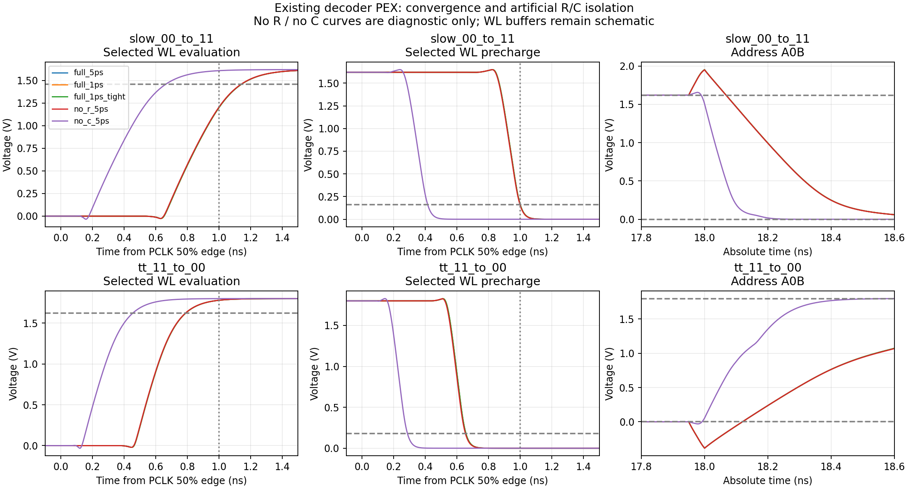
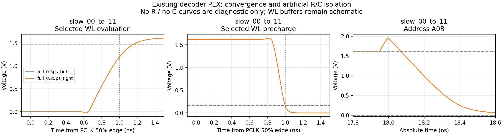

# Simulações diagnósticas do decoder com o PEX existente — 08/10/2026

> Evidência histórica da revisão 39f5ebc. O commit 7ad0348 mudou sizing,
> geometria e extração, registrando a aprovação de outra matriz. A compactação
> posterior está descrita no [handoff](row_decoder_layout_compaction_20261008.md).
> Os resultados abaixo não qualificam essas novas versões.

Foram executadas **12 simulações ngspice**, todas com retorno zero do
simulador: dez comparações de convergência/isolamento R-C em dois casos
críticos e duas verificações adicionais da pré-carga no caso lento.
As duas campanhas têm `complete=true`, sem erros de execução. Os checks
continuam identificando a falha de estabilização e os avisos de tensão.

Não houve nova extração, edição de schematic, layout ou limite de aceitação.
Os modelos, dimensões, carga de WL e estímulos permanecem os mesmos. As
intervenções sem R/sem C são feitas somente em decks diagnósticos separados,
sem substituir o PEX físico.

## Condições e rastreabilidade

- PEX histórico preservado: `layout/row_decoder/archive/precompact_20261008/pex/row_decoder_pex.spice`.
- SHA-256: `c3e39efae880fd46fddd0d610f9dd789a3beeee847c62ba2fbdaa1bf88419128`.
- ngspice 44.2, integração Gear, mesma biblioteca SKY130A da campanha original;
  hashes de toda a dependência de modelos conferidos antes de simular.
- Caso `slow_00_to_11`: SS, 1,62 V, −40 °C.
- Caso `tt_11_to_00`: TT, 1,8 V, 27 °C.
- Bordas de endereço/PCLK: 50 ps; endereço estabelecido 2 ns antes da
  avaliação; fase alta de 5 ns; intervalo de pré-carga de 10 ns.
- Quatro WL drivers esquemáticos, cada um com carga estimada de 17,4 fF.
- Os decks completos de 5 ps são idênticos aos respectivos decks arquivados.
- Houve diferença entre hashes históricos e atuais dos arquivos Xschem.
  Quatro hashes históricos coincidem com a representação CRLF dos arquivos
  locais. Para não aceitar mudanças elétricas por hipótese, um netlist novo
  foi exportado pelo Xschem e suas linhas elétricas comparadas ao baseline
  arquivado: correspondência exata. A exportação fica em
  `fresh_baseline_audit.spice`; os dois conjuntos de hashes estão no manifest.
- O container gráfico não iniciou devido à montagem Xauthority antiga. Foi
  usado um container headless `sram-pex-diag-20261008`, criado com a imagem
  já instalada `isaiassh/unic-cass-tools:1.0.7`, limitado a 1 CPU, 2 GiB de
  RAM e 3 GiB de memória mais swap. Nenhuma imagem nova foi baixada.

## Comparação controlada R/C

| Caso / rede | DEC a 90% (ps) | WL a 90% (ps) | WL a 10% na pré-carga (ps) | Resultado funcional/temporal |
|---|---:|---:|---:|---|
| SS, PEX completo, 5 ps | 688,57 | 1.141,66 | 999,90 | SETTLING_SCREEN_FAIL |
| SS, VSS resistivo colapsado, 5 ps | 686,35 | 1.139,63 | 998,30 | SETTLING_SCREEN_FAIL |
| SS, sem C explícitos do extrator, 5 ps | 133,28 | 662,89 | 414,72 | PASS diagnóstico |
| TT, PEX completo, 5 ps | 512,80 | 787,77 | 656,49 | PASS funcional/temporal; aviso de tensão |
| TT, VSS resistivo colapsado, 5 ps | 511,34 | 786,56 | 653,41 | PASS diagnóstico; aviso de tensão |
| TT, sem C explícitos do extrator, 5 ps | 106,72 | 453,25 | 286,83 | PASS diagnóstico; avisos de tensão |

No caso lento, colapsar os 393 resistores da rede VSS muda o atraso de WL
em apenas 2,03 ps. Remover os 226 capacitores explícitos do extrator muda
esse atraso em 478,77 ps. A comparação sustenta que **o conjunto de
capacitâncias extraídas domina a regressão temporal nesses casos**, enquanto
a resistência explícita de VSS tem efeito muito menor nesse experimento.
Ela não separa a contribuição de cada capacitor, rede ou camada física.

Na intervenção sem R, os nós VSS.* são unificados com VSS; os resistores
não são simplesmente apagados deixando terminais desconectados. Na
intervenção sem C, permanecem os modelos e suas capacitâncias intrínsecas,
os resistores e os quatro capacitores externos de WL. Nenhuma intervenção
representa um layout fabricável ou substitui a validação do PEX completo.



## Convergência numérica e pré-carga

As variantes com tolerância apertada usam `minbreak=1 fs` e `chgtol=1e-18 C`.
O par de 5 ps/1 ps sem overrides isola o efeito do passo máximo. O par
1 ps/1 ps apertado isola os overrides. As verificações de 0,5 e 0,25 ps
mantêm os mesmos overrides apertados.

| Caso SS / método | WL a 90% (ps) | WL a 10% na pré-carga (ps) | Maior magnitude de tensão (V) |
|---|---:|---:|---:|
| 5 ps, tolerâncias padrão | 1.141,6556 | 999,8959 | 1,950500 |
| 1 ps, tolerâncias padrão | 1.141,8528 | 999,9724 | 1,952124 |
| 1 ps, tolerância apertada | 1.141,8523 | 999,9705 | 1,952123 |
| 0,5 ps, tolerância apertada | 1.141,8583 | 999,9761 | 1,952175 |
| 0,25 ps, tolerância apertada | 1.141,8598 | 999,9769 | 1,952187 |

A diferença entre os dois últimos passos é 0,00152 ps em avaliação e
0,00085 ps em pré-carga. A falha de estabilização é reproduzida com todos
os passos: a WL selecionada ultrapassa 1 ns até atingir 90% de VDD.
A pré-carga continua passando o check neste caso, mas sua distância para
1 ns cai de 0,104 ps no resultado antigo para **0,0231 ps** na verificação
de 0,25 ps. A concordância numérica não fornece margem para variações físicas,
de carga, ruído, mismatch ou bordas de clock.

O screen de 1 ns continua experimental. Não foi alterado e não é a
frequência máxima nem um orçamento aprovado da macro SRAM.



## Excursões nas redes de endereço

O nó A0B foi salvo e observado diretamente na nova waveform. No caso TT
11 → 00, o mínimo no PEX completo é −0,38579 V com 5 ps e −0,38606 V
com 1 ps e tolerância apertada. Colapsar VSS resistivo resulta em −0,38541 V;
remover os C explícitos resulta em −0,03095 V. A excursão ocorre na mudança
de endereço em 18 ns, antes da avaliação de PCLK em 20 ns.

O maior extremo de tensão no caso TT completo é 2,18606 V na verificação
de 1 ps; ele não desaparece com o refinamento numérico. A remoção dos C
reduz a excursão de A0B, mas **o caso TT diagnóstico ainda excede o screen
de magnitude de 1,95 V**: seu maior extremo é 2,05783 V, e o proxy superior
dos nós dinâmicos também excede 1,95 V. Portanto, remover C em um experimento
não resolve toda a qualificação de tensão.

No caso SS completo, a maior magnitude converge para 1,95219 V e permanece
fora desse screen experimental. Os resultados não qualificam a faixa
assinada completa dos modelos nem a confiabilidade dos dispositivos.

## Evidências preservadas e reprodução

As duas pastas de resultados contêm `summary.csv`, `checks.csv`,
`terminals.csv`, manifests, snapshots do executor/helpers, decks exatos,
logs ngspice em `ngspice_output.txt` e gráficos PNG/PDF. As waveforms `.raw`
ficam disponíveis localmente em `artifacts/`, excluídas do Git pela regra
existente. `plot_samples.csv` preserva janelas de sinais interpoladas em uma
grade de 10 ps para visualização; os checks e métricas usam a waveform
adaptativa original, sem essa redução. Os hashes dos artefatos gráficos e
dos logs exportados são registrados no manifest.

```bash
SRAM_EDA_CONTAINER=sram-pex-diag-20261008 ./tools/sram-eda python3 \
  sims/row_decoder/run_row_decoder_pex_diagnostics.py \
  --historical-pex layout/row_decoder/archive/precompact_20261008/pex/row_decoder_pex.spice \
  --output-dir /tmp/decoder-pex-diagnostics-review --timeout-s 600

SRAM_EDA_CONTAINER=sram-pex-diag-20261008 ./tools/sram-eda python3 \
  sims/row_decoder/run_row_decoder_pex_diagnostics.py \
  --historical-pex layout/row_decoder/archive/precompact_20261008/pex/row_decoder_pex.spice \
  --output-dir /tmp/decoder-pex-precharge-refinement-review \
  --refinement-only --timeout-s 600
```

Esses comandos reproduzem a fonte arquivada explicitamente, sem alegar uma
nova auditoria do esquemático atual. Para reprodução exata do checker original,
os snapshots executados estão nas pastas de resultados. Esses comandos usam
pastas novas. O lançador inicia o container se ele estiver
parado. O executor retorna **1** porque os critérios do PEX completo ainda
falham, embora todos os subprocessos ngspice retornem **0** e as campanhas
terminem completas. Isso não é uma falha da ferramenta.

## Próxima ação sustentada pelos resultados

A investigação inicial está concluída para os dois casos selecionados.
Os dados sustentam preparar uma alteração física que reduza o comprimento
das redes locais e o acoplamento, sobretudo N0..N3, net1..net4, EVAL_GND,
DEC e os complementos de endereço. A amplitude/margem nas redes de endereço
também precisa de revisão. Ainda não foi escolhido um novo W/L.

**Depois dessa alteração física**, repetir DRC/LVS, avisar sobre a etapa
de extração e produzir um PEX novo na máquina adequada. A nova qualificação
deve incluir a matriz completa e os corners/bordas ainda pendentes.
As simulações aqui cobrem dois casos críticos; não encerram os outros
casos, a carga física de bitcells ou a SRAM completa.
