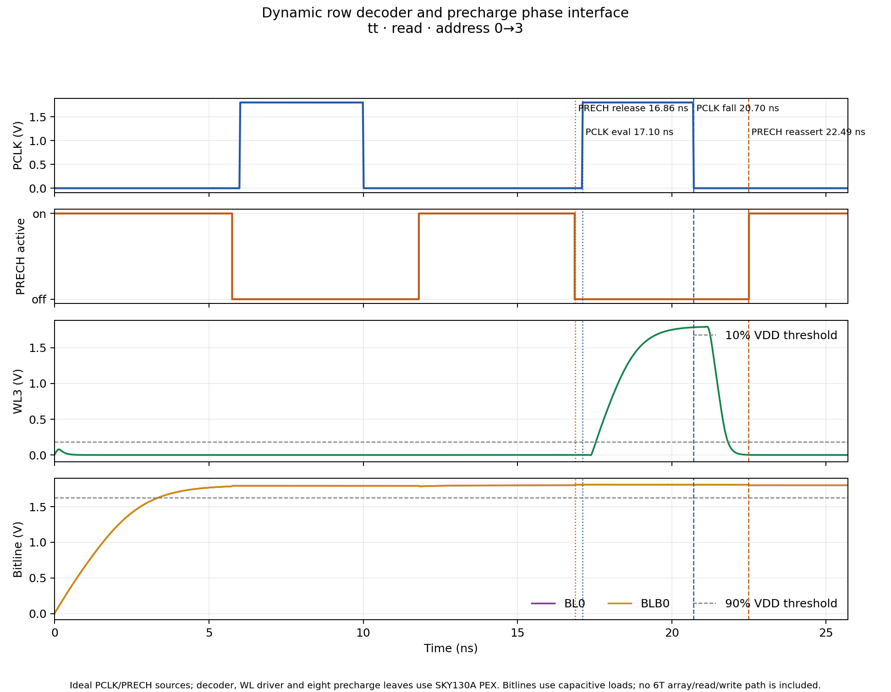

# Decoder and bitline-precharge phase decision — 2026-10-09

## Decision

For Person 3's row-decoder integration, use Danilo's W2.52 three-PMOS
precharge/equalization leaf as the selected simulation and integration input.
The branch uses the pinned, byte-for-byte PEX copy at
[`precharge_w2p52_pex_5dc00fe.spice`](../sims/row_decoder/inputs/precharge_w2p52_pex_5dc00fe.spice),
from `origin/feat/sram-6t-cell` commit `5dc00fe02e43492267516c3e448e935456406a1d`.
Its pins are `VDD BL BLB PRECH VSS`; `PRECH` is active low. This selects the
leaf for this integration work and does not edit Danilo's source or merge a
precharge revision into the team's shared branch.

Use **2.10 ns from rising-edge capture to decoder evaluation** as the initial
PCLK timing candidate. During a valid access, release active-low `PRECH` 250 ps
before PCLK rises, and reassert it 1.80 ns after PCLK falls. PCLK falls with
the falling edge of CLK. For idle, disabled, or invalid controls, keep PCLK low
and PRECH asserted. Address, controls, and write data are captured as required
by the specification; qualify access from the captured controls, not from live
control pins.

The captured-control qualification is:

```text
VALID_ACCESS_Q = !CSb_Q && (OEb_Q XOR WEb_Q)
```

It is true for the specified read vector `001` and write vector `010`, and false
for idle, disabled, and invalid vectors. The phase source must be glitch-free,
provide a delayed rising evaluation event, and stop evaluation at the falling
edge. It must release bitline precharge before evaluation and wait for the
wordline to turn off before reasserting precharge. This is phase control, not a
dedicated FSM.

Recommended signal path:

```text
captured controls ──> VALID_ACCESS_Q ─────┐
                                         ├─> delayed evaluation phase ──> PCLK
CLK rising/falling ─> asymmetric phases ─┤
                                         └─> PRECH release/turn-off ────> PRECH
```

The phase-source interface is `CLK`, captured control bits, `VDD`, `VSS`,
`PCLK`, and active-low `PRECH`. `PCLK` is allowed to rise only for a valid
captured read or write and falls at the falling clock edge. `PRECH`
releases after the captured rising edge and reasserts only after the selected
wordline is off. Idle, disabled, and invalid vectors keep `PCLK` low and
`PRECH` asserted. Since the specification has no reset, require an initial low
clock/precharge interval before the first valid access; the bench's 6 ns
conditioning pulse is only test setup, not an implemented startup circuit.

## Why 2.10 ns

The combined decoder/WL-driver PEX phase sweep at a fixed ideal 20.70 ns PCLK
fall measured two competing SS margins:

| Capture-to-PCLK candidate | Address-literal slack beyond 250 ps guard | Remaining time after latest WL90 | Smaller margin |
|---:|---:|---:|---:|
| 1.95 ns | 41.738 ps | 518.563 ps | 41.738 ps |
| 2.10 ns | 191.738 ps | 369.780 ps | 191.738 ps |

Among these sampled points, 2.10 ns gives the larger minimum of those two
slacks, by 150.000 ps. This maximin comparison uses the experimental 250 ps
literal guard and WL90-to-fall margin; it is an engineering choice for the next
integration step, not a specification limit or an operating-frequency claim.
The 2.10 ns point leaves a 3.60 ns ideal PCLK evaluation window in the specific
phase sweep; the clock-fall time and settling allowance used there are
experimental bench conditions.

## Verification with Danilo's PEX

### Correction to the first 2.10 ns phase-interface run

The first 2.10 ns matrix passed electrically, but its access-cycle `PRECH`
release was scheduled at the address-capture edge (`15 ns`) instead of 250 ps
before the access `PCLK` rise (`17.1 ns`). Thus it simulated roughly 2.09 ns
of release lead for the access cycle. The initial conditioning pulse did use
the intended 250 ps nominal lead. That first matrix is retained as historical
data, but it does **not** verify the intended access-phase release timing.

The runner was corrected to schedule `PRECH` 250 ps before both PCLK rising
edges. The campaigns below are the corrected replacement; their manifests
record the updated runner hash. The earlier 2.10 ns campaign directories remain
unchanged and are superseded for phase-ordering claims.

The selected phase candidate was screened with the current decoder PEX, four
wordline-driver PEX instances, eight copies of Danilo's W2.52 precharge PEX,
the current 102.873935496 fF row load, and lumped residual bitline capacitance.
Ideal PWL sources drove PCLK and PRECH. At a maximum transient step of 5 ps:

| Campaign | Cases | Detailed checks | Result |
|---|---:|---:|---|
| TT read/write transitions | 8 | 1,792 | 8/8 pass |
| TT idle/disabled/invalid vectors | 6 | 180 | 6/6 pass |
| Slow profile, 1.62 V / −40 °C, selected transitions | 4 | 896 | 4/4 pass |
| Fast profile, 1.80 V / 125 °C, all target rows | 8 | 1,792 | 8/8 pass |
| **Total** | **26** | **4,660** | **26/26 pass** |

The corrected phase-ordering subset passed 1,460/1,460 checks. The minimum measured
selected-WL-off interval before the conservative 75%-VDD precharge-conduction
threshold was 262.786 ps in the slow-profile cases. The observed PRECH release
lead was 237.5 ps; the observed PCLK-fall-to-precharge threshold interval was
1,787.5 ps. The minimum sampled bitline voltage before valid evaluation was
1.624086 V at 1.62 V, above the bench's 90%-VDD screen of 1.458 V.

### Representative waveform

This separate TT read case changes the captured address from row 0 to row 3.
The vertical markers show PRECH release, PCLK evaluation, PCLK fall, and
PRECH reassertion. It uses ideal PWL phase sources and extracted decoder,
wordline-driver, and precharge leaves; it contains no 6T access path and is not
counted in the 26-case matrix.



[waveform-case manifest](../sims/row_decoder/results/precharge_phase_interface_tt_waveform_phase2100_release250_20261009/manifest.json)

The four result sets are archived in:

- [TT valid accesses](../sims/row_decoder/results/precharge_phase_interface_tt_valid_phase2100_release250_20261009/manifest.json)
- [TT invalid and idle vectors](../sims/row_decoder/results/precharge_phase_interface_invalid_tt_phase2100_release250_20261009/manifest.json)
- [Slow profile](../sims/row_decoder/results/precharge_phase_interface_slow_phase2100_release250_20261009/manifest.json)
- [Fast profile](../sims/row_decoder/results/precharge_phase_interface_ff_phase2100_release250_20261009/manifest.json)

The reproduction commands use a fresh output directory for each campaign:

```bash
./tools/sram-eda python3 sims/row_decoder/run_precharge_phase_interface.py \
  --profiles tt --transitions 0:0 0:1 0:2 0:3 \
  --control-vectors 001 010 --transitions-per-vector \
  --phase-ps 2100 --clk-fall-ps 20700 --settling-allowance-ns 3.3 \
  --wl-cap-ff 102.873935496 --release-lead-ps 250 \
  --turnoff-guard-ps 1800 --prime-pclk-rise-ns 6 --step-ps 5 \
  --output-dir sims/row_decoder/results/precharge_phase_interface_tt_valid_phase2100_release250_20261009

./tools/sram-eda python3 sims/row_decoder/run_precharge_phase_interface.py \
  --profiles tt --transitions 0:3 \
  --control-vectors 000 011 100 101 110 111 \
  --phase-ps 2100 --clk-fall-ps 20700 --settling-allowance-ns 3.3 \
  --wl-cap-ff 102.873935496 --release-lead-ps 250 \
  --turnoff-guard-ps 1800 --prime-pclk-rise-ns 6 --step-ps 5 \
  --output-dir sims/row_decoder/results/precharge_phase_interface_invalid_tt_phase2100_release250_20261009

./tools/sram-eda python3 sims/row_decoder/run_precharge_phase_interface.py \
  --profiles slow --transitions 1:2 3:0 \
  --control-vectors 001 010 --transitions-per-vector \
  --phase-ps 2100 --clk-fall-ps 20700 --settling-allowance-ns 3.3 \
  --wl-cap-ff 102.873935496 --release-lead-ps 250 \
  --turnoff-guard-ps 1800 --prime-pclk-rise-ns 6 --step-ps 5 \
  --output-dir sims/row_decoder/results/precharge_phase_interface_slow_phase2100_release250_20261009

./tools/sram-eda python3 sims/row_decoder/run_precharge_phase_interface.py \
  --profiles fast --transitions 0:0 0:1 0:2 0:3 \
  --control-vectors 001 010 --transitions-per-vector \
  --phase-ps 2100 --clk-fall-ps 20700 --settling-allowance-ns 3.3 \
  --wl-cap-ff 102.873935496 --release-lead-ps 250 \
  --turnoff-guard-ps 1800 --prime-pclk-rise-ns 6 --step-ps 5 \
  --output-dir sims/row_decoder/results/precharge_phase_interface_ff_phase2100_release250_20261009
```

Regenerate the representative waveform case with `--keep-raw`, then plot it:

```bash
./tools/sram-eda python3 sims/row_decoder/run_precharge_phase_interface.py \
  --profiles tt --transitions 0:3 --control-vectors 001 \
  --phase-ps 2100 --clk-fall-ps 20700 --settling-allowance-ns 3.3 \
  --wl-cap-ff 102.873935496 --release-lead-ps 250 \
  --turnoff-guard-ps 1800 --prime-pclk-rise-ns 6 --step-ps 5 --keep-raw \
  --output-dir sims/row_decoder/results/precharge_phase_interface_tt_waveform_phase2100_release250_20261009

./tools/sram-eda python3 sims/row_decoder/plot_precharge_phase_interface.py \
  --case-dir sims/row_decoder/results/precharge_phase_interface_tt_waveform_phase2100_release250_20261009/cases/tt_ctl001_a0_to_3_p2100 \
  --output-svg docs/assets/row_decoder_precharge_phase_sequence_phase2100_release250_20261009.svg \
  --output-png docs/assets/row_decoder_precharge_phase_sequence_phase2100_release250_20261009.png
```

The original result folders without the `release250` suffix are kept for audit
and should not be used as evidence for the 250 ps access-release requirement.

## Limits and next work

These measurements verify only the specified cases in this bounded integration
bench. PCLK and PRECH are still ideal stimuli; captured-control logic, a real
phase generator, distributed bitlines, 6T access devices, sense amplification,
write behavior, and stored-data readback are not present. The initial 6 ns
conditioning pulse is bench setup, not an architectural startup circuit. No
extraction was run as part of this campaign, and no new DRC or LVS was run.
The source model's signed-bias/reliability acceptance also remains open.

The next implementation step is to define and capture the transistor-level
phase-source interface, then replace the ideal PWL PCLK/PRECH sources with that
implementation and repeat the phase checks. The timing candidate must be
adjusted if the real generator, extracted loads, or advisor-approved operating
window does not preserve the measured ordering and margins. The 2.10 ns,
250 ps, and 1.80 ns values remain experimental until then.
