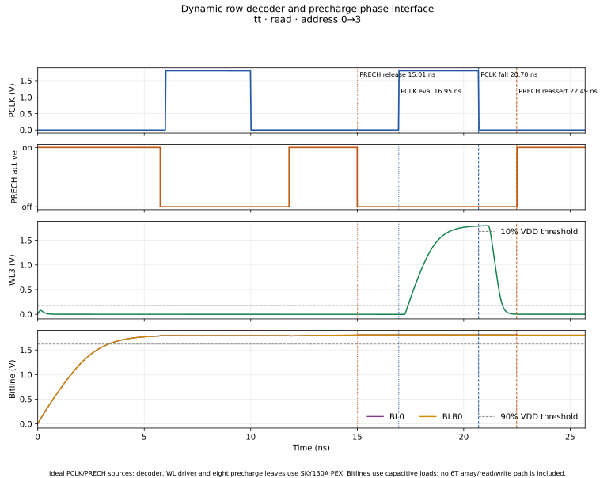

# Decoder, wordline and Danilo precharge phase-interface screen — 2026-10-09

## Purpose and result — initial run, release timing superseded

**Correction status:** this report records the first phase-interface campaign.
Its access-cycle `PRECH` release was inadvertently placed at the capture edge,
not 250 ps before access `PCLK`. The original results therefore describe an
earlier release schedule and do not verify the stated 250 ps access lead. The
runner and full 2.10 ns matrix have since been corrected; use the updated
[phase decision report](row_decoder_precharge_pclk_decision_20261009.md) and
its `release250` manifests for current phase-ordering evidence. The archived
results below are left unchanged for audit.
The reproduction commands retained later in this report now invoke the
corrected runner and therefore will not recreate the historical access-release
waveforms; use the commands in the phase decision report for current results.

This is a bounded electrical interface screen for the dynamic 2-to-4 decoder
owned by Person 3. It consumes the extracted SKY130A precharge candidate from
Danilo's branch as a read-only simulation dependency. It does not replace the
precharge source shared by the team or approve a final system timing contract.

The initial campaigns completed **26/26 ngspice cases** and **4,660/4,660
detailed checks** with no failures. The runner's phase-check summary contains
**1,460/1,460 passing checks**. The tested cases cover valid read/write
sequences in TT, selected transitions in the slow corner, all address targets
in FF, and all six non-read/non-write control vectors in TT.

The tested sequence releases active-low bitline `PRECH` before decoder
evaluation and waits for the selected wordline to turn off before asserting
`PRECH` again. At the 10% `VDD` wordline-off and 75% `VDD` precharge-device
conduction thresholds, the smallest measured separation was **254.48 ps** in
the slow-corner cases. This is a measured result for the ideal waveforms and
loads below; the 1.8 ns nominal falling-edge guard used to obtain it is an
experimental bench setting, not an approved clock requirement.

## Inputs and provenance

The read-only input is
[`precharge_w2p52_pex_5dc00fe.spice`](../sims/row_decoder/inputs/precharge_w2p52_pex_5dc00fe.spice),
copied byte-for-byte from
`origin/feat/sram-6t-cell` commit
`5dc00fe02e43492267516c3e448e935456406a1d`, path
`layout/precharge/experimental_w2p52/pex/precharge_w2p52_pex.spice`.
SHA-256: `cf0fa457b4ab84a1d19e6202541b6a43149b575e492a108e36d0de62489cc423`.
The copy's source and owner-reported qualification are recorded in the
[provenance sidecar](../sims/row_decoder/inputs/precharge_w2p52_pex_5dc00fe.provenance.json).

The selected leaf is `precharge_w2p52_flat`, with pin order
`VDD BL BLB PRECH VSS`, three PMOS devices, 20 resistors and 30 capacitors.
Its `PRECH` input is active low. Danilo's report records 60/60 PEX-Ceff cases,
zero Magic DRC errors and a unique Netgen LVS match. Those are owner-reported
results from Danilo's branch; they were not independently rerun in this work.
The older disconnected `cells/precharge/precharge.sch` in this branch and
André's source were left unchanged.

The bench also uses the current decoder PEX (29 MOS, 762 R, 389 C) and four
wordline-driver PEX instances (four MOS, 99 R and 43 C per driver). The WL
load is `102.873935496 fF` per row from the current owner row-Ceff evidence.
Each BL/BLB gets `583.992055 fF` of external capacitance, calculated as the
`597.056241 fF` bitline target minus Danilo's owner-reported maximum precharge
leaf Ceff of `13.064186 fF`. This is a lumped residual approximation: it does
not reproduce a distributed bitline or the state-dependent effective
capacitance exactly.

## Phase sequence exercised

The bench uses ideal PWL sources for both `PCLK` and `PRECH`. The control
vector chooses the stimulus policy; there is no transistor-level control
capture or phase generator in this test. `PCLK` controls dynamic-node
precharge/evaluation inside the decoder. Active-low `PRECH` controls Danilo's
separate bitline precharge/equalization devices.

For valid read (`001`) and write (`010`) cases, `PRECH` is released 250 ps
before a PCLK rising edge and reasserted 1.8 ns after PCLK falls. The PWL edge
has a 50 ps ramp, so the observed release lead is 237.5 ps and the observed
PCLK-fall-to-75%-VDD precharge threshold interval is 1,787.5 ps. A 6 ns
conditioning pulse provides initial precharge before the later test access;
that pulse is bench setup, not a proposed architectural access cycle.

Wordline turn-off is measured at 10% of the applicable supply, and precharge
device onset is conservatively measured at 75% of supply. In valid cases, all
bitlines reached at least 90% of supply before evaluation. In invalid, idle,
and disabled cases, PCLK stayed below 10% of supply, PRECH stayed asserted,
and all decoder/WL outputs stayed inactive.



The figure is one TT, 1.8 V, 27 °C read case with address transition `0→3`.
It plots the selected `WL3` and one bitline pair; the checks cover all eight
bitline pairs. The waveform was saved from the final run and exported as SVG
and [PNG](assets/row_decoder_precharge_phase_sequence_20261009.png). The raw
transient was omitted from the repository to avoid storing a roughly 10 MB
ngspice file; rerun with `--keep-raw` to regenerate the plot.

## Campaign results

| Campaign | Cases | Coverage | Result |
|---|---:|---|---|
| TT valid | 8 | Read and write; transitions `0→0`, `0→1`, `0→2`, `0→3` | 8/8 pass |
| TT invalid/idle/disabled | 6 | `000`, `011`, `100`, `101`, `110`, `111`; transition `0→3` | 6/6 pass |
| Slow corner | 4 | Read and write; selected transitions `1→2`, `3→0`; 1.62 V, −40 °C | 4/4 pass |
| FF | 8 | Read and write; transitions `0→0`, `0→1`, `0→2`, `0→3`; 1.8 V, 125 °C | 8/8 pass |

Across these campaigns, the minimum selected-WL-off margin before the
75%-VDD `PRECH` threshold was 254.477 ps. The measured minimum bitline voltage
before a valid evaluation was 1.619687 V in the 1.62 V slow-corner cases,
above the bench's 90%-VDD threshold of 1.458 V. These values are sampled
simulation results for this bench, not silicon guarantees or project-level
acceptance limits.

The final manifests and CSVs are retained in:

- [TT valid matrix](../sims/row_decoder/results/precharge_phase_interface_tt_valid_20261009/manifest.json)
- [TT invalid-vector matrix](../sims/row_decoder/results/precharge_phase_interface_invalid_tt_20261009/manifest.json)
- [slow-corner selected-transition matrix](../sims/row_decoder/results/precharge_phase_interface_slow_guard1800_20261009/manifest.json)
- [FF address-target matrix](../sims/row_decoder/results/precharge_phase_interface_ff_matrix_20261009/manifest.json)
- [TT waveform case](../sims/row_decoder/results/precharge_phase_interface_tt_waveform_final_20261009/manifest.json)

The completed exploratory pilots also preserve why the guard was increased:
the 500 ps TT pilot had a selected wordline still active when precharge began
conducting, with a minimum measured clearance of −637.466 ps. The 1.5 ns slow
pilot missed that clearance by 52.963 ps and began its first evaluation before
all bitlines reached the 90%-VDD screen. The final 1.8 ns guard and longer
initial conditioning interval passed the cases listed above. These pilots are
not evidence that 1.8 ns is optimal or sufficient outside the sampled cases.

## Reproduction

Run from the repository root in the configured SKY130A container. Use a new
output directory for each run:

```bash
./tools/sram-eda python3 sims/row_decoder/run_precharge_phase_interface.py \
  --profiles tt --transitions 0:0 0:1 0:2 0:3 \
  --control-vectors 001 010 --transitions-per-vector \
  --phase-ps 1950 --clk-fall-ps 20700 --settling-allowance-ns 3.3 \
  --wl-cap-ff 102.873935496 --release-lead-ps 250 \
  --turnoff-guard-ps 1800 --prime-pclk-rise-ns 6 --step-ps 5 \
  --output-dir sims/row_decoder/results/precharge_phase_interface_tt_valid_repro

./tools/sram-eda python3 sims/row_decoder/run_precharge_phase_interface.py \
  --profiles tt --transitions 0:3 \
  --control-vectors 000 011 100 101 110 111 \
  --phase-ps 1950 --clk-fall-ps 20700 --settling-allowance-ns 3.3 \
  --wl-cap-ff 102.873935496 --release-lead-ps 250 \
  --turnoff-guard-ps 1800 --prime-pclk-rise-ns 6 --step-ps 5 \
  --output-dir sims/row_decoder/results/precharge_phase_interface_invalid_tt_repro

./tools/sram-eda python3 sims/row_decoder/run_precharge_phase_interface.py \
  --profiles slow --transitions 1:2 3:0 \
  --control-vectors 001 010 --transitions-per-vector \
  --phase-ps 1950 --clk-fall-ps 20700 --settling-allowance-ns 3.3 \
  --wl-cap-ff 102.873935496 --release-lead-ps 250 \
  --turnoff-guard-ps 1800 --prime-pclk-rise-ns 6 --step-ps 5 \
  --output-dir sims/row_decoder/results/precharge_phase_interface_slow_repro

./tools/sram-eda python3 sims/row_decoder/run_precharge_phase_interface.py \
  --profiles fast --transitions 0:0 0:1 0:2 0:3 \
  --control-vectors 001 010 --transitions-per-vector \
  --phase-ps 1950 --clk-fall-ps 20700 --settling-allowance-ns 3.3 \
  --wl-cap-ff 102.873935496 --release-lead-ps 250 \
  --turnoff-guard-ps 1800 --prime-pclk-rise-ns 6 --step-ps 5 \
  --output-dir sims/row_decoder/results/precharge_phase_interface_ff_repro
```

To regenerate the plotted case, rerun the TT `0→3` read with `--keep-raw`,
then run the plotter on that case directory. The runner freshly netlists the
current decoder and combines that netlist with the pinned decoder, WL-driver
and precharge PEX inputs.

```bash
./tools/sram-eda python3 sims/row_decoder/run_precharge_phase_interface.py \
  --profiles tt --transitions 0:3 --control-vectors 001 \
  --phase-ps 1950 --clk-fall-ps 20700 --settling-allowance-ns 3.3 \
  --wl-cap-ff 102.873935496 --release-lead-ps 250 \
  --turnoff-guard-ps 1800 --prime-pclk-rise-ns 6 --step-ps 5 --keep-raw \
  --output-dir sims/row_decoder/results/precharge_phase_interface_waveform_repro

./tools/sram-eda python3 sims/row_decoder/plot_precharge_phase_interface.py \
  --case-dir sims/row_decoder/results/precharge_phase_interface_waveform_repro/cases/tt_ctl001_a0_to_3_p1950 \
  --output-svg docs/assets/row_decoder_precharge_phase_sequence_repro.svg \
  --output-png docs/assets/row_decoder_precharge_phase_sequence_repro.png
```

## Limits and next work

- The PCLK and PRECH waveforms are ideal, not generated by a transistor-level
  phase/control circuit. The access-control vector does not instantiate
  capture logic.
- The bench contains no 6T bitcell row, write-driver operation, sense
  amplifier, stored-data readback or full 4×8 SRAM. It checks phase ordering,
  decoder/WL response and bitline precharge restoration only.
- The external bitline capacitance is a lumped residual based on owner-reported
  effective Ceff; its equivalence to a distributed bitline remains approximate.
- TT and FF address coverage is broad for this selected set; SS covers only
  two address transitions. This is not a fully crossed PVT or mismatch study.
- No layout, DRC, LVS or extraction was run for this integration bench. The
  precharge leaf's physical checks are cited from Danilo's report, not repeated.
- The original 1.95 ns phase, 1.8 ns turn-off guard, voltage screens and 3.3 ns
  settling window are experimental settings. A follow-up at the selected
  2.10 ns candidate is recorded in the [phase decision report](row_decoder_precharge_pclk_decision_20261009.md).
  Neither run establishes clock frequency, reliability, power, area or a
  frozen interface specification.

Person 3's integration uses Danilo's W2.52 PEX; this does not modify Danilo's
or André's source or decide a team-wide merge. Next, implement
the captured-control/glitch-free PCLK/PRECH phase path, then repeat the test
with the physical bitcell row and real read/write behavior.
