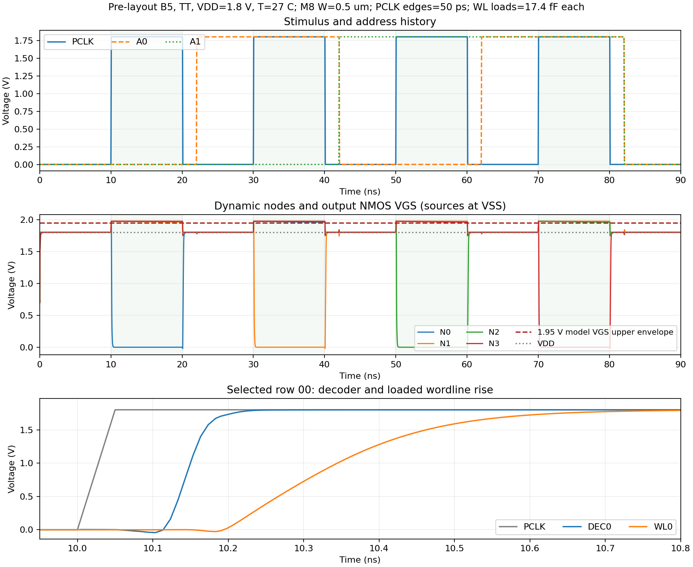

# Dynamic row decoder review and sizing campaign

Status: proposed pre-layout campaign for the existing 2-to-4 dynamic decoder.
This document plans experiments; it does not freeze transistor sizes, clock
limits, nominal characterization temperature, or the project's optimization
priority. Architecture remains defined by [the specification](../specs/technical_specification.md).
Historical candidates B0–B5 are recorded in [the sizing record](row_decoder_sizing.md).

## 1. Current circuit and connectivity review

The generated Xschem hierarchy was reviewed, not only the drawing. It contains
25 SKY130 1.8 V MOS instances, L=0.15 um and nf=1. All widths are 1.00 um except
the shared footer M8, currently 0.50 um (B5).

| Family | Devices | Function and review |
|---|---|---|
| Address complements | M1/M2, M3/M4 | Static inverters generate A0B and A1B; PMOS S/B=VDD, NMOS S/B=VSS |
| Precharge | M5, M11, M16, M21 | Each PMOS connects VDD to N0–N3 when PCLK is low |
| Upper evaluation devices | M6, M12, M17, M22 | Gates A1B, A1B, A1, A1 |
| Lower evaluation devices | M7, M13, M18, M23 | Gates A0B, A0, A0B, A0; sources join EVAL_GND |
| Shared footer | M8 | D=EVAL_GND, G=PCLK, S/B=VSS; isolates evaluation paths during precharge |
| Output inverters | M9/M10, M14/M15, M19/M20, M24/M25 | Gate=N0–N3; outputs DEC0–DEC3; static supply rails |

The four series-stack intermediate nodes are distinct. Evaluation NMOS bulks
are VSS, rather than their elevated source nodes. EVAL_GND is not shorted to VSS.
The symbol orders DEC3 before DEC2; the runner reads the actual subcircuit pin
order and follows each driver's input, instead of assuming a drawn position or
a generated net number determines its row.

During evaluation, the selected dynamic node discharges through three NMOS
channels: upper device, lower device, and footer. The other nodes retain charge.
There is no keeper and no dedicated precharge device on the stack intermediate
nodes. EVAL_GND is shared by four branches and is a floating node while the
footer is off; it need not be zero during precharge.

Each true address bit drives two evaluation gates plus the two gates of its
complement inverter. Each complement drives two evaluation gates. PCLK drives
four precharge gates and the footer gate. Ideal sources in the current benches
mask the effect of this load on the upstream address registers and clock source.

The loaded bench uses four existing noninverting, two-stage WL drivers:
W_P=W_N=0.42 um in stage 1 and 0.84 um in stage 2. The estimated full-row
capacitance is 17.4 fF at each WL output; it is not attached directly to DEC.
There is no enable qualification in either the decoder interface or this buffer.
Valid-operation gating and captured-address timing must therefore be checked
with the integration control implementation before claiming safe idle,
disabled, or invalid macro operation.

## 2. Reproduced results and newly observed limits

The repaired runner passes Xschem netlisting and ngspice execution. The original
functional bench passes 36/36 output samples; the loaded bench passes 72/72.
At TT, 1.80 V, 27 C, 17.4 fF/WL and 50 ps clock edges, B5 also passes 252
additional output-window, internal-precharge, crossing-time and slew checks.

| B5 loaded measurement | Result |
|---|---:|
| PCLK to DEC 50% rising delay | 118.60–121.92 ps |
| PCLK to WL 50% rising delay | 299.58–302.94 ps |
| PCLK to DEC falling below 10% | 114.53–117.35 ps |
| PCLK to WL falling below 10% | 289.82–292.90 ps |
| DEC 10–90% rise | 53.75–54.29 ps |
| DEC 90–10% fall | 30.38–31.36 ps |
| WL 10–90% rise | 294.70–294.73 ps |
| WL 90–10% fall | 106.82–106.86 ps |
| Additional DEC-to-WL rising delay, per row | 180.93–181.02 ps |
| Additional DEC-to-WL falling delay, per row | 175.16–175.54 ps |
| Dynamic-node voltage at precharge samples | 1.799616–1.800000 V |
| Lowest unselected dynamic-node voltage within evaluation | 1.799974 V |
| Highest dynamic-node voltage within evaluation | 1.97798 V |

These output checks use experimental limits of 10%/90% VDD, an excursion guard
of +/-10% VDD, and a 1 ns settling allowance for selected/precharging outputs.
They are not final noise-margin or clock-budget specifications. Unselected
outputs are checked over the full evaluation interval, not only at its end.
The DEC-to-WL differences quantify the existing buffer's contribution under this
load; they are not a recommendation to redesign its frozen schematic now.

**Model-envelope review is required despite the logic passes.** Each dynamic
node drives an output NMOS gate whose source is VSS. The measured peak therefore
gives that NMOS's external VGS. Sixteen per-row/per-cycle upper-VGS measurements
exceed 1.95 V, the upper published model-validity voltage for nfet_01v8.
The repaired runner records OUTSIDE_MODEL_RANGE and returns nonzero for this
condition, without changing the output-voltage PASS results. This is evidence
of extrapolation outside the published model envelope, not proof of silicon
damage or a foundry reliability violation.
[SKY130 device model information](https://skywater-pdk.readthedocs.io/en/main/rules/device-details.html#v-nmos-fet).

Two diagnostic runs were completed with the identical B5 sizing and load:

| Diagnostic | Output samples | Maximum dynamic-node/output-NMOS VGS | Max DEC/WL evaluation delay | Max DEC/WL precharge delay |
|---|---|---:|---:|---:|
| Gear, 10 ps maximum step, 50 ps clock | 72/72 PASS | 1.97798 V, outside published envelope | 121.92 / 302.94 ps | 117.35 / 292.90 ps |
| Trapezoidal, 5 ps maximum step, 50 ps clock | 72/72 PASS | 1.97475 V, outside published envelope | 122.12 / 302.82 ps | 116.00 / 292.34 ps |
| Gear, 10 ps maximum step, 250 ps clock | 72/72 PASS | 1.89772 V, below 1.95 V in all 16 checks | 161.44 / 342.51 ps | 164.15 / 340.03 ps |

The smaller timestep and different integration method preserve the envelope
finding. Slower clock edges eliminate this particular upper-VGS violation in
the tested sequence, at the cost of greater delay. Capacitive clock coupling
is a plausible contributor; it has not been isolated from every other mechanism.
A 250 ps input edge has not been adopted as the macro's allowed clock slew.

Supply integration is now reported separately for evaluation and precharge.
It includes the decoder and, in the loaded bench, all four drivers. It excludes
energy delivered by the ideal address and PCLK sources. The low phase also
contains address changes, so these are phase/cycle energy measurements for this
specific schedule, not pure leakage or read/write macro energy.

Historical B2 (footer 1.50 um) has the fastest recorded evaluation, B5 the
fastest recorded precharge, and B1 (all eight stack NMOS widened to 1.50 um with
a 1.00 um footer) was slower in both. Those earlier runs did not apply the new
model-envelope and window screens. None of B0–B5 is a final robust design.

The B5 decoder's sum(W*L) channel-area proxy is 3.675 um2, versus 3.750 um2
for uniform B0 (2% smaller). This is a width/length arithmetic proxy, not
measured layout area; taps, wells, contacts and routing are excluded. Footer
size alone is therefore an incomplete basis for either timing or area choices.

## 3. Measurements to keep consistent

Record one row per address, candidate and condition, retaining:

- exact W/L/nf for all transistor families, source hashes and tool/model versions;
- functional one-hot behavior and all-low precharge behavior over time windows;
- selected DEC and WL delay at 50%, precharge completion at 10%, rise/fall slew;
- N0–N3 min/max, selected discharge, precharge completion, and inverter trip point;
- EVAL_GND and stack-intermediate waveforms, charge sharing and clock-induced excursions;
- supply phase energy, clock/input-source energy, settling/DC current and peak current;
- all relevant VGS/VDS/VBS terminal ranges with model-validity findings identified;
- an area proxy such as sum(W*L), gate load, and eventually actual Magic area;
- minimum low phase for recovery and maximum high phase before unselected-node loss.

For an initial interpretation only,
t_eval approximately follows C_dynamic*(R_upper + R_lower + R_footer) plus the
output inverter and driver delays; t_precharge approximately follows
R_precharge*C_effective plus output restoration. Increasing width changes
resistance, capacitance, source charge and clock/address loading together.
These equations organize hypotheses; they do not predict a final SKY130 width.

Use actual simulated inverter transfer curves to obtain Vtrip. Evaluate the
unselected dynamic-node margin relative to Vtrip and a proposed guard band;
90% VDD at one late sample is not a dynamic noise-margin characterization.

## 4. Ordered campaign

Proceed in the following order. A campaign entry is not marked complete until
its results exist. The script currently supports the fixed four-address
sequence, load/slew/PVT overrides, timing, windows, supply energy and the
output-NMOS upper-VGS screen. Sequence/phase-length, terminal-voltage,
inverter-DC, register/control integration and extracted-netlist tests below
still need dedicated benches or extensions.

### A. Measurement and clock-envelope closure — first priority

1. Preserve B0–B5 timing references and recheck selected references with the
   repaired runner; store new criteria as a separate review, not a silent
   rewrite of earlier results.
2. Complete numeric sensitivity: Gear 10 ps versus Gear 5 ps and trapezoidal
   5 ps, recording timing and voltage-peak changes. Investigate differences
   that could change candidate ranking or an envelope decision.
3. Explore PCLK rise/fall edges at 25, 50, 100, 250, 500 and 1000 ps at current
   B5 sizes. Then test unequal rise/fall edges with a dedicated stimulus.
   These are diagnostic inputs, not an approved slew specification.
4. Check the full model terminal envelope and the actual upstream clock load.
   Determine the input waveform range that a realizable clock driver supplies.
5. Examine precharge/output-inverter sizes as possible ways to alter clock
   feedthrough before optimizing only the footer. A bigger footer cannot
   directly clamp a dynamic node whose address stack is off.
6. If sizing and credible timing cannot provide adequate retention/margin,
   present a keeper or intermediate-node-precharge option for a topology
   decision. Do not insert either into the schematic automatically.

Exit: a documented clock/model envelope and stable measurement definitions.
Keep unresolved model excursions visible; do not freeze a candidate from
functional PASS alone.

### B. Address history and timing

- Run all 16 ordered old-address/new-address pairs, including four repeats.
  Prime the previous state through an evaluation and precharge before measuring.
- Include binary and Gray sequences, reverse order, 01↔10 and 00↔11, and
  both signs of A0/A1 arrival skew when two bits change.
- Apply legal changes during the low phase. Sweep captured-address arrival
  before evaluation, for example -1000, -500, -250, -100, -50 and 0 ps
  relative to PCLK, then refine the boundary.
- Deliberately change address during evaluation as a negative control.
  Already discharged dynamic nodes cannot restore until precharge; a
  subsequent selected branch can produce multiple asserted outputs.
- Model register clock-to-Q plus complement-inverter delay, input slew and
  real fanout. PCLK evaluation must follow their settling as required by spec.
- Treat this as the decoder's internal address-stability requirement.
  External SRAM setup/hold belongs to the implemented capture registers.
- Verify idle/disabled/invalid qualification with the future control path;
  this leaf bench has no CSb/OEb/WEb gating.

Exit: no spurious decoded/physical row for the defined legal timing envelope.
Record negative-control failures as expected evidence of the timing contract.

### C. Coarse family sweeps

Hold L=0.15 um and nf=1 initially. The following W values are exploratory,
in um, and use ordinary devices with W>=0.42; check realizability in Magic.
Every isolated sweep holds other decoder families at B0, uses all four rows,
and keeps the existing WL-driver schematic unchanged.

| Family | W candidates | Primary measurements |
|---|---|---|
| M8 footer | 0.42, 0.50, 0.75, 1.00, 1.25, 1.50, 2.00, 3.00 | Evaluation, EVAL_GND, clock load/energy, precharge recovery |
| Eight stack NMOS together | 0.42, 0.50, 0.75, 1.00, 1.25, 1.50, 2.00 | Discharge vs added node/source capacitance and charge sharing |
| Four precharge PMOS together | 0.42, 0.50, 0.75, 1.00, 1.50, 2.00 | N recovery, clock feedthrough, overlap current and input load |
| Four output inverters together | Wn=0.42, 0.75, 1.00; Wp/Wn=1, 1.5, 2, 3 (12 pairs) | Actual Vtrip, dynamic-node capacitance/margin, DEC/WL slew and delay |
| Two address inverters together | Wn=0.42, 0.75, 1.00; Wp/Wn=1, 1.5, 2 (9 pairs) | Complement arrival/skew, upstream load and two-bit transitions |

This is 38 distinct initial sizings after deduplicating the common B0 point.
Start at 17.4 fF/WL and the clock conditions established in stage A. Stress
only passing/interesting candidates at 50 fF, instead of applying a full
Cartesian product to every poor candidate.

Use a smaller output-inverter width to study input capacitance, not merely
larger devices. P/N ratios are exploratory and must be judged by their measured
trip voltage and dynamic margin, not an assumed universal 2:1 rule.

The next simple footer comparison can be 0.42 um, but the model-envelope
investigation has priority over declaring a best footer.

### D. Interactions and refinement

- Test a 3x3 footer/stack grid: footer=1.00, 1.50, 2.00 and stack=0.50,
  1.00, 1.50 um. B1 alone does not reject larger stack devices under another footer.
- Around retained settings, test upper/lower stack width pairs such as
  (0.50,1.00), (1.00,0.50), (1.00,1.00), (1.00,1.50), (1.50,1.00).
  Equal gate count does not imply equal behavior at the two stack positions.
- Combine at most two retained precharge sizes, two output-inverter pairs
  and two footer/stack settings (up to eight combinations). Recheck all metrics.
- Refine W around useful knees with 0.05–0.10 um steps where physically legal.
  Extend the upper-width range only if another increase has a measurable benefit.
- Use longer L (e.g. 0.18/0.25 um) only if leakage/retention or peak behavior
  motivates it; compare timing and area cost. Study nf=2/4 only after selecting
  total W and ensuring each finger meets the width rule.
- Do not change the existing WL driver implicitly. If its measured contribution
  becomes the limiting factor, open a separate driver study and then repeat
  the combined chain test.

Exit: a small set of nondominated candidates, rather than one winner from a
single metric.

### E. Load, input-waveform and phase-length stress

- WL capacitance: use 8.7, 17.4, 34.8 and 50 fF as sensitivity points.
  Only 17.4 fF is the current full-row estimate; other values are experiments.
- Separately vary DEC input load/interconnect capacitance and actual captured
  address/clock driver resistance. WL capacitance is behind the buffer.
- Shorten precharge and evaluation independently. Find the minimum low phase
  that restores all N nodes and outputs, and the minimum high phase that
  establishes the selected WL within the defined load/voltage limits.
- Extend evaluation holds (e.g. 10, 100 and 1000 ns, then refine) to measure
  leakage-induced node loss and false rows. Address must remain stable.
- Exercise charge-sharing initial conditions explicitly: precharge N to VDD,
  start a relevant stack-intermediate node near VSS, and enable only part of
  its address path. Measure the unselected N dip and any resulting DEC/WL pulse.
- Inject calibrated transient charge into unselected nodes and examine PCLK/
  address glitches and supply droop. Sweep pulse amplitude, duration and phase,
  observing false row selection and recovery. Define charge/voltage targets
  from the measured or extracted capacitance and integration noise budget;
  do not call an arbitrarily chosen injected pulse a final noise specification.
- Hold PCLK low and high separately, then restart the clock. Record precharge
  recovery, maximum safe evaluation hold and the clock-gating timing contract.
- Compare UIC startup with a settled operating-point/ramped-VDD experiment,
  arbitrary internal-node initial conditions and a first legal precharge.
- Measure clock/input energy and settled current with consistent windows.
  Separate finite startup/address transitions from DC leakage.

The macro maximum frequency also depends on capture, bitcell access, write,
sense and output-register timing; decoder delay alone is insufficient.

### F. PVT and optional mismatch

Required process corners from the specification: TT, SS, FF. Use SF and FS as
additional diagnostic corners for P/N asymmetry and inverter-trip sensitivity.

A proposed exploratory screen for up to three retained candidates is:
TT/SS/FF × VDD={1.62,1.80 V} × T={-40,27,125 C}, 18 conditions per candidate.
The voltage/temperature stress points are proposals consistent with existing
peripheral experiments; they are not approved product limits. Nominal
characterization temperature still requires advisor confirmation.

Check model envelopes at each condition before ranking its timing. A higher
supply requires demonstrated headroom for dynamic-node excursions; do not
automatically apply 1.98 V as a '+10%' corner for 1.8 V devices.

If mismatch simulation is needed, first verify the installed statistical model
and seed handling. Monte Carlo SNM>=200 samples is a bitcell requirement; it
does not automatically define a 200-sample decoder campaign. Define decoder
sample count and failure metric separately.

### G. Physical closure and choice

For retained candidates: Magic layout, well/tap and channel rules, routing,
DRC, extraction and Netgen LVS. Rerun phase/window/model-envelope/load/PVT
measurements with extracted parasitics, including PCLK and EVAL_GND routing.
The existing estimated capacitor must be replaced or partitioned carefully
when actual bitcell gate/routing capacitance is included; avoid double counting.

Choose the final point only after all required functionality, timing contract,
node margins and applicable physical checks pass. Then compare delay,
precharge duration, energy, clock/input load and actual area. Optimization
priority remains an advisor decision; no weighted cost or target frequency is
invented here.

## 5. Reproducible commands and evidence

Functional screen (the old command continues to work):

~~~bash
./tools/sram-eda python3 sims/row_decoder/run_row_decoder_tt.py \
  --output /tmp/decoder_functional_review.csv
~~~

Loaded sizing screen, preserving the source schematic and original stimuli:

~~~bash
./tools/sram-eda python3 sims/row_decoder/run_row_decoder_tt.py \
  --bench sizing --candidate B5 \
  --output sims/row_decoder/results/b5_review_tt_samples.csv \
  --artifacts-dir /tmp/decoder-sizing-review-artifacts
~~~

The current 50 ps B5 screen returns 1 because of OUTSIDE_MODEL_RANGE, despite
Xschem/ngspice return codes 0 and all output logic/window checks passing.
That result is intentional evidence, not the old symbol-loading error.

For a diagnostic change only, add --clock-slew-ps 250, or
--method trap --max-step-ps 5, and give each run its own candidate/output path.
Other supported experiment overrides are --corner, --vdd, --temp-c,
--address-slew-ps and --wl-cap-ff (sizing bench only). The fixed address/phase
schedule is verified; altered schedule experiments require a new bench/extension.

The sample CSV, metric CSV and JSON manifest record criteria, limits,
dimensions, source hashes, node mapping and tool versions. Optional artifacts
retain the generated netlist/deck, logs and binary raw waveform. Use unique
output paths for archived comparisons. The manifest hashes the top-level PDK
library; it does not claim to hash all recursively included models.

Archived evidence:
[B5 output samples](../sims/row_decoder/results/b5_review_tt_samples.csv),
[B5 expanded metrics](../sims/row_decoder/results/b5_review_tt_samples_metrics.csv),
[B5 run manifest](../sims/row_decoder/results/b5_review_tt_samples.json),
[5 ps/trapezoidal metrics](../sims/row_decoder/results/b5_review_tt_trap5_samples_metrics.csv),
[250 ps clock metrics](../sims/row_decoder/results/b5_review_tt_clock250_samples_metrics.csv).
The archived Xschem netlist is a structural regression fixture; the waveform
remains a reproducible temporary artifact.

Ten checker regression tests pass, including intentional footer shorts, wrong
output bulk, duplicated driver input, wrong capacitor row, subminimum width,
negative/above-rail false-pass prevention and local precharge crossing windows:

~~~bash
./tools/sram-eda python3 sims/row_decoder/test_run_row_decoder_tt.py -v
~~~

Regenerate the plotted review from the kept raw waveform and manifest:

~~~bash
./tools/sram-eda python3 sims/row_decoder/plot_row_decoder_review.py \
  /tmp/decoder-sizing-review-artifacts/row_decoder.raw \
  sims/row_decoder/results/b5_review_tt_samples.json \
  --output docs/assets/row_decoder_b5_review.png
~~~

The runner uses Xschem's runtime XSCHEM_SHAREDIR plus both standard-library
path forms and project cell directories. It stops before ngspice if symbols,
netlisting, dimensions or the current topology fail its audit. Crossings use
local TD windows, so UIC startup edges cannot silently become negative delays.
Supply and raw export use a one-thread control run; measurements are retained
without the incompatible batch '-r' mode.

Sources: [Xschem library paths](https://xschem.sourceforge.io/stefan/xschem_man/tutorial_xschem_libraries.html),
[ngspice manual](https://ngspice.sourceforge.io/docs/ngspice-44-manual.pdf),
[SKY130 minimum channel width](https://skywater-pdk.readthedocs.io/en/main/rules/periphery.html),
[dynamic-node charge sharing](https://pages.hmc.edu/harris/class/e158/01/lect04.pdf).

Verification gaps that remain explicit: general address histories, capture/
enable integration, input-source energy, full terminal envelopes, extended
retention, PVT for the decoder, decoder layout/DRC/LVS and extracted timing.
