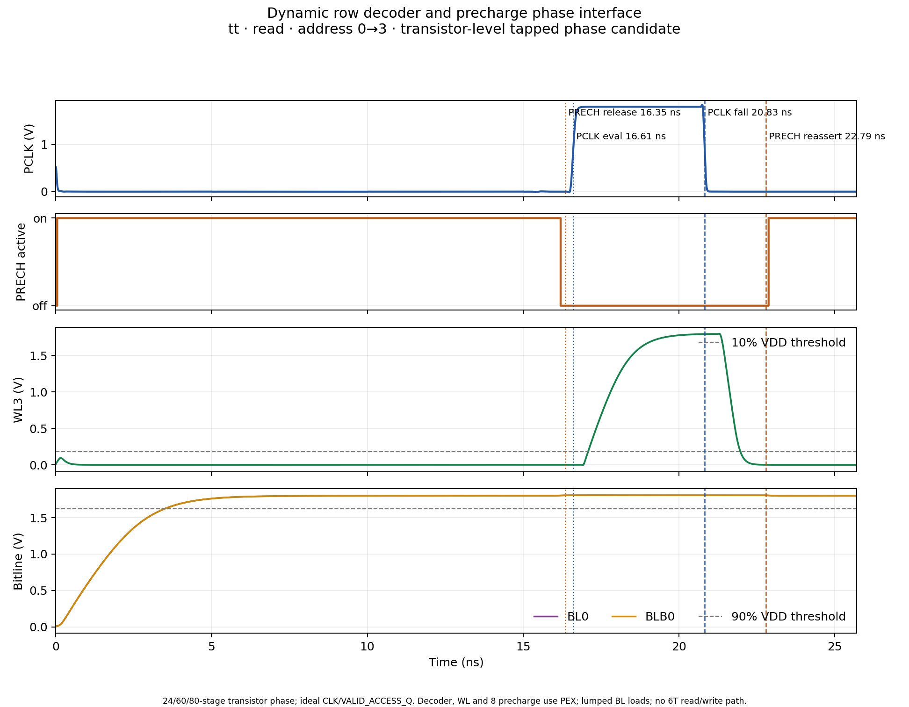

# Dynamic decoder PCLK/PRECH transistor-level phase candidate — 2026-10-09

## Result and status

A generated-deck transistor-level phase candidate was first added to
[`run_precharge_phase_interface.py`](../sims/row_decoder/run_precharge_phase_interface.py)
and screened with the current decoder and wordline-driver PEX plus Danilo's
read-only W2.52 precharge PEX. **All 26 cases passed, with 3,540/3,540 checks
passing.** This gives the project a measured reference for a phase-source
topology. The table and metrics in this first part describe that initial
generated-deck version.

That initial source was generated into each SPICE test deck by the runner. A
follow-up now provides a hierarchical Xschem phase-source cell and a runner
mode that uses its actual SKY130 device netlist; see the final section below.
Neither implementation includes the captured qualifier: `CLK` and
`VALID_ACCESS_Q` remain ideal PWL inputs. The tests contain no 6T access
transistors, sense amplifier, stored-data read/write, or readback. Treat these
results as bounded timing/interface screens, not phase-generator signoff or an
approved maximum frequency.

## Phase equations

`PRECH` is active low. The candidate uses one shared chain of 80 even-numbered
CMOS inverter stages. The selected taps are 24 stages for precharge release,
60 for decoder evaluation, and 80 for delayed precharge reassertion:

```text
PCLK = VALID_ACCESS_Q AND CLK AND DLY60
PRECH = VALID_ACCESS_Q AND ((CLK AND DLY24) OR DLY80)
```

With a valid access, the 24-stage tap delays the rising release of bitline
precharge until before PCLK evaluates. On the falling edge, the 80-stage tap
keeps `PRECH` high while the selected wordline turns off; then bitline
precharge resumes. With an idle or invalid access, `VALID_ACCESS_Q=0` keeps
`PCLK` low and `PRECH` active. The initial testbench clock pulse is also
suppressed by holding the ideal valid qualifier low until the access edge.

Each delay stage uses SKY130A `pfet_01v8`/`nfet_01v8` devices at `L=0.15 µm`,
`Wp=0.84 µm`, and `Wn=0.42 µm`. The delay chain contains 160 MOSFETs. The
phase equations use **three** three-input AND gates and one two-input OR gate.
Including their output inverters, these gates add 30 MOSFETs, for 190 total.
The initial report incorrectly counted only two AND3 gates and stated 182;
this audit corrects that error. This is a functional timing candidate, not a
finalized area choice. The chain's PVT spread and area proxy need review before
layout.

## Testbench and evidence boundary

Each case freshly netlists the current 29-MOS decoder, inserts four extracted
wordline-driver instances, and instantiates eight copies of Danilo's
`precharge_w2p52_flat` PEX. The PEX input is pinned to commit `5dc00fe` and
SHA-256 `cf0fa457b4ab84a1d19e6202541b6a43149b575e492a108e36d0de62489cc423`;
the source file remains read-only. The row load is `102.873935496 fF`. Each
bitline uses Danilo's precharge PEX plus a `583.992055 fF` lumped residual to
represent the `597.056241 fF` effective-load target. It is not a distributed
physical bitline model.

The valid qualifier rises at the testbench capture edge as an ideal PWL source.
The address sequence is also represented by timed voltage sources. The
transistor-level portion is the delay chain and its CMOS phase logic; the
external clock driver and captured-control path are outside this bench. The
simulator uses a 5 ps maximum transient step. No new layout, DRC, LVS, or
parasitic extraction was run for the phase candidate.

## PVT results

The matrix contains valid read/write operations in TT, selected slow-corner
transitions, all four row targets in the fast corner, and all six invalid/idle
control vectors in TT. All cases and all detailed checks passed.

| Profile | Conditions | Cases | Capture to PCLK rise | PRECH release lead | PCLK fall to PRECH conduction | WL-off clearance before PRECH | Minimum BL before evaluation |
|---|---|---:|---:|---:|---:|---:|---:|
| TT | 1.80 V, 27 °C | 8 valid | 1.610 ns | 255.13 ps | 1.963 ns | 814.9 ps | 1.80679 V |
| Slow / SS | 1.62 V, −40 °C | 4 valid | 2.444 ns | 444.28 ps | 2.979 ns | 1,423.3 ps | 1.62497 V |
| Fast / FF | 1.80 V, 125 °C | 8 valid | 1.386 ns | 168.05 ps | 1.694 ns | 637.0 ps | 1.80759 V |
| TT invalid/idle | 1.80 V, 27 °C | 6 invalid | PCLK suppressed | PRECH active | — | — | final BL screen passed |

Across the matrix, **980 phase-interface checks and 2,560 decoder checks
passed**. Release lead is measured from the 75%-VDD `PRECH` threshold to the
50%-VDD PCLK rise. Wordline turn-off uses 10% VDD; precharge conduction uses
the conservative 75%-VDD `PRECH` threshold. The smallest measured interval
from a selected wordline falling below 10% VDD to precharge conduction was
`637.024 ps` in FF. The smallest bitline sample before evaluation was
`1.624971 V` in SS, above its 90%-VDD test threshold of `1.458 V`.

The nominal ideal-source targets were 250 ps release lead and 1.80 ns after
PCLK fall. The phase-chain measurements do not exactly match those targets:
the actual release lead falls to `168.05 ps` in FF, and the actual
PCLK-fall-to-conduction interval falls to `1.694 ns` in FF. These values are
not specification limits. The measured wordline-off clearance remained
positive in the sampled matrix, but a different system acceptance guard would
require retuning and rerunning the phase source.

In these reproductions, `--phase-ps 2100` preserves the nominal
access/address stimulus schedule used by the prior interface study. It does
not force the transistor-generated PCLK edge to occur 2.10 ns after capture;
the measured generated edge is reported separately in each case manifest.

The maximum absolute decoder terminal voltage recorded in these valid cases
was `1.86703 V`, below the project's current 1.95 V numerical screen. This is
not model-domain, reliability, or silicon signoff.

## Result files and waveform

- [TT valid matrix](../sims/row_decoder/results/precharge_phase_tapped_tt_valid_accessonly_246080_20261009/manifest.json)
- [TT invalid/idle matrix](../sims/row_decoder/results/precharge_phase_tapped_tt_invalid_accessonly_246080_20261009/manifest.json)
- [Slow / SS matrix](../sims/row_decoder/results/precharge_phase_tapped_slow_accessonly_246080_20261009/manifest.json)
- [Fast / FF matrix](../sims/row_decoder/results/precharge_phase_tapped_fast_accessonly_246080_20261009/manifest.json)
- [Representative case manifest](../sims/row_decoder/results/precharge_phase_tapped_tt_waveform_accessonly_246080_20261009/manifest.json)



The figure shows PCLK, active-low PRECH, selected WL3, and one BL pair for a
TT read from address 0 to 3. The decoder, WL driver, and precharge cell use
PEX; the bitline load is lumped. The raw transient can be recreated with the
`--keep-raw` option shown below.

## Reproduction

Run each command from the repository root using a fresh output directory.
Together they reproduce the 26-case matrix:

```bash
./tools/sram-eda python3 sims/row_decoder/run_precharge_phase_interface.py \
  --profiles tt --transitions 0:0 0:1 0:2 0:3 \
  --control-vectors 001 010 --transitions-per-vector \
  --phase-ps 2100 --clk-fall-ps 20700 --settling-allowance-ns 3.3 \
  --wl-cap-ff 102.873935496 --release-lead-ps 250 \
  --turnoff-guard-ps 1800 --prime-pclk-rise-ns 6 --step-ps 5 \
  --phase-source tapped-delay-chain --delay-release-stages 24 \
  --delay-evaluation-stages 60 --delay-reassert-stages 80 \
  --output-dir sims/row_decoder/results/precharge_phase_tapped_tt_valid_repro

./tools/sram-eda python3 sims/row_decoder/run_precharge_phase_interface.py \
  --profiles tt --transitions 0:3 \
  --control-vectors 000 011 100 101 110 111 \
  --phase-ps 2100 --clk-fall-ps 20700 --settling-allowance-ns 3.3 \
  --wl-cap-ff 102.873935496 --release-lead-ps 250 \
  --turnoff-guard-ps 1800 --prime-pclk-rise-ns 6 --step-ps 5 \
  --phase-source tapped-delay-chain --delay-release-stages 24 \
  --delay-evaluation-stages 60 --delay-reassert-stages 80 \
  --output-dir sims/row_decoder/results/precharge_phase_tapped_tt_invalid_repro

./tools/sram-eda python3 sims/row_decoder/run_precharge_phase_interface.py \
  --profiles slow --transitions 1:2 3:0 \
  --control-vectors 001 010 --transitions-per-vector \
  --phase-ps 2100 --clk-fall-ps 20700 --settling-allowance-ns 3.3 \
  --wl-cap-ff 102.873935496 --release-lead-ps 250 \
  --turnoff-guard-ps 1800 --prime-pclk-rise-ns 6 --step-ps 5 \
  --phase-source tapped-delay-chain --delay-release-stages 24 \
  --delay-evaluation-stages 60 --delay-reassert-stages 80 \
  --output-dir sims/row_decoder/results/precharge_phase_tapped_slow_repro

./tools/sram-eda python3 sims/row_decoder/run_precharge_phase_interface.py \
  --profiles fast --transitions 0:0 0:1 0:2 0:3 \
  --control-vectors 001 010 --transitions-per-vector \
  --phase-ps 2100 --clk-fall-ps 20700 --settling-allowance-ns 3.3 \
  --wl-cap-ff 102.873935496 --release-lead-ps 250 \
  --turnoff-guard-ps 1800 --prime-pclk-rise-ns 6 --step-ps 5 \
  --phase-source tapped-delay-chain --delay-release-stages 24 \
  --delay-evaluation-stages 60 --delay-reassert-stages 80 \
  --output-dir sims/row_decoder/results/precharge_phase_tapped_fast_repro
```

To regenerate the representative waveform, add `--keep-raw` and use a new
output directory, then run:

```bash
./tools/sram-eda python3 sims/row_decoder/plot_precharge_phase_interface.py \
  --case-dir sims/row_decoder/results/precharge_phase_tapped_tt_waveform_repro/cases/tt_ctl001_a0_to_3_p2100 \
  --output-svg docs/assets/row_decoder_precharge_phase_chain_20261009.svg \
  --output-png docs/assets/row_decoder_precharge_phase_chain_20261009.png
```

## Follow-up — hierarchical Xschem implementation

The same 24/60/80-stage topology is now present as a generated, hierarchical
Xschem cell in [`cells/control`](../cells/control/README.md). The runner's
`xschem-tapped-delay-chain` mode netlists that cell with the SKY130A device
library and simulates the resulting transistor hierarchy. It does not use the
earlier hand-written phase subcircuit. Xschem netlisting completed without
missing symbols or netlist errors; the hierarchy contains 80 inverter cells,
three AND3 cells, and one OR2 cell. The audited device count is 190 MOSFETs.

The final Xschem-source screen passes **26/26 cases and 3,540/3,540 checks**:

| Profile | Conditions | Cases | Checks | Capture→PCLK rise | PRECH release lead | PCLK fall→PRECH conduction | Selected WL off→PRECH conduction |
|---|---|---:|---:|---:|---:|---:|---:|
| TT valid | 1.80 V, 27 °C | 8/8 | 1,344 | 2.0446–2.0449 ns | 390.34–390.54 ps | 2.4971–2.4975 ns | 1.3446–1.3468 ns |
| TT invalid/idle | 1.80 V, 27 °C | 6/6 | 180 | PCLK suppressed | PRECH remains active | Not applicable | Not applicable |
| SS | 1.62 V, −40 °C | 4/4 | 672 | 3.1470–3.1473 ns | 685.23–685.53 ps | 3.8499–3.8501 ns | 2.2748–2.2762 ns |
| FF | 1.80 V, 125 °C | 8/8 | 1,344 | 1.7252–1.7253 ns | 265.69–265.72 ps | 2.1104–2.1105 ns | 1.0498–1.0511 ns |

PCLK-fall-to-precharge and selected-wordline-off-to-precharge are distinct
intervals. Both use the 75%-VDD falling `PRECH` crossing as the conservative
precharge-conduction point; the selected WL-off crossing is at 10% VDD. The
per-case checks and manifests now record these as separate fields, so the
PCLK edge delay is not mistaken for the WL turn-off clearance.

The measured phase timing differs by corner and is experimental. In particular,
the `--phase-ps 2100` input is the address/capture stimulus reference; it does
not force the generated PCLK edge to 2.100 ns after capture. The 250 ps release
lead and 1.8 ns turn-off guard are requested bench checks, not project
specification limits.

The shared final matrix uses `--clk-fall-ps 22000` and
`--settling-allowance-ns 3.4`. These are testbench settings, not a change to the
SRAM clock specification. With the earlier 20.7 ns falling edge, the SS
wordline had not reached the bench's low-level check by the final sample. At
22 ns and a 3.3 ns settling sample, a representative SS wordline reached
1.4562 V against a 1.458 V threshold; increasing the sample allowance to 3.4 ns
closed that numerical check. This adjustment changes when the bench samples
settling and must not be read as a relaxed logic threshold.

The four final manifests preserve the run inputs, PEX provenance, model hashes,
tool versions, case-level checks, separate PCLK and WL turn-off timing
measurements, Xschem netlist hash, and results:

- [TT valid, 8 cases](../sims/row_decoder/results/xschem_phase_source_tt_valid_clk22_settle34_20261009/manifest.json)
- [TT invalid/idle, 6 cases](../sims/row_decoder/results/xschem_phase_source_tt_invalid_clk22_settle34_20261009/manifest.json)
- [SS, 4 cases](../sims/row_decoder/results/xschem_phase_source_slow_clk22_settle34_20261009/manifest.json)
- [FF, 8 cases](../sims/row_decoder/results/xschem_phase_source_fast_clk22_settle34_20261009/manifest.json)
- [Xschem phase-source schematic export](assets/pclk_phase_source_24_60_80_20261009.svg)
- [Representative Xschem-source waveform](assets/pclk_phase_source_interface_xschem_20261009.png)

To reproduce the matrix, run these commands from the repository root with the
project EDA environment:

```bash
COMMON=(--phase-ps 2100 --clk-fall-ps 22000 --settling-allowance-ns 3.4 \
  --wl-cap-ff 102.873935496 --release-lead-ps 250 \
  --turnoff-guard-ps 1800 --step-ps 5 \
  --phase-source xschem-tapped-delay-chain \
  --delay-release-stages 24 --delay-evaluation-stages 60 \
  --delay-reassert-stages 80)

./tools/sram-eda python3 sims/row_decoder/run_precharge_phase_interface.py \
  --profiles tt --transitions 0:0 0:1 0:2 0:3 \
  --control-vectors 001 010 --transitions-per-vector "${COMMON[@]}" \
  --output-dir sims/row_decoder/results/xschem_phase_source_tt_valid_repro

./tools/sram-eda python3 sims/row_decoder/run_precharge_phase_interface.py \
  --profiles tt --transitions 0:3 \
  --control-vectors 000 011 100 101 110 111 "${COMMON[@]}" \
  --output-dir sims/row_decoder/results/xschem_phase_source_tt_invalid_repro

./tools/sram-eda python3 sims/row_decoder/run_precharge_phase_interface.py \
  --profiles slow --transitions 1:2 3:0 \
  --control-vectors 001 010 --transitions-per-vector "${COMMON[@]}" \
  --output-dir sims/row_decoder/results/xschem_phase_source_slow_repro

./tools/sram-eda python3 sims/row_decoder/run_precharge_phase_interface.py \
  --profiles fast --transitions 0:0 0:1 0:2 0:3 \
  --control-vectors 001 010 --transitions-per-vector "${COMMON[@]}" \
  --output-dir sims/row_decoder/results/xschem_phase_source_fast_repro
```

The plotted SS waveform is from a representative read transition (address
1→2). To regenerate its raw transient and image, rerun that one case with
`--keep-raw`, then invoke the plotter:

```bash
./tools/sram-eda python3 sims/row_decoder/run_precharge_phase_interface.py \
  --profiles slow --transitions 1:2 --control-vectors 001 \
  --phase-ps 2100 --clk-fall-ps 22000 --settling-allowance-ns 3.4 \
  --wl-cap-ff 102.873935496 --release-lead-ps 250 \
  --turnoff-guard-ps 1800 --step-ps 5 --keep-raw \
  --phase-source xschem-tapped-delay-chain --delay-release-stages 24 \
  --delay-evaluation-stages 60 --delay-reassert-stages 80 \
  --output-dir sims/row_decoder/results/xschem_phase_source_waveform_repro

./tools/sram-eda python3 sims/row_decoder/plot_precharge_phase_interface.py \
  --case-dir sims/row_decoder/results/xschem_phase_source_waveform_repro/cases/slow_ctl001_a1_to_2_p2100 \
  --output-svg docs/assets/pclk_phase_source_interface_xschem_20261009.svg \
  --output-png docs/assets/pclk_phase_source_interface_xschem_20261009.png
```

## Remaining work after this screen

1. Phase-delay inverter sizing has a provisional `Wp=1.26 µm`, `Wn=0.42 µm`,
   `L=0.15 µm`, `nf=1` candidate from a six-pair margin screen. The tap counts,
   other phase-gate sizing, and the candidate itself remain experimental.
2. Replace ideal `VALID_ACCESS_Q` with captured/qualified control logic and
   check it against address capture and write-data timing. A follow-up arrival
   screen passes through 900 ps in its sampled TT/SS/FF cases; the FF case
   misses the 250 ps experimental release guard at 1,000 ps. This does not
   measure the actual qualifier. See the [arrival-skew report](row_decoder_valid_access_arrival_skew_20261009.md).
3. Characterize the legal access period and low-phase precharge time before
   making any frequency claim.
4. Layout the reviewed phase cell and run DRC/LVS. PEX of this new phase cell
   remains a later, compute-heavy step; no extraction was run in this work.
5. Integrate the physical bitcell row and actual read/write path, then test
   stored-data readback and valid/invalid operation sequencing.

## Current follow-up — phase sizing and qualifier arrival

The selected six-pair screen and the selected-pair 26-case interface matrix
are documented in the [phase-delay inverter sizing report](phase_delay_inverter_sizing_screen_20261009.md).
The later arrival-skew screen exercises the same current Xschem phase source
and PEX inputs with an idealized delay on `VALID_ACCESS_Q`. Its runner now
checks a minimum 250 ps measured PRECH release lead for transistor-level
phase-source modes. That value remains an experimental criterion, and the
actual captured-control/qualifier circuit is still absent.
