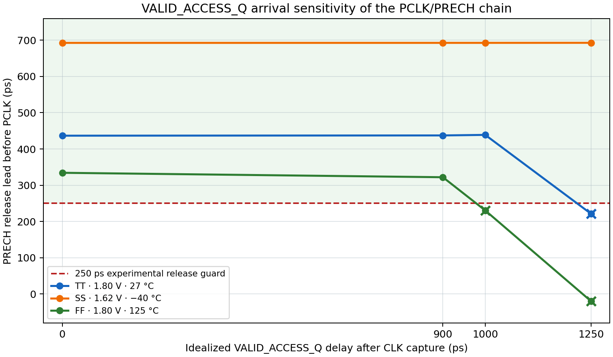

# VALID_ACCESS_Q arrival-skew screen — 2026-10-09

This report records the earlier ideal-PWL arrival sweep. A follow-up screen
uses the SKY130 `dfxtp_1` Liberty clock-to-Q delay and output slew for
`VALID_ACCESS_Q`; see the [captured-Q Liberty report](row_decoder_valid_access_q_liberty_screen_20261009.md).

## Purpose and result

The selected transistor-level PCLK/PRECH phase source takes `VALID_ACCESS_Q`
as an input. Its capture and qualification logic is not yet implemented, so
this screen moves the idealized `VALID_ACCESS_Q` rising edge later than the
CLK capture edge and measures how much precharge-release margin remains.

For the current `Wp=1.26 µm`, `Wn=0.42 µm`, 24/60/80-tap candidate, the
single-transition screen passes in TT, SS and FF through a 900 ps qualifier
arrival delay. At 1,000 ps, the FF PRECH-release lead is 230.525 ps and misses
the 250 ps experimental guard. At 1,250 ps, TT and FF miss that guard; FF also
starts evaluation before PRECH has reached the required high level. SS passes
the sampled points because its delay-chain taps are slower and retain more
separation between precharge release and evaluation.

The project specification does not assign a 250 ps phase margin or a
maximum frequency. The 250 ps value is the experimental interface target
already used in the phase decision. The 900 ps point is a provisional target
for the next captured-qualifier implementation: it passed all three sampled
corners with a minimum measured release lead of 322.004 ps, 72.004 ps above
that guard. It is not a specification limit, a measured control-logic delay,
or a timing signoff.

## Method and scope

The runner simulated the current decoder and WL-driver R-C PEX, Danilo's
read-only W2.52 precharge PEX, eight precharge instances, the 102.873935496 fF
full-row WL load, and the current checked-in Xschem phase-source hierarchy.
The phase-delay inverter sizing is `Wp=1.26 µm`, `Wn=0.42 µm`, `L=0.15 µm`,
`nf=1`. PCLK/PRECH are produced by the transistor-level phase generator.

The external CLK and `VALID_ACCESS_Q` remain ideal PWL sources. The qualifier
delay is a swept arrival offset, not a DFF or control-qualification circuit.
The screen covers one address transition (0→3), one valid read vector (`001`),
the full 102.873935496 fF WL load, and TT (`1.80 V`, `27 °C`), SS (`1.62 V`,
`−40 °C`), and FF (`1.80 V`, `125 °C`). It does not measure address/control
setup or hold, metastability, write-data timing, glitches from real control
logic, all address transitions, or an approved SRAM clock period.

Timing is measured from the rising `PRECH` crossing at 75% VDD to the rising
PCLK crossing at 50% VDD. The runner now enforces the configured 250 ps minimum
for transistor-level phase-source modes. Ideal-PWL mode still schedules the
nominal release spacing and does not apply this threshold-crossing minimum as
a separate check. This change closes a checker gap: before it, a transistor
source case with a positive but sub-250 ps lead could be reported as PASS.

## Results

| Idealized `VALID_ACCESS_Q` delay after capture | TT: lead / status | SS: lead / status | FF: lead / status | Combined waveform checks |
|---:|---:|---:|---:|---:|
| 0 ps | 436.590 ps / PASS | 692.555 ps / PASS | 334.241 ps / PASS | 120/120 |
| 900 ps | 437.302 ps / PASS | 692.592 ps / PASS | 322.004 ps / PASS | 120/120 |
| 1,000 ps | 438.805 ps / PASS | 692.612 ps / PASS | 230.525 ps / REJECTED_SCREEN | 119/120 |
| 1,250 ps | 221.461 ps / REJECTED_SCREEN | 692.731 ps / PASS | −19.607 ps / REJECTED_SCREEN | 117/120 |

Each corner case has 40 checks. The decoder logic, model-envelope screen, and
terminal-magnitude screen passed in all 12 cases. Rejections are from the
PRECH/PCLK timing screen: one failed guard check at 1,000 ps FF; at 1,250 ps,
TT misses the 250 ps guard, while FF has negative release lead and fails the
PRECH-at-PCLK voltage check as well. The slow-corner WL settled within the
configured 3.4 ns bench sample for the chosen 22 ns clock-fall condition.

An offline audit of the 20 valid cases in the selected-pair 26-case matrix
found no access release lead below 250 ps; the minimum was 334.111 ps in FF.
That audit post-processes archived measurements from the same selected phase
subcircuit. It is not a new SPICE run and is not included in the 120-check
counts above.

Measured capture-to-PCLK rise remained approximately 1.836 ns in FF, 2.119 ns
in TT, and 3.154 ns in SS across the sampled qualifier delays. This indicates
that the 60-stage path controls the PCLK edge in these cases, while the
PRECH-release path becomes sensitive to late `VALID_ACCESS_Q` arrival first.



The plotted campaign data and provenance are in:

- [0 ps arrival](../sims/row_decoder/results/phase_source_valid_access_q_guard250_0ps_20261009/manifest.json)
- [900 ps arrival](../sims/row_decoder/results/phase_source_valid_access_q_guard250_900ps_20261009/manifest.json)
- [1,000 ps arrival](../sims/row_decoder/results/phase_source_valid_access_q_guard250_1000ps_20261009/manifest.json)
- [1,250 ps arrival](../sims/row_decoder/results/phase_source_valid_access_q_guard250_1250ps_20261009/manifest.json)
- [Plot generator](../sims/row_decoder/plot_valid_access_arrival_skew.py)

The earlier `phase_source_valid_access_q_delay_*` folders without `guard250`
are retained as exploratory history. Their PASS/FAIL labels predate the
measured 250 ps check and must not be used for acceptance.

## Next tasks

1. Implement the captured control registers and `VALID_ACCESS_Q` qualification
   logic in Xschem. The follow-up Liberty screen models only the DFF's Q
   clock-to-output arc; it does not model the qualification logic, setup/hold,
   glitches or next-cycle deassertion. Check read/write, invalid/idle
   suppression and control transitions against address capture.
2. Re-run the full address and PVT matrix using the implemented qualifier.
   Compare its arrival and slew with the Liberty-timed baseline; keep the
   provisional 900 ps arrival target only as an exploratory reference unless
   the implemented path and an updated phase design demonstrate adequate
   margin.
3. Establish the legal clock high/low windows, including the actual period,
   WL turn-off, PRECH assertion, bitline recovery and setup/hold constraints;
   do not infer an Fmax from the present phase chain.
4. Review and lay out the phase source, close Magic DRC and Netgen LVS, then
   requalify its extracted implementation. Warn before phase-source PEX because
   it is a compute-heavy extraction intended for the stronger machine.
5. Integrate the physical bitcell row and real read/write path, with stored-data
   readback and valid/invalid operation tests. Preserve model-domain and
   reliability findings as separate signoff questions.

## Reproduction

Run each point with a fresh output directory from the repository root:

```bash
for delay in 0 900 1000 1250; do
  ./tools/sram-eda python3 sims/row_decoder/run_precharge_phase_interface.py \
    --phase-source xschem-tapped-delay-chain \
    --profiles tt slow fast --transitions 0:3 --control-vectors 001 \
    --phase-ps 2100 --clk-fall-ps 22000 --settling-allowance-ns 3.4 \
    --wl-cap-ff 102.873935496 --release-lead-ps 250 \
    --turnoff-guard-ps 1800 --valid-access-q-delay-ps "$delay" \
    --step-ps 5 \
    --output-dir "sims/row_decoder/results/phase_source_valid_access_q_guard250_${delay}ps_20261009"
done

./tools/sram-eda python3 sims/row_decoder/plot_valid_access_arrival_skew.py
```

No extraction was run in this screen.
