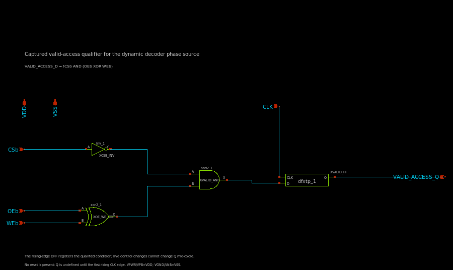

# Captured valid-access qualifier: schematic and functional check

Date: 2026-10-09 · Branch: `feature/peripherals` · Scope: Person 3 control-path work for the dynamic 2-to-4 row decoder.

## Circuit

The phase source needs a registered, glitch-free enable for a legal read or
write. The Xschem cell `cells/control/valid_access_capture.sch` implements:

```text
VALID_ACCESS_D = !CSb AND (OEb XOR WEb)
VALID_ACCESS_Q = rising_edge_capture(VALID_ACCESS_D, CLK)
```

The schematic uses `inv_1`, `xor2_1`, `and2_1`, and positive-edge `dfxtp_1`
from the SKY130 FD SC HD library. `VPWR` and `VPB` connect to `VDD`; `VGND` and
`VNB` connect to `VSS`. No reset is present, so Q is unspecified before the
first rising edge.

| CSb | OEb | WEb | Interpretation | Captured valid |
|---:|---:|---:|---|---:|
| 0 | 0 | 0 | Read and write both requested; reject | 0 |
| 0 | 0 | 1 | Read | 1 |
| 0 | 1 | 0 | Write | 1 |
| 0 | 1 | 1 | Idle | 0 |
| 1 | 0 | 0 | Chip disabled | 0 |
| 1 | 0 | 1 | Chip disabled | 0 |
| 1 | 1 | 0 | Chip disabled | 0 |
| 1 | 1 | 1 | Chip disabled | 0 |

`cells/control/captured_pclk_phase_source.sch` is a hierarchical wrapper that
connects the qualifier's `VALID_ACCESS_Q` to the existing
`pclk_phase_source.sch`. The phase-source schematic itself was not modified.
The wrapper was netlisted to confirm the instance hierarchy and pin wiring.
This qualifier captures only the access-valid bit; it does not capture address
bits or write data.



## Functional evidence

Reproduce the check from the repository root:

```bash
./tools/sram-eda python3 sims/row_decoder/run_valid_access_capture.py
```

The runner asks Xschem to generate structural Verilog, compiles that netlist
with Icarus and the SKY130 FD SC HD functional models, and checks the captured
Q output. It also generates a hierarchical SPICE netlist of the wrapper to
check that the qualifier feeds the existing phase source.

Observed result:

- Xschem netlisting completed without missing symbols.
- The wrapper netlist contains both `valid_access_capture` and the existing
  `pclk_phase_source` in the intended hierarchy.
- All 8 control vectors were captured correctly on a rising clock edge.
- All 8 checks held Q when live controls changed while CLK remained high.
- All 8 checks held Q across the falling clock edge.
- The simulation reported `PASS: 8/8 control-vector captures and 16/16 hold checks`.

Machine-readable evidence and generated netlists are under
[`sims/row_decoder/results/valid_access_capture_integrated_20261009T213300994820Z/`](../sims/row_decoder/results/valid_access_capture_integrated_20261009T213300994820Z/):
the manifest records input and PDK model hashes; `vectors.csv` records each
control vector; `capture.vcd` is the event trace; and the generated Verilog and
hierarchical SPICE are preserved alongside tool logs.

## Limits and follow-up

This check uses the PDK's functional Verilog models with zero unit delay. It
verifies Boolean behavior and edge-triggered state only. It does not measure
analog delay, slew, setup/hold, power, metastability, PVT behavior, or the
electrical interaction of the qualifier with PCLK/PRECH. The wrapper's
hierarchy has been netlisted, but the wrapper has not yet been simulated as a
complete event or transistor-level phase path.

The prior phase-timing matrices still use an ideal or Liberty-derived
`VALID_ACCESS_Q` waveform. Their timing results are separate evidence and are
not measurements of this new gate/DFF path. Direct ngspice simulation of the
standard-cell DFF remains unresolved because the continuous SKY130 SPICE model
deck does not cover the DFF's 0.36 µm special NFET width at the relevant
channel length; widening the device for diagnosis was not accepted as a
standard-cell simulation result.

There is no reset, so startup behavior before the first rising clock edge must
be handled or bounded by the surrounding SRAM sequence. Address capture,
write-data capture, full PVT/timing characterization, layout, DRC/LVS, and
integrated read/write/readback remain open. No extraction was run for this
work.
