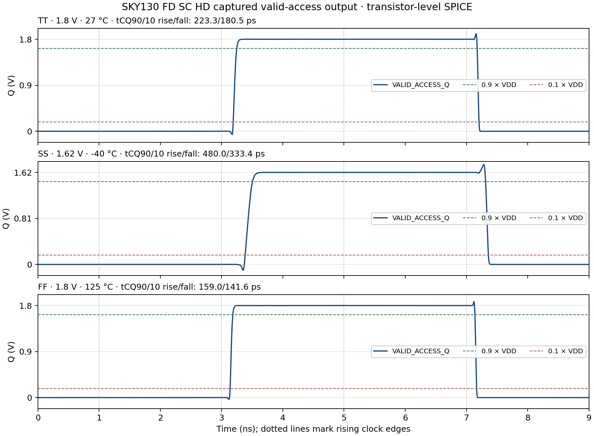

# Captured valid-access qualifier: schematic and electrical checks

Date: 2026-10-09 · Branch: `feature/peripherals` · Scope: Person 3 control-path work for the dynamic 2-to-4 row decoder.

## Circuit

The phase source needs a registered, glitch-free enable for a legal read or
write. The Xschem cell `cells/control/valid_access_capture.sch` implements:

```text
VALID_ACCESS_D = !CSb AND (OEb XOR WEb)
VALID_ACCESS_Q = rising_edge_capture(VALID_ACCESS_D, CLK)
```

The schematic uses `inv_1`, `xor2_1`, `and2_1`, and positive-edge `dfxtp_1`
from the SKY130 FD SC HD library. `VPWR` and `VPB` connect to `VDD`; `VGND` and
`VNB` connect to `VSS`. No reset is present, so Q is unspecified before the
first rising edge.

| CSb | OEb | WEb | Interpretation | Captured valid |
|---:|---:|---:|---|---:|
| 0 | 0 | 0 | Read and write both requested; reject | 0 |
| 0 | 0 | 1 | Read | 1 |
| 0 | 1 | 0 | Write | 1 |
| 0 | 1 | 1 | Idle | 0 |
| 1 | 0 | 0 | Chip disabled | 0 |
| 1 | 0 | 1 | Chip disabled | 0 |
| 1 | 1 | 0 | Chip disabled | 0 |
| 1 | 1 | 1 | Chip disabled | 0 |

`cells/control/captured_pclk_phase_source.sch` is a hierarchical wrapper that
connects the qualifier's `VALID_ACCESS_Q` to the existing
`pclk_phase_source.sch`. The phase-source schematic itself was not modified.
The wrapper was netlisted to confirm the instance hierarchy and pin wiring.
This qualifier captures only the access-valid bit; it does not capture address
bits or write data.


## Functional evidence

Reproduce the check from the repository root:

```bash
./tools/sram-eda python3 sims/row_decoder/run_valid_access_capture.py
```

The runner asks Xschem to generate structural Verilog, compiles that netlist
with Icarus and the SKY130 FD SC HD functional models, and checks the captured
Q output. It also generates a hierarchical SPICE netlist of the wrapper to
check that the qualifier feeds the existing phase source.

Observed result:

- Xschem netlisting completed without missing symbols.
- The wrapper netlist contains both `valid_access_capture` and the existing
  `pclk_phase_source` in the intended hierarchy.
- All 8 control vectors were captured correctly on a rising clock edge.
- All 8 checks held Q when live controls changed while CLK remained high.
- All 8 checks held Q across the falling clock edge.
- The simulation reported `PASS: 8/8 control-vector captures and 16/16 hold checks`.

Machine-readable evidence and generated netlists are under
[`sims/row_decoder/results/valid_access_capture_integrated_20261009T213300994820Z/`](../sims/row_decoder/results/valid_access_capture_integrated_20261009T213300994820Z/):
the manifest records input and PDK model hashes; `vectors.csv` records each
control vector; `capture.vcd` is the event trace; and the generated Verilog and
hierarchical SPICE are preserved alongside tool logs.

## Transistor-level cell screen

The isolated standard-cell path was then simulated with the official SKY130 FD
SC HD transistor subcircuits and the PDK's native ngspice PM3 corner library.
The controls change with 50 ps edges, settle 500 ps before each rising clock
edge, and change again 800 ps after capture. Q is sampled at 700 ps after the
edge, at 1,000 ps while CLK is still high, and at 1,250 ps after the falling
edge. The isolated output has a 3.434554 fF load, a nominal `dfxtp_1` Liberty
table lookup point; it is not an extracted phase-source fanout.

| Profile | VDD / temperature | Captures | High-phase holds | Falling-edge holds | Measured tCQ 90% rise / 10% fall | Observed Q minimum / maximum |
|---|---:|---:|---:|---:|---:|---:|
| TT | 1.80 V / 27 °C | 8/8 | 8/8 | 8/8 | 223.265 / 180.537 ps | −0.0648 / 1.9092 V |
| SS | 1.62 V / −40 °C | 8/8 | 8/8 | 8/8 | 480.021 / 333.448 ps | −0.1022 / 1.7590 V |
| FF | 1.80 V / 125 °C | 8/8 | 8/8 | 8/8 | 159.007 / 141.591 ps | −0.0340 / 1.8753 V |

The delay is measured from the 50% clock crossing to the first Q crossing of
90% VDD on a rising transition or 10% VDD on a falling transition. The
waveform also shows transient excursions below VSS and above VDD: the largest
measured values are −102.2 mV and +139.0 mV beyond the rails in SS. This
campaign has no rail-excursion acceptance criterion, so these values require
electrical review and are not treated as passes. The sampled capture and hold
checks pass; this does not establish setup/hold limits, metastability behavior,
or a legal SRAM clock period.



Machine-readable samples, threshold-crossing delays, observed rail extrema,
input deck, generated cell netlist, hashes, and ngspice logs are in the
[electrical campaign directory](../sims/row_decoder/results/valid_access_capture_spice_20261009T215804875567Z/).
Reproduce it with:

```bash
./tools/sram-eda python3 sims/row_decoder/run_valid_access_capture_spice.py
```

Ngspice completed all three profiles using the native PM3 model library, but
each log also reports four unavailable PDK OSDI libraries and
`No compatibility mode selected!`. These warnings are recorded in the
manifest and remain an environment/model-acceptance limitation for broader
qualification.

## Limits and follow-up

The Icarus check uses functional Verilog models with zero unit delay and
verifies Boolean behavior only. The ngspice check supplies limited transistor-
level evidence for the isolated qualifier at three selected profiles and
measures two Q transitions. It does not simulate setup/hold sweeps, clock
frequency, power, metastability, mismatch, or the interaction of the captured
Q output with PCLK/PRECH. The wrapper's hierarchy has been netlisted, but the
wrapper has not yet been simulated as a complete transistor-level phase path.

The prior phase-timing matrices still use an ideal or Liberty-derived
`VALID_ACCESS_Q` waveform. Their timing results are separate evidence and are
not measurements of the real captured-Q-to-PCLK path. The earlier attempt to
simulate `dfxtp_1` with the continuous MOS model deck remains excluded because
its width bins do not cover the cell's 0.36 µm special NFET. The current
isolated-cell screen uses the PDK's native PM3 model family instead; it is a
different model flow and retains the startup warnings listed above.

There is no reset, so startup behavior before the first rising clock edge must
be handled or bounded by the surrounding SRAM sequence. Address capture,
write-data capture, full PVT/timing characterization, layout, DRC/LVS, and
integrated read/write/readback remain open. No extraction was run for this
work.
