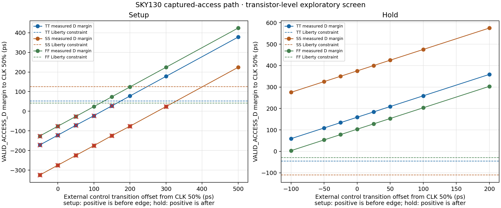

# Captured valid-access setup/hold screen — 2026-10-09

## Result

The `valid_access_capture.sch` input-to-register path was simulated with
SKY130 FD SC HD SPICE subcircuits and native PM3 models at TT, SS, and FF.
The matrix contains 8 setup and 8 hold offsets per profile: **48 timing points**
in total. All three ngspice transient runs completed and produced waveform
data. No missing OSDI libraries or fatal model errors were reported; each log
prints `No compatibility mode selected!`.

The measured internal `VALID_ACCESS_D` margin is its 50% crossing relative to
the 50% rising `CLK` crossing. Actual 10–90% clock and D slews are used to
interpolate the `dfxtp_1` setup/hold constraint tables. The table below also
shows the sampled Q result 700 ps after the measured clock edge. A positive
external setup lead means the 50% control transition center precedes the clock
edge; for hold, a positive offset means it follows the edge.

| PM3 profile | Native voltage / temperature | Setup Q samples captured | Coarse external setup-lead bracket | Hold Q samples retained | Minimum measured Liberty hold slack |
|---|---:|---:|---:|---:|---:|
| TT | 1.80 V / 27 °C | 3/8 | `150 ps < boundary ≤ 200 ps` | 8/8 | +104.670 ps |
| SS | 1.62 V / −40 °C | 1/8 | `300 ps < boundary ≤ 500 ps` | 8/8 | +385.971 ps |
| FF | 1.80 V / 125 °C | 5/8 | `50 ps < boundary ≤ 100 ps` | 8/8 | +32.322 ps |

These brackets describe only the sampled `VALID_ACCESS_Q` behavior in this
coarse screen. They are not system setup/hold limits. The test applies the
control bits simultaneously and samples Q once; it does not model
metastability or establish an operating frequency.

At the neighboring TT setup samples, a 200 ps external lead gives 77.703 ps
of measured D margin against a 51.848 ps Liberty setup reference (+25.855 ps
slack); at 150 ps the measured margin is 27.697 ps and the Liberty reference
slack is −24.119 ps, and Q remains low. In SS, 500 ps gives +99.104 ps Liberty
slack while 300 ps gives −100.785 ps and Q remains low. In FF, the 100 ps case
has −18.204 ps Liberty slack but Q is high at the sample point; at 50 ps the
slack is −68.595 ps and Q remains low. That FF difference shows why the SPICE
sample and Liberty table comparison must remain separate evidence rather than
using either one alone as signoff.

## Setup and hold references

| Profile | Measured setup-reference range | Measured hold-reference range | Liberty characterization point |
|---|---:|---:|---|
| TT | 51.815–52.427 ps | −45.616 to −45.590 ps | 1.80 V / 25 °C |
| SS | 124.589–126.027 ps | −110.665 to −110.660 ps | 1.60 V / −40 °C |
| FF | 42.030–42.386 ps | −29.262 to −29.127 ps | 1.65 V / 100 °C |

The native PM3 points are 1.80 V/27 °C, 1.62 V/−40 °C, and 1.80 V/125 °C.
Therefore the Liberty data is not an exact operating-point match in any case;
the values are comparative references only. The interpolation used the actual
measured 10–90% input slews and the `setup_rising`/`hold_rising` tables on the
`dfxtp_1` D pin.

## Testbench and scope

For setup, controls begin at disabled vector `111` and change to legal read
vector `001` around the measured rising edge. For hold, controls change from
`001` to invalid simultaneous-read/write vector `000` around that edge. Both
clock and control transitions use 50 ps ramps. A first clock edge captures
`111` before the measured edge. Q has a 3.434554 fF load and is sampled 700 ps
after the measured edge. Maximum transient step is 2 ps.

The test runner freshly netlists the Xschem schematic. It promotes the
schematic's existing `VALID_ACCESS_D` wire to an additional port only in the
generated simulation subcircuit so ngspice records the internal data input;
the project schematic itself is not edited for this probe. Large transient
RAW files are discarded after measurements; the generated decks, logs,
manifest, CSV, and plot are retained.



The screen covers only the captured valid-access control bit. **A0 and A1 are
still not captured by this path**, despite the technical specification
requiring the row address to be captured on the rising clock edge and the
dynamic decoder to use that captured address. Thus this result does not close
the specified address-to-decoder interface. The clock phase source also has
no layout, DRC, LVS, or PEX; the path is not metastability, reliability, or
system signoff.

## Reproduction and evidence

Run the default 3-profile matrix in a new output directory:

```bash
./tools/sram-eda python3 sims/row_decoder/run_valid_access_setup_hold.py \
  --output-dir sims/row_decoder/results/valid_access_setup_hold_3corner_repro
```

Archived evidence:

- [runner](../sims/row_decoder/run_valid_access_setup_hold.py)
- [per-point checks](../sims/row_decoder/results/valid_access_setup_hold_tt_ss_ff_v2_20261009/checks.csv)
- [run manifest and hashes](../sims/row_decoder/results/valid_access_setup_hold_tt_ss_ff_v2_20261009/manifest.json)
- [TT, SS, and FF simulation decks and logs](../sims/row_decoder/results/valid_access_setup_hold_tt_ss_ff_v2_20261009/)

The simulation directories contain no retained RAW files. A separate finer
boundary sweep, captured-address implementation, address/control combined
timing, startup behavior, and integration through the physical bitcell row
remain open.
